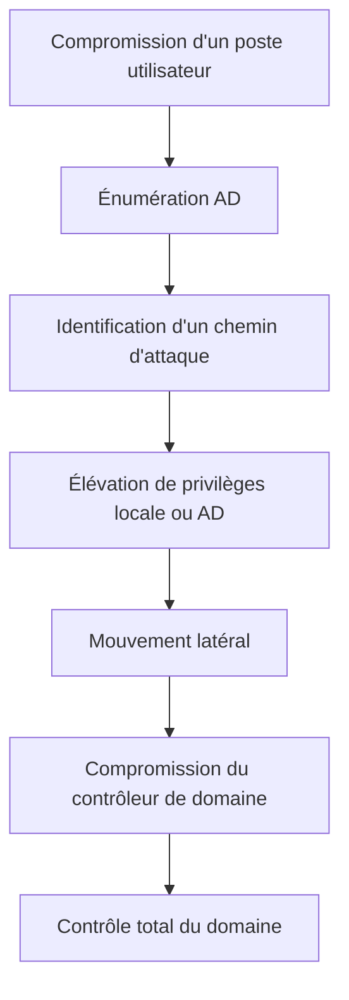

## Introduction

Ce cours change de perspective par rapport au cours Administration Systèmes et Réseaux d'Entreprise : là où celui-ci aborde Active Directory du point de vue de l'administrateur qui le configure, celui-ci l'aborde du point de vue de l'attaquant qui l'audite et l'exploite — la compétence la plus recherchée sur le marché du pentest interne, et le cœur des certifications CRTP/CRTE.

## Les concepts fondamentaux d'AD

<CompareTable
  titleA="Concept"
  titleB="Définition"
  rows={[
    { a: "Forêt (forest)", b: "Le plus haut niveau de la hiérarchie — peut contenir plusieurs domaines liés par des relations d'approbation" },
    { a: "Domaine (domain)", b: "Une unité administrative avec sa propre base d'utilisateurs, groupes et politiques" },
    { a: "Contrôleur de domaine (DC)", b: "Le serveur qui héberge la base AD et traite l'authentification" },
    { a: "Unité d'organisation (OU)", b: "Conteneur logique pour organiser objets et appliquer des GPO" },
    { a: "Objet", b: "Utilisateur, ordinateur, groupe, GPO — chaque élément de l'annuaire est un objet avec des attributs" },
]}
/>

<TipCallout>
Le protocole LDAP (Lightweight Directory Access Protocol) est le langage utilisé pour interroger et modifier l'annuaire AD — comprendre les requêtes LDAP de base est un prérequis pour toute énumération offensive, abordée au chapitre 2.
</TipCallout>

## Pourquoi AD est une cible de choix

<CehCallout>
Dans la majorité des tests d'intrusion internes réels, l'objectif final n'est pas de trouver une faille exotique sur le contrôleur de domaine lui-même, mais d'enchaîner des mauvaises configurations et privilèges mal gérés — c'est cette logique de "chemin d'attaque" (attack path) que ce cours développe chapitre après chapitre.
</CehCallout>

## Relations d'approbation (trusts)

<Steps steps={[
  { title: "Trust unidirectionnel", description: "Le domaine A fait confiance au domaine B, mais pas l'inverse — les utilisateurs de B peuvent accéder aux ressources de A, pas le contraire." },
  { title: "Trust bidirectionnel", description: "Confiance mutuelle entre deux domaines — courant entre domaines d'une même forêt." },
  { title: "Trust transitif vs non transitif", description: "Un trust transitif s'étend implicitement (A fait confiance à B qui fait confiance à C, donc A fait confiance à C) — un non-transitif ne s'étend pas." },
]} />

<WarningCallout>
Une relation d'approbation mal maîtrisée entre deux domaines (ou pire, entre deux forêts) peut permettre à un attaquant ayant compromis le domaine le "moins sensible" de rebondir vers un domaine bien plus critique — l'audit des trusts est une étape essentielle de toute évaluation de sécurité AD.
</WarningCallout>

## Lab — Mise en Pratique

**Environnement** : Réflexion guidée (sans terminal)

<Steps steps={[
  { title: "Identifier la structure", description: "Une entreprise a une forêt avec deux domaines : 'corp.local' (siège) et 'filiale.corp.local' (filiale rachetée). Quel type de trust est le plus probable entre eux, et quel risque cela représente-t-il si la filiale est moins bien sécurisée ?" },
  { title: "Situer un chemin d'attaque", description: "En une phrase, explique pourquoi un attaquant préfère généralement enchaîner plusieurs mauvaises configurations plutôt que de chercher une vulnérabilité unique sur le contrôleur de domaine." },
]} />

## En résumé

- Une forêt AD peut contenir plusieurs domaines, chacun avec ses propres objets, organisés en OU et gérés par des contrôleurs de domaine.
- Les relations d'approbation (trusts) permettent l'accès entre domaines, mais mal maîtrisées, elles créent des chemins d'attaque inter-domaines.
- L'exploitation d'AD repose typiquement sur l'enchaînement de mauvaises configurations plutôt que sur une vulnérabilité unique.

## Questions de Révision

1. Quelle est la différence entre une forêt et un domaine dans Active Directory ?
2. Qu'est-ce qu'un trust transitif, et en quoi diffère-t-il d'un trust non transitif ?
3. Pourquoi un attaquant cherche-t-il généralement un "chemin d'attaque" plutôt qu'une faille isolée sur le contrôleur de domaine ?
