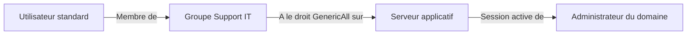

## Introduction

Une fois un premier pied posé dans le domaine (même avec un compte utilisateur standard, sans privilège particulier), l'énumération est l'étape qui transforme cet accès limité en une carte exploitable. Ce chapitre couvre les outils et méthodes d'énumération AD les plus utilisés en pentest interne.

## Énumération manuelle via LDAP

<Steps steps={[
  { title: "Lister les utilisateurs du domaine", description: "Interroger l'annuaire pour obtenir la liste complète des comptes utilisateurs et leurs attributs." },
  { title: "Identifier les groupes à privilèges", description: "Repérer les membres de 'Admins du domaine', 'Opérateurs de sauvegarde', 'Administrateurs de l'entreprise'." },
  { title: "Repérer les comptes avec SPN (service accounts)", description: "Ces comptes sont les cibles du Kerberoasting, étudié au chapitre 3." },
  { title: "Identifier les délégations Kerberos configurées", description: "Une délégation non contrainte mal configurée est un vecteur d'attaque majeur, vu au chapitre 6." },
]} />

```bash
# Depuis un poste Windows du domaine (PowerShell natif, sans outil externe)
net user /domain
net group "Domain Admins" /domain
```

<TipCallout>
L'énumération "living off the land" (avec les outils natifs Windows comme `net`, `nltest`, ou les cmdlets ActiveDirectory PowerShell) laisse beaucoup moins de traces qu'un outil externe téléchargé — un réflexe à privilégier en test d'intrusion discret.
</TipCallout>

## BloodHound — cartographier les chemins d'attaque

BloodHound collecte les relations entre objets AD (appartenance à des groupes, droits délégués, sessions actives) et les représente sous forme de graphe, révélant des chemins d'attaque invisibles à l'œil nu dans une simple liste d'utilisateurs.



<CehCallout>
Ce graphe illustre un chemin d'attaque classique révélé par BloodHound : un simple utilisateur, membre d'un groupe support disposant de droits excessifs (GenericAll) sur un serveur où une session administrateur est active, peut in fine atteindre les privilèges du domaine — sans qu'aucune étape individuelle ne semble "critique" isolément.
</CehCallout>

<Steps steps={[
  { title: "Collecte des données", description: "Un collecteur (SharpHound) interroge le domaine et exporte les relations sous forme de fichiers JSON." },
  { title: "Import dans BloodHound", description: "Les données sont chargées dans la base graphe de l'outil pour analyse." },
  { title: "Recherche de chemins", description: "BloodHound propose des requêtes prêtes à l'emploi : 'chemin le plus court vers Admins du domaine', 'utilisateurs Kerberoastables', etc." },
]} />

<WarningCallout>
L'exécution de SharpHound génère un volume important de requêtes LDAP et de connexions, potentiellement détectable par un SOC bien instrumenté — en test d'intrusion réel, la vitesse et l'ampleur de la collecte doivent être ajustées au niveau de discrétion attendu par le client.
</WarningCallout>

## PowerView — énumération offensive en PowerShell

<CompareTable
  titleA="Commande PowerView"
  titleB="Ce qu'elle révèle"
  rows={[
    { a: "Get-DomainUser -SPN", b: "Comptes utilisateurs avec un SPN (cibles Kerberoasting)" },
    { a: "Get-DomainGroupMember 'Domain Admins'", b: "Membres du groupe le plus privilégié du domaine" },
    { a: "Get-DomainComputer", b: "Liste des postes et serveurs joints au domaine" },
    { a: "Find-DomainShare", b: "Partages réseau accessibles, parfois mal restreints" },
]}
/>

## Lab — Mise en Pratique

**Environnement** : Réflexion guidée + Kali Linux (terminal Nyx Shell)

<Steps steps={[
  { title: "Identifier une cible prioritaire", description: "Après une énumération, tu identifies un compte de service avec un SPN, membre du groupe 'Opérateurs de sauvegarde'. Pourquoi ce compte est-il une cible plus intéressante qu'un compte utilisateur standard ?" },
  { title: "Interpréter un chemin BloodHound", description: "Un graphe BloodHound montre qu'un utilisateur standard a un droit 'WriteDacl' sur l'objet d'un groupe à privilèges. Que permettrait ce droit à un attaquant, en une phrase ?" },
]} />

## En résumé

- L'énumération transforme un accès limité en une carte exploitable du domaine — comptes, groupes, délégations, SPN.
- BloodHound révèle des chemins d'attaque qui ne seraient pas visibles en examinant les objets un par un.
- L'énumération "living off the land" et le réglage de la vitesse de collecte réduisent la détectabilité en test réel.

## Questions de Révision

1. Pourquoi l'énumération avec des outils natifs Windows est-elle généralement plus discrète qu'avec un outil externe ?
2. Que révèle un graphe BloodHound qu'une simple liste d'utilisateurs et de groupes ne révèle pas ?
3. Pourquoi un compte de service avec un SPN constitue-t-il une cible d'énumération particulièrement intéressante ?
