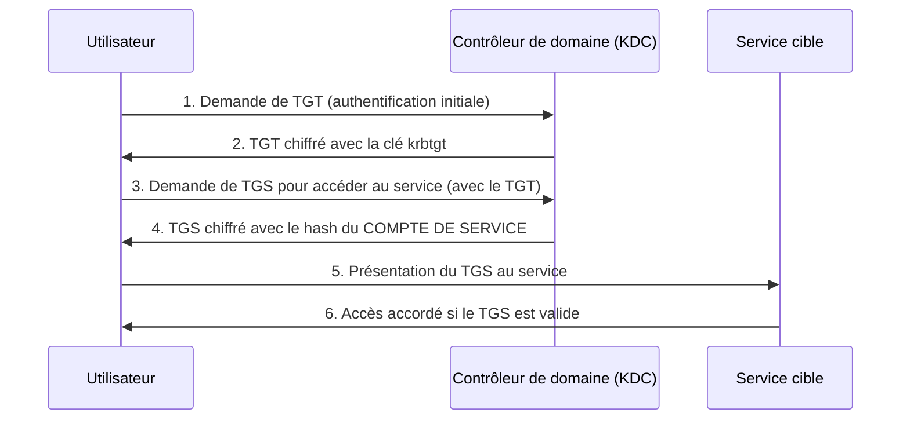

## Introduction

Kerberos est le protocole d'authentification par défaut d'Active Directory depuis Windows 2000 — sa conception, robuste sur le papier, dissimule deux faiblesses structurelles massivement exploitées en pentest interne : le Kerberoasting et l'AS-REP Roasting, tous deux abordés dans ce chapitre.

## Le fonctionnement de Kerberos, simplifié

<TipCallout>
L'étape clé à retenir : le TGS (ticket de service) est chiffré avec le hash du mot de passe du compte de service, pas avec une clé partagée aléatoire — c'est précisément ce détail qui rend le Kerberoasting possible.
</TipCallout>

## Kerberoasting — exploiter les comptes de service

<CehCallout>
N'importe quel utilisateur authentifié du domaine, même sans aucun privilège particulier, peut demander un TGS pour n'importe quel compte disposant d'un SPN (Service Principal Name) — et ce TGS est chiffré avec le hash du mot de passe du compte de service, qu'il devient alors possible de craquer hors ligne, sans aucune interaction supplémentaire avec le domaine.
</CehCallout>

<Steps steps={[
  { title: "Identifier les comptes avec SPN", description: "Énumérer les comptes de service (vu au chapitre 2)." },
  { title: "Demander les tickets TGS", description: "Demander un ticket de service pour chacun des comptes identifiés." },
  { title: "Extraire le hash", description: "Le ticket TGS contient une portion chiffrée avec le hash du mot de passe du compte de service, extractible hors ligne." },
  { title: "Craquer le hash hors ligne", description: "Attaque par dictionnaire ou brute-force sur le hash extrait, sans générer d'alerte supplémentaire côté domaine." },
]} />

<WarningCallout>
Les comptes de service ont historiquement des mots de passe rarement changés (parfois jamais depuis leur création) et souvent plus faibles que ceux des comptes utilisateurs, car "personne ne les tape au clavier" — cette croyance est précisément ce qui rend le Kerberoasting redoutablement efficace en pratique.
</WarningCallout>

## AS-REP Roasting — l'autre faiblesse Kerberos

<CompareTable
  titleA="Kerberoasting"
  titleB="AS-REP Roasting"
  rows={[
    { a: "Cible les comptes de service (avec SPN)", b: "Cible les comptes avec la pré-authentification Kerberos désactivée" },
    { a: "Nécessite un compte authentifié pour demander le TGS", b: "Ne nécessite AUCUNE authentification préalable" },
    { a: "Exploite le chiffrement du ticket de service (TGS)", b: "Exploite l'absence de vérification avant l'émission du TGT" },
]}
/>

<CehCallout>
La pré-authentification Kerberos est activée par défaut — un compte l'ayant désactivée (souvent par erreur de configuration ou pour compatibilité avec une application ancienne) permet à quiconque de demander directement une réponse AS-REP chiffrée avec le hash du mot de passe de ce compte, sans même connaître un identifiant valide au préalable au sens strict de l'authentification.
</CehCallout>

## Se protéger contre ces deux attaques

<Steps steps={[
  { title: "Mots de passe longs et complexes pour les comptes de service", description: "25+ caractères aléatoires rendent le craquage hors ligne impraticable, même avec un GPU puissant." },
  { title: "Rotation régulière des mots de passe de service", description: "Réduit la fenêtre d'exploitation même si un hash est extrait." },
  { title: "Utiliser des comptes de service gérés (gMSA)", description: "Mots de passe générés et changés automatiquement par AD, jamais manipulés manuellement." },
  { title: "Ne jamais désactiver la pré-authentification sans raison impérieuse", description: "Vérifier régulièrement qu'aucun compte ne l'a désactivée par erreur ou héritage historique." },
]} />

## Lab — Mise en Pratique

**Environnement** : Kali Linux (terminal Nyx Shell) — cible : contrôleur de domaine du lab AD

<Steps steps={[
  { title: "Identifier les comptes Kerberoastables", description: "Énumère les comptes du domaine disposant d'un SPN." },
  { title: "Demander et extraire un ticket TGS", description: "Demande un TGS pour un compte de service identifié et extrait sa portion chiffrée." },
  { title: "Craquer le hash hors ligne", description: "Tente de craquer le hash extrait avec une wordlist.", code: 'hashcat -m 13100 tgs_hash.txt /usr/share/wordlists/rockyou.txt' },
]} />

## En résumé

- Le TGS Kerberos est chiffré avec le hash du compte de service — c'est ce qui rend le Kerberoasting possible pour tout utilisateur authentifié du domaine.
- L'AS-REP Roasting exploite les comptes ayant désactivé la pré-authentification Kerberos, sans nécessiter aucune authentification préalable.
- Des mots de passe de service longs, une rotation régulière et l'usage de comptes gérés (gMSA) neutralisent l'essentiel du risque.

## Questions de Révision

1. Pourquoi n'importe quel utilisateur authentifié du domaine peut-il réaliser un Kerberoasting sans privilège particulier ?
2. Quelle configuration spécifique rend un compte vulnérable à l'AS-REP Roasting ?
3. Pourquoi un compte de service géré (gMSA) élimine-t-il pratiquement le risque de Kerberoasting ?
