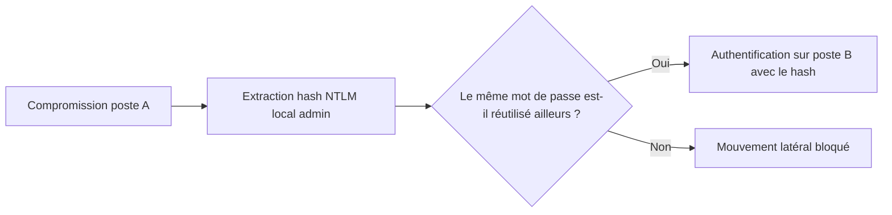

## Introduction

Une fois des identifiants ou des tickets obtenus sur une machine (via Kerberoasting, dump mémoire ou toute autre technique), le mouvement latéral consiste à réutiliser ce matériel d'authentification pour accéder à d'autres machines du domaine, sans jamais avoir besoin du mot de passe en clair.

## Pass-the-Hash — réutiliser un hash NTLM sans le craquer

<CehCallout>
Le principe du Pass-the-Hash tient en une phrase : Windows accepte un hash NTLM directement comme preuve d'authentification, sans nécessiter de le déchiffrer d'abord — un attaquant disposant du hash d'un compte peut donc s'authentifier partout où ce compte a des droits, sans jamais connaître le mot de passe réel.
</CehCallout>

<WarningCallout>
La réutilisation du même mot de passe administrateur local sur plusieurs machines d'un parc (une pratique historiquement très répandue pour simplifier la gestion) transforme la compromission d'une seule machine en un accès potentiel à l'ensemble du parc via Pass-the-Hash — c'est l'une des mauvaises configurations les plus fréquemment exploitées en pentest interne.
</WarningCallout>

## Pass-the-Ticket — réutiliser un ticket Kerberos

<CompareTable
  titleA="Pass-the-Hash"
  titleB="Pass-the-Ticket"
  rows={[
    { a: "Réutilise un hash NTLM", b: "Réutilise un ticket Kerberos (TGT ou TGS) déjà émis" },
    { a: "Fonctionne tant que le mot de passe n'est pas changé", b: "Le ticket a une durée de vie limitée (généralement 10h par défaut)" },
    { a: "S'authentifie via le protocole NTLM", b: "S'authentifie via le protocole Kerberos, souvent moins surveillé" },
]}
/>

<TipCallout>
Un ticket TGT volé permet potentiellement de générer de nouveaux TGS pour n'importe quel service accessible par le compte compromis, tant que le ticket original n'a pas expiré — d'où l'intérêt, côté défense, de réduire la durée de vie par défaut des tickets sur les comptes les plus sensibles.
</TipCallout>

## Exécution distante — comment l'attaquant agit sur la machine cible

<Steps steps={[
  { title: "WinRM (Windows Remote Management)", description: "Protocole d'administration distante légitime, souvent disponible par défaut — une session PowerShell distante s'ouvre avec des identifiants valides ou un hash réutilisé." },
  { title: "PsExec", description: "Outil historique de Sysinternals permettant l'exécution de commandes à distance via le partage administratif ADMIN$." },
  { title: "WMI (Windows Management Instrumentation)", description: "Permet l'exécution de commandes à distance, souvent moins surveillé que PsExec car largement utilisé pour l'administration légitime." },
]} />

<CehCallout>
Ces trois techniques sont des outils d'administration LÉGITIMES détournés à des fins offensives — c'est précisément ce qui les rend difficiles à distinguer d'une activité normale pour un SOC mal réglé, et pourquoi la corrélation d'événements (cours Analyse SOC) est essentielle pour les détecter.
</CehCallout>

## Se défendre contre le mouvement latéral

<Steps steps={[
  { title: "Mots de passe administrateur locaux uniques (LAPS)", description: "Local Administrator Password Solution génère un mot de passe unique et aléatoire par machine, neutralisant le Pass-the-Hash à grande échelle." },
  { title: "Segmentation et modèle de tiering", description: "Séparer les postes utilisateurs, serveurs et contrôleurs de domaine en niveaux d'administration distincts (approfondi au chapitre 8)." },
  { title: "Surveillance des connexions administratives inhabituelles", description: "Une session WinRM ou WMI depuis un poste qui n'en a jamais initié auparavant est un signal fort à investiguer." },
]} />

## Lab — Mise en Pratique

**Environnement** : Réflexion guidée (sans terminal)

<Steps steps={[
  { title: "Identifier un risque de Pass-the-Hash", description: "Une entreprise déploie le même mot de passe administrateur local sur 200 postes via une image système standard. Quel est le risque concret si un seul poste est compromis ?" },
  { title: "Proposer une contre-mesure", description: "Quelle solution Microsoft neutralise spécifiquement ce risque de mot de passe administrateur local partagé, et comment fonctionne-t-elle en une phrase ?" },
]} />

## En résumé

- Le Pass-the-Hash exploite l'acceptation directe d'un hash NTLM par Windows comme preuve d'authentification, sans avoir besoin du mot de passe en clair.
- Le Pass-the-Ticket réutilise un ticket Kerberos déjà émis, avec une fenêtre d'exploitation limitée par sa durée de vie.
- WinRM, PsExec et WMI sont des outils d'administration légitimes détournés pour l'exécution distante, ce qui les rend difficiles à distinguer d'une activité normale.
- LAPS neutralise le Pass-the-Hash à grande échelle en garantissant un mot de passe administrateur local unique par machine.

## Questions de Révision

1. Pourquoi le Pass-the-Hash ne nécessite-t-il jamais de connaître le mot de passe en clair d'un compte ?
2. Qu'est-ce qui limite dans le temps l'exploitabilité d'un Pass-the-Ticket, contrairement au Pass-the-Hash ?
3. Comment LAPS neutralise-t-il le risque de Pass-the-Hash à grande échelle sur un parc de machines ?
