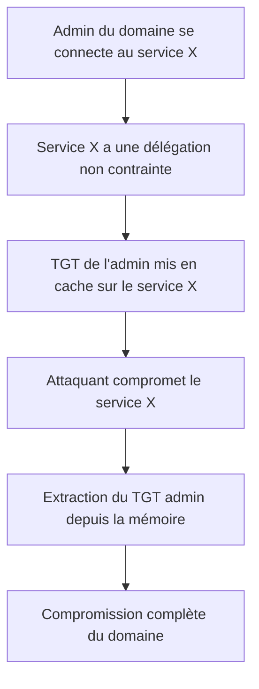

## Introduction

Ce chapitre approfondit deux vecteurs d'attaque avancés, plus subtils que le Kerberoasting ou le Pass-the-Hash, mais tout aussi redoutables une fois identifiés via BloodHound (chapitre 2) : l'abus de délégation Kerberos et l'abus de GPO. Ce sont typiquement les vecteurs recherchés dans les certifications CRTP/CRTE.

## Les trois types de délégation Kerberos

<CompareTable
  titleA="Type de délégation"
  titleB="Risque"
  rows={[
    { a: "Délégation non contrainte (unconstrained)", b: "Le service peut réutiliser le TGT de TOUT utilisateur qui s'y connecte — le compromettre expose potentiellement le TGT d'un administrateur du domaine" },
    { a: "Délégation contrainte (constrained)", b: "Le service ne peut usurper l'identité d'un utilisateur QUE vers des services spécifiques listés — risque réduit mais toujours abusable si mal ciblé" },
    { a: "Délégation contrainte basée sur les ressources (RBCD)", b: "Configurable par le propriétaire de l'objet cible lui-même — un attaquant disposant de droits d'écriture sur un objet ordinateur peut potentiellement s'auto-déléguer un accès" },
]}
/>

<CehCallout>
La délégation non contrainte est le cas le plus dangereux : si un administrateur du domaine se connecte, même une seule fois, à un service disposant de ce type de délégation, son TGT reste en mémoire sur ce serveur et devient récupérable — compromettre ce serveur, même s'il ne semble pas critique, peut suffire à compromettre tout le domaine.
</CehCallout>

## Les droits ACL dangereux sur les objets AD

Chaque objet AD (utilisateur, groupe, ordinateur, GPO) porte une liste de contrôle d'accès (ACL) définissant qui peut le lire, le modifier, ou agir en son nom. Certains droits, mal attribués, ouvrent des chemins d'attaque directs.

<CompareTable
  titleA="Droit ACL"
  titleB="Ce qu'il permet à un attaquant"
  rows={[
    { a: "GenericAll", b: "Contrôle total de l'objet — y compris réinitialiser le mot de passe d'un utilisateur cible" },
    { a: "GenericWrite", b: "Modifier des attributs de l'objet, parfois suffisant pour forcer une authentification ou modifier un script de connexion" },
    { a: "WriteDacl", b: "Modifier les permissions elles-mêmes de l'objet — permet de s'auto-accorder GenericAll ensuite" },
    { a: "ForceChangePassword", b: "Réinitialiser le mot de passe d'un utilisateur cible sans connaître l'ancien" },
]}
/>

<WarningCallout>
Ces droits sont souvent accordés par commodité opérationnelle (une équipe support ayant besoin de réinitialiser des mots de passe reçoit ForceChangePassword sur l'ensemble d'une OU) sans que personne ne vérifie ensuite si un utilisateur à privilèges élevés se trouve dans le périmètre concerné — c'est exactement ce que BloodHound révèle en reliant droits ACL et appartenance aux groupes sensibles.
</WarningCallout>

## L'abus de GPO comme vecteur de compromission

<Steps steps={[
  { title: "Identifier une GPO modifiable", description: "Un attaquant disposant de droits d'écriture sur une GPO appliquée à une OU contenant des postes ou serveurs sensibles." },
  { title: "Injecter une tâche planifiée ou un script", description: "La GPO peut déployer une tâche planifiée exécutant un payload au prochain rafraîchissement de politique sur les machines concernées." },
  { title: "Attendre l'exécution automatique", description: "Le rafraîchissement périodique des GPO (par défaut toutes les 90-120 minutes) déclenche l'exécution sans action supplémentaire de l'attaquant." },
]} />

<CehCallout>
Contrairement au Kerberoasting qui nécessite de craquer un hash hors ligne, l'abus de GPO donne un contrôle direct et quasi immédiat sur toutes les machines couvertes par la GPO compromise — c'est l'un des vecteurs les plus puissants une fois qu'un accès en écriture est obtenu, mais aussi l'un des plus rares à trouver en pratique.
</CehCallout>

## Se défendre contre ces vecteurs

<Steps steps={[
  { title: "Auditer les délégations non contraintes", description: "Les éliminer ou les remplacer par des délégations contraintes chaque fois que possible." },
  { title: "Revoir régulièrement les ACL sur les objets sensibles", description: "Avec BloodHound utilisé en mode défensif, pour détecter les chemins d'attaque avant qu'un attaquant ne les découvre." },
  { title: "Restreindre les droits de modification des GPO", description: "Seul un groupe restreint et surveillé doit pouvoir modifier les GPO appliquées à des OU sensibles." },
]} />

## Lab — Mise en Pratique

**Environnement** : Réflexion guidée (sans terminal)

<Steps steps={[
  { title: "Évaluer un risque de délégation", description: "Un serveur d'impression dispose d'une délégation Kerberos non contrainte. Un administrateur du domaine imprime occasionnellement depuis ce serveur. Explique le risque exact que cela représente." },
  { title: "Identifier un chemin d'attaque ACL", description: "Un utilisateur standard dispose du droit GenericWrite sur le compte d'un administrateur du domaine. Que peut potentiellement faire un attaquant contrôlant ce compte utilisateur ?" },
]} />

## En résumé

- La délégation non contrainte est le vecteur de délégation le plus dangereux : elle expose le TGT de tout utilisateur s'y connectant, y compris un administrateur du domaine.
- Des droits ACL comme GenericAll, GenericWrite, WriteDacl ou ForceChangePassword, mal attribués, ouvrent des chemins d'attaque directs révélés par BloodHound.
- L'abus de GPO donne un contrôle quasi immédiat sur toutes les machines couvertes, via le mécanisme normal de rafraîchissement des politiques.

## Questions de Révision

1. Pourquoi la délégation Kerberos non contrainte est-elle considérée comme la plus dangereuse des trois types de délégation ?
2. Que permet le droit ACL "WriteDacl" qu'un simple "GenericWrite" ne permet pas ?
3. Pourquoi l'abus de GPO est-il considéré comme l'un des vecteurs les plus puissants, bien que rare en pratique ?
