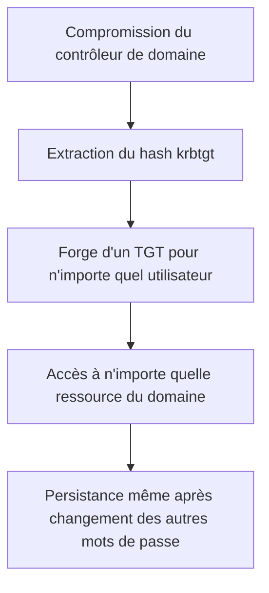

## Introduction

Une fois le domaine compromis (contrôle du contrôleur de domaine obtenu, même temporairement), un attaquant cherche généralement à établir une persistance durable — un accès qui survit même si les mots de passe des comptes initialement compromis sont changés. Ce chapitre couvre les trois techniques de persistance AD les plus documentées.

## Le compte krbtgt — la clé de voûte de Kerberos

<CehCallout>
Le compte krbtgt est un compte système spécial dont le hash de mot de passe sert à chiffrer TOUS les TGT émis par le domaine — un attaquant qui obtient ce hash peut forger lui-même des TGT valides pour n'importe quel utilisateur, y compris des comptes qui n'existent même pas, sans jamais interagir avec le contrôleur de domaine pour les authentifier.
</CehCallout>

## Golden Ticket — forger un TGT

<WarningCallout>
Un Golden Ticket forgé avec le hash krbtgt reste valide même après un changement de mot de passe de TOUS les comptes utilisateurs du domaine — seule la rotation du mot de passe krbtgt lui-même (à faire DEUX fois de suite, car AD conserve l'ancien et le nouveau hash) invalide réellement les Golden Tickets déjà émis.
</WarningCallout>

## Silver Ticket — une persistance plus ciblée et plus discrète

<CompareTable
  titleA="Golden Ticket"
  titleB="Silver Ticket"
  rows={[
    { a: "Forgé avec le hash du compte krbtgt", b: "Forgé avec le hash d'un compte de SERVICE spécifique" },
    { a: "Donne accès à TOUT service du domaine", b: "Donne accès uniquement au service dont le hash a été utilisé" },
    { a: "Nécessite d'avoir compromis le contrôleur de domaine", b: "Nécessite seulement d'avoir compromis le compte de service ciblé" },
    { a: "Plus facilement détectable (validé par le KDC)", b: "Plus discret — le service cible ne valide pas toujours le ticket auprès du KDC" },
]}
/>

<CehCallout>
Le Silver Ticket est souvent plus discret que le Golden Ticket précisément parce que le service cible fait généralement confiance au ticket présenté sans le revalider systématiquement auprès du contrôleur de domaine — ce qui réduit la trace laissée dans les journaux du KDC.
</CehCallout>

## DCSync — se faire passer pour un contrôleur de domaine

<Steps steps={[
  { title: "Principe", description: "DCSync exploite le protocole de réplication AD (utilisé normalement entre contrôleurs de domaine légitimes) pour demander la synchronisation des hashes de mots de passe de n'importe quel compte, y compris krbtgt." },
  { title: "Condition d'exploitation", description: "Nécessite que le compte utilisé dispose des droits de réplication (Replicating Directory Changes) — normalement réservés aux contrôleurs de domaine et à un nombre restreint de comptes à privilèges." },
  { title: "Résultat", description: "Extraction directe des hashes de mots de passe sans jamais toucher physiquement au contrôleur de domaine ni y exécuter de code." },
]} />

<WarningCallout>
DCSync ne nécessite aucun accès direct (RDP, exécution de commande) au contrôleur de domaine lui-même — seulement un compte disposant des droits de réplication, ce qui en fait une technique particulièrement discrète et difficile à détecter sans surveillance spécifique des événements de réplication AD.
</WarningCallout>

## Détecter et se défendre

<Steps steps={[
  { title: "Surveiller les événements de réplication anormaux", description: "Une demande de réplication provenant d'un compte qui n'est pas un contrôleur de domaine légitime est un signal fort de DCSync." },
  { title: "Faire tourner le mot de passe krbtgt régulièrement (double rotation)", description: "Neutralise les Golden Tickets forgés précédemment." },
  { title: "Limiter strictement les droits de réplication", description: "Seuls les contrôleurs de domaine eux-mêmes devraient normalement disposer de ces droits." },
  { title: "Surveiller les tickets à durée de vie anormale", description: "Un Golden Ticket forgé peut avoir une durée de vie bien supérieure à la politique Kerberos normale du domaine — un indicateur de compromission classique." },
]} />

## Lab — Mise en Pratique

**Environnement** : Réflexion guidée (sans terminal)

<Steps steps={[
  { title: "Expliquer la persistance du Golden Ticket", description: "Pourquoi un Golden Ticket reste-t-il valide même après que TOUS les mots de passe utilisateurs du domaine ont été changés, et quelle est la seule action qui l'invalide réellement ?" },
  { title: "Comparer Golden et Silver Ticket", description: "Pourquoi un Silver Ticket est-il souvent plus discret qu'un Golden Ticket, malgré un accès plus limité ?" },
]} />

## En résumé

- Le compte krbtgt chiffre tous les TGT du domaine — son hash compromis permet de forger un Golden Ticket valide pour n'importe quel utilisateur.
- Le Silver Ticket, forgé avec le hash d'un compte de service, offre un accès plus limité mais souvent plus discret.
- DCSync exploite le protocole de réplication AD pour extraire des hashes sans jamais toucher directement au contrôleur de domaine.
- Seule la double rotation du mot de passe krbtgt invalide réellement les Golden Tickets déjà forgés.

## Questions de Révision

1. Pourquoi faut-il changer le mot de passe krbtgt DEUX fois de suite pour invalider un Golden Ticket ?
2. Quelle condition précise permet à un attaquant de réaliser une attaque DCSync ?
3. Donne un indicateur de compromission classique permettant de détecter l'usage d'un Golden Ticket forgé.
