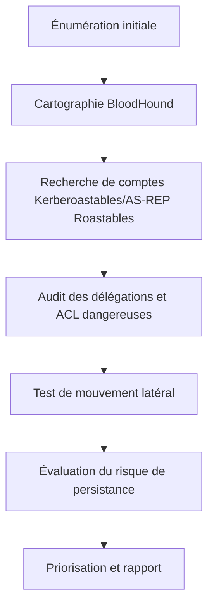
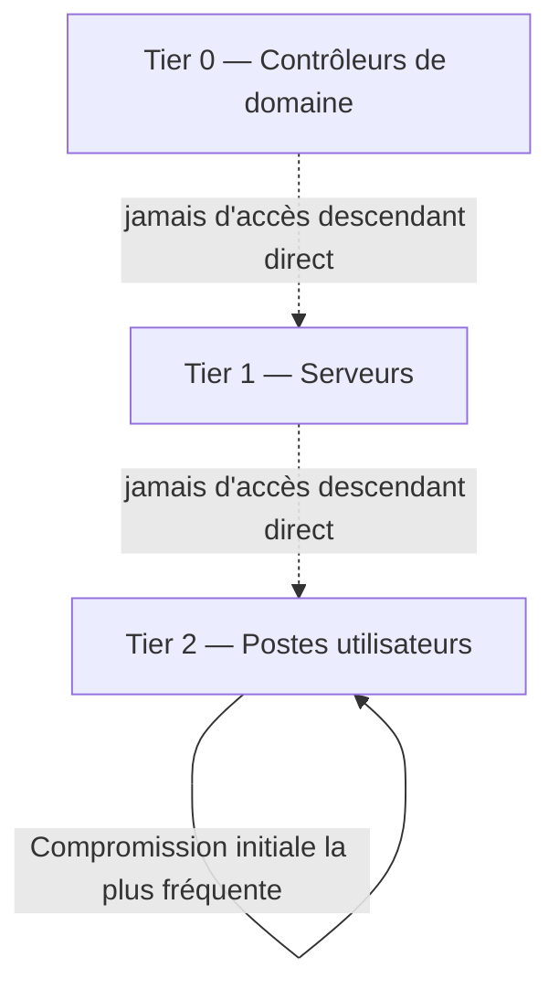

## Introduction

Ce dernier chapitre referme le cours en réunissant les vecteurs vus précédemment (Kerberoasting, mouvement latéral, délégation, persistance) dans une méthodologie d'audit structurée, puis en présentant le modèle de défense en profondeur le plus recommandé pour AD : le modèle de tiering.

## Méthodologie d'audit Active Directory complète

<CompareTable
  titleA="Phase"
  titleB="Chapitres de ce cours associés"
  rows={[
    { a: "Énumération et cartographie", b: "Chapitre 2" },
    { a: "Attaques Kerberos", b: "Chapitre 3" },
    { a: "Mouvement latéral et élévation locale", b: "Chapitres 4 et 5" },
    { a: "Délégation et ACL", b: "Chapitre 6" },
    { a: "Persistance", b: "Chapitre 7" },
]}
/>

<TipCallout>
Cette méthodologie complète, une fois les vulnérabilités documentées, s'appuie directement sur les compétences du cours Rédaction de Rapports pour produire un livrable exploitable par l'équipe d'administration système du client.
</TipCallout>

## Le modèle de tiering — la référence en défense AD

Le modèle de tiering (popularisé par Microsoft) segmente les comptes et systèmes en niveaux hermétiques, empêchant qu'une compromission d'un niveau inférieur ne remonte vers un niveau supérieur.

<CompareTable
  titleA="Niveau"
  titleB="Contenu"
  rows={[
    { a: "Tier 0", b: "Contrôleurs de domaine, comptes Admins du domaine/de l'entreprise — le contrôle total du domaine" },
    { a: "Tier 1", b: "Serveurs applicatifs et leurs administrateurs — comptes ne devant JAMAIS se connecter à un poste Tier 2" },
    { a: "Tier 2", b: "Postes de travail utilisateurs — le niveau le plus exposé, mais aussi le plus isolé du reste" },
]}
/>

<CehCallout>
La règle d'or du tiering : un compte à privilèges d'un niveau donné (ex: administrateur Tier 1) ne doit JAMAIS se connecter à une machine d'un niveau inférieur (Tier 2) — c'est précisément cette violation (un admin Tier 1 qui dépanne un poste utilisateur avec son compte à privilèges) qui permet le Pass-the-Hash et le mouvement latéral étudiés au chapitre 4.
</CehCallout>

## Prioriser le durcissement selon l'impact réel

<Steps steps={[
  { title: "Éliminer les délégations non contraintes", description: "Impact maximal pour un effort de configuration généralement faible (chapitre 6)." },
  { title: "Déployer LAPS sur l'ensemble du parc", description: "Neutralise le Pass-the-Hash à grande échelle (chapitre 4)." },
  { title: "Renforcer les mots de passe des comptes de service", description: "Neutralise le Kerberoasting (chapitre 3)." },
  { title: "Appliquer strictement le modèle de tiering", description: "Le changement le plus structurant, mais aussi le plus coûteux organisationnellement — souvent un projet à part entière." },
  { title: "Auditer et nettoyer les ACL dangereuses", description: "Nécessite un passage régulier avec BloodHound en mode défensif, pas une action ponctuelle unique." },
]} />

<WarningCallout>
Le modèle de tiering, bien que la mesure la plus structurante contre le mouvement latéral et le Pass-the-Hash, est aussi la plus difficile à déployer dans une organisation déjà mature, car il implique souvent de revoir des habitudes d'administration ancrées depuis des années — un audit réaliste doit donc le recommander, sans pour autant négliger les mesures à impact immédiat (LAPS, rotation krbtgt) qui peuvent être déployées bien plus rapidement.
</WarningCallout>

## Lab — Mise en Pratique

**Environnement** : Réflexion guidée (sans terminal)

<Steps steps={[
  { title: "Identifier une violation de tiering", description: "Un administrateur Tier 1 se connecte régulièrement avec son compte à privilèges sur des postes utilisateurs pour du support technique. Quelle règle de tiering est violée, et quel risque concret cela ouvre-t-il ?" },
  { title: "Prioriser un plan de durcissement", description: "Pour un audit ayant révélé une délégation non contrainte, des mots de passe de service faibles, et l'absence de LAPS, propose un ordre de priorité de correction et justifie-le en une phrase par mesure." },
]} />

## En résumé

- Une méthodologie d'audit AD complète enchaîne énumération, cartographie, recherche de vecteurs Kerberos, audit des délégations/ACL, test de mouvement latéral et évaluation du risque de persistance.
- Le modèle de tiering (Tier 0/1/2) segmente comptes et systèmes pour empêcher qu'une compromission remonte vers le niveau le plus critique.
- La priorisation du durcissement doit équilibrer mesures à impact immédiat (LAPS, rotation krbtgt) et mesures structurantes mais coûteuses (tiering complet).

## Questions de Révision

1. Quelle règle fondamentale du modèle de tiering, si violée, permet directement le Pass-the-Hash entre niveaux ?
2. Pourquoi le déploiement complet du modèle de tiering est-il souvent plus difficile qu'une mesure comme LAPS, bien que plus structurant ?
3. Cite les six phases d'une méthodologie d'audit Active Directory complète, dans l'ordre.

Félicitations, tu viens de terminer le cours **Active Directory & Windows** ! Ces compétences sont directement alignées sur les certifications CRTP et CRTE — direction le cours Cybersécurité Offensive pour intégrer AD dans un parcours de pentest complet, ou vers Forensics & DFIR pour apprendre à investiguer ces mêmes attaques après coup.
