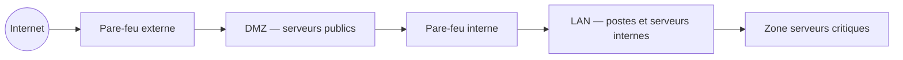

## Introduction

Avant d'attaquer ou de défendre un système d'information, il faut comprendre comment il est construit — ce cours adopte le point de vue de celui qui le fait fonctionner au quotidien : l'administrateur système et réseau. Ce premier chapitre pose la carte d'ensemble d'un SI d'entreprise typique, socle indispensable pour situer ensuite chaque compétence technique du cours.

## Les briques constitutives d'un SI d'entreprise

<CompareTable
  titleA="Brique"
  titleB="Rôle typique"
  rows={[
    { a: "Annuaire (Active Directory / LDAP)", b: "Authentification centralisée, gestion des identités et des droits" },
    { a: "Serveurs applicatifs et de fichiers", b: "Hébergement des applications métier, partage de documents" },
    { a: "Infrastructure réseau (switches, routeurs, pare-feu)", b: "Interconnexion et segmentation des différentes zones" },
    { a: "Postes de travail et périphériques", b: "Points d'accès utilisateurs — souvent le maillon le plus exposé" },
    { a: "Supervision et sauvegarde", b: "Continuité de service et capacité de restauration en cas d'incident" },
]}
/>

<TipCallout>
Chacune de ces briques sera approfondie dans un chapitre dédié de ce cours : Active Directory au chapitre 2, Linux au chapitre 3, virtualisation au chapitre 4, sauvegarde au chapitre 5, supervision au chapitre 6, gestion des identités au chapitre 7.
</TipCallout>

## Le zonage réseau — segmenter pour limiter la casse

<Steps steps={[
  { title: "DMZ (zone démilitarisée)", description: "Héberge les services exposés à Internet (serveur web public, relais mail) — isolée du reste du réseau interne." },
  { title: "LAN (réseau interne)", description: "Postes de travail, imprimantes, services internes — accès restreint depuis l'extérieur." },
  { title: "Zone serveurs critiques", description: "Bases de données, contrôleurs de domaine — accès le plus restreint, souvent un VLAN dédié." },
  { title: "Environnements séparés", description: "Production, pré-production, développement — jamais interconnectés directement, pour éviter qu'un test ne perturbe la production." },
]} />

<CehCallout>
Un attaquant qui compromet un serveur web en DMZ ne doit, si le zonage est correctement configuré, disposer d'aucun accès direct vers la zone serveurs critiques — le franchissement de cette frontière (mouvement latéral) est précisément ce qu'étudie le cours Active Directory & Windows.
</CehCallout>

## L'administrateur système/réseau et la sécurité — un même métier, deux réflexes

<WarningCallout>
Une erreur de perception fréquente : penser que "la sécurité" est le travail d'une équipe séparée de "l'administration système". En pratique, la majorité des vulnérabilités exploitées en entreprise (mots de passe par défaut, correctifs non appliqués, comptes de service surprivilégiés) relèvent directement de décisions d'administration quotidienne, pas d'attaques sophistiquées.
</WarningCallout>

<CompareTable
  titleA="Réflexe d'exploitation (faire fonctionner)"
  titleB="Réflexe de sécurisation (limiter le risque)"
  rows={[
    { a: "Ouvrir un port pour qu'un service fonctionne", b: "Restreindre ce port à la plage IP strictement nécessaire" },
    { a: "Créer un compte de service pour une application", b: "Lui accorder uniquement les droits minimaux requis (moindre privilège)" },
    { a: "Reporter une mise à jour pour éviter une interruption", b: "Planifier une fenêtre de maintenance régulière pour appliquer les correctifs" },
]}
/>

## Lab — Mise en Pratique

**Environnement** : Réflexion guidée (sans terminal)

<Steps steps={[
  { title: "Zoner un SI simplifié", description: "Pour un site e-commerce (serveur web public, base de données clients, poste des développeurs), propose un zonage réseau en 3 zones et justifie l'emplacement de chaque élément." },
  { title: "Identifier un réflexe manquant", description: "Un administrateur crée un compte de service avec des droits d'administrateur du domaine pour une application qui n'a besoin que de lire un dossier partagé. Quel principe de sécurité est ignoré, et quel est le risque concret ?" },
]} />

## En résumé

- Un SI d'entreprise s'articule autour de l'annuaire, des serveurs, du réseau, des postes de travail, et de la supervision/sauvegarde.
- Le zonage réseau (DMZ, LAN, zone critique) limite la propagation d'une compromission d'une zone à l'autre.
- L'administration système et la sécurité ne sont pas deux métiers séparés : la majorité des vulnérabilités exploitées relèvent de décisions d'administration quotidienne.

## Questions de Révision

1. Pourquoi une DMZ est-elle isolée du reste du réseau interne plutôt que directement connectée au LAN ?
2. Cite trois briques constitutives d'un SI d'entreprise typique.
3. Donne un exemple de décision d'administration quotidienne qui, mal prise, crée une vulnérabilité exploitable.
