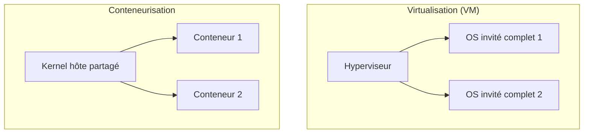

## Introduction

La virtualisation et la conteneurisation, souvent confondues par les débutants, répondent à des besoins différents et présentent des surfaces de risque distinctes. Ce chapitre les distingue clairement — les labs Nyx eux-mêmes reposent sur Docker, ce qui rend cette distinction directement concrète pour toi.

## Deux niveaux d'isolation très différents

<CompareTable
  titleA="Virtualisation (VM)"
  titleB="Conteneurisation (Docker)"
  rows={[
    { a: "Chaque VM embarque son propre noyau OS complet", b: "Les conteneurs partagent le noyau de la machine hôte" },
    { a: "Isolation forte, au niveau matériel virtualisé", b: "Isolation plus légère, au niveau du noyau (namespaces, cgroups)" },
    { a: "Démarrage en dizaines de secondes, empreinte lourde", b: "Démarrage en millisecondes, empreinte légère" },
    { a: "Adapté à l'isolation de charges hétérogènes/sensibles", b: "Adapté au déploiement rapide d'applications, microservices" },
]}
/>

<CehCallout>
C'est précisément parce que les conteneurs partagent le noyau de l'hôte que l'isolation Docker est plus fragile qu'une VM : une faille d'échappement de conteneur (container escape) donne potentiellement accès directement à l'hôte, alors qu'une faille d'échappement de VM (beaucoup plus rare) est nécessaire pour le même résultat en virtualisation classique.
</CehCallout>

## Sécuriser une infrastructure de conteneurs

<Steps steps={[
  { title: "Ne jamais lancer un conteneur en --privileged", description: "Ce mode désactive quasiment toute l'isolation de sécurité normalement apportée par les namespaces — à réserver à des cas très spécifiques et maîtrisés." },
  { title: "Limiter les ressources", description: "Toujours borner CPU et mémoire (comme le fait Nyx pour ses labs) pour éviter qu'un conteneur compromis ou buggé n'épuise les ressources de l'hôte." },
  { title: "Images minimalistes et vérifiées", description: "Préférer des images officielles ou 'distroless', réduisant la surface d'attaque par rapport à une image généraliste complète." },
  { title: "Ne jamais monter le socket Docker dans un conteneur non maîtrisé", description: "Un accès au socket Docker (/var/run/docker.sock) depuis l'intérieur d'un conteneur équivaut souvent à un accès root sur l'hôte." },
]} />

<WarningCallout>
Monter le socket Docker de l'hôte à l'intérieur d'un conteneur est une pratique fréquente pour des outils d'orchestration — mais un attaquant qui compromet ce conteneur peut alors créer, depuis l'intérieur, un nouveau conteneur privilégié montant le disque de l'hôte, ce qui revient à un accès root complet sur la machine physique.
</WarningCallout>

## Quand choisir quoi

<CompareTable
  titleA="Besoin"
  titleB="Choix recommandé"
  rows={[
    { a: "Isoler fortement des charges de sécurité sensibles (labs Nyx, environnements clients distincts)", b: "Virtualisation, ou conteneurs à l'intérieur de VM dédiées" },
    { a: "Déployer rapidement de nombreux microservices", b: "Conteneurisation (Docker/Kubernetes)" },
    { a: "Faire tourner plusieurs OS différents (Windows + Linux) sur un même hôte", b: "Virtualisation — un conteneur Linux ne peut pas faire tourner un noyau Windows" },
]}
/>

<TipCallout>
Nyx combine les deux niveaux dans ses labs : chaque session utilise des conteneurs Docker isolés par un réseau dédié, avec des limites de ressources strictes — un compromis pragmatique entre rapidité de déploiement et isolation raisonnable pour un usage pédagogique.
</TipCallout>

## Lab — Mise en Pratique

**Environnement** : Réflexion guidée (sans terminal)

<Steps steps={[
  { title: "Identifier un risque de configuration", description: "Un conteneur applicatif est lancé avec l'option --privileged et un montage du socket Docker de l'hôte. Quel scénario d'attaque cela ouvre-t-il en cas de compromission de l'application ?" },
  { title: "Choisir la bonne isolation", description: "Une entreprise veut proposer à ses clients des environnements de test totalement isolés les uns des autres, y compris au niveau noyau. Virtualisation ou conteneurisation seule ? Justifie." },
]} />

## En résumé

- La virtualisation isole au niveau matériel (chaque VM a son propre noyau), la conteneurisation au niveau du noyau partagé (namespaces, cgroups).
- Le partage du noyau rend un échappement de conteneur potentiellement plus dangereux qu'un échappement de VM.
- Le socket Docker et le mode --privileged sont deux points de configuration à protéger en priorité dans une infrastructure de conteneurs.

## Questions de Révision

1. Pourquoi une faille d'échappement de conteneur est-elle potentiellement plus dangereuse qu'une faille d'échappement de VM ?
2. Que risque-t-on à monter le socket Docker de l'hôte à l'intérieur d'un conteneur non maîtrisé ?
3. Dans quel cas la virtualisation reste-t-elle préférable à la conteneurisation seule ?
