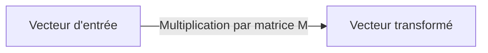

## Introduction

Ce chapitre change de perspective sur la matrice : plutôt qu'un simple tableau de nombres, une matrice peut être vue comme une fonction qui transforme un vecteur en un autre — une idée centrale pour comprendre le fonctionnement des réseaux de neurones, abordés au cours IA & Agents en Cybersécurité.

## Une matrice comme fonction

<CehCallout>
Multiplier un vecteur par une matrice produit un nouveau vecteur — c'est exactement la définition d'une fonction (une entrée, une sortie). On dit que la matrice réalise une "transformation linéaire" : elle respecte l'addition et la multiplication par un scalaire (transformer la somme de deux vecteurs équivaut à sommer leurs transformations respectives).
</CehCallout>

## Transformations géométriques courantes

<CompareTable
  titleA="Transformation"
  titleB="Effet sur un vecteur"
  rows={[
    { a: "Mise à l'échelle (scaling)", b: "Étire ou compresse le vecteur selon chaque axe" },
    { a: "Rotation", b: "Fait pivoter le vecteur d'un certain angle, sans changer sa longueur" },
    { a: "Projection", b: "Écrase le vecteur sur un axe ou un plan (perd de l'information)" },
    { a: "Cisaillement (shear)", b: "Incline l'espace, comme pousser le haut d'un livre pendant que le bas reste fixe" },
]}
/>

<TipCallout>
Chacune de ces transformations correspond à une matrice spécifique — une matrice de rotation de 90°, par exemple, a une forme mathématique bien définie et reconnaissable ([[0,-1],[1,0]] en 2D), ce qui permet de composer plusieurs transformations en multipliant simplement leurs matrices entre elles.
</TipCallout>

## Composer des transformations

<Steps steps={[
  { title: "Appliquer une première transformation", description: "Multiplier le vecteur par une première matrice A." },
  { title: "Appliquer une seconde transformation", description: "Multiplier le résultat par une seconde matrice B." },
  { title: "Équivalent à une seule transformation combinée", description: "Cette séquence équivaut exactement à multiplier le vecteur original par la matrice produit B × A (dans cet ordre précis)." },
]} />

<WarningCallout>
L'ordre des transformations composées compte, exactement comme la multiplication matricielle n'est pas commutative (chapitre 2) — faire d'abord une rotation puis une mise à l'échelle ne donne pas le même résultat que l'inverse. Un point de vigilance fréquent en infographie comme en machine learning.
</WarningCallout>

## Le lien avec les réseaux de neurones

<CehCallout>
Chaque couche d'un réseau de neurones applique typiquement une transformation linéaire (multiplication par une matrice de poids, appris pendant l'entraînement) suivie d'une fonction non linéaire — comprendre les transformations linéaires est donc un prérequis direct pour comprendre comment un réseau "transforme" progressivement une donnée d'entrée (par exemple, du texte ou du trafic réseau) en une décision de sortie (spam ou non, intrusion ou non), approfondi au cours IA & Agents en Cybersécurité.
</CehCallout>

## Lab — Mise en Pratique

**Environnement** : Réflexion guidée (calculs à la main)

<Steps steps={[
  { title: "Identifier une transformation", description: "La matrice [[2,0],[0,2]] appliquée à un vecteur produit quel type de transformation géométrique ?" },
  { title: "Réfléchir à l'ordre des transformations", description: "Pourquoi appliquer une rotation puis une mise à l'échelle peut-il donner un résultat différent de l'ordre inverse ?" },
]} />

## En résumé

- Une matrice peut être interprétée comme une fonction qui transforme un vecteur en un autre.
- Les transformations géométriques courantes (mise à l'échelle, rotation, projection, cisaillement) correspondent chacune à une forme matricielle spécifique.
- Chaque couche d'un réseau de neurones applique une transformation linéaire suivie d'une fonction non linéaire.

## Questions de Révision

1. En quel sens une matrice peut-elle être vue comme une fonction ?
2. Pourquoi la composition de deux transformations dépend-elle de l'ordre dans lequel elles sont appliquées ?
3. Quel rôle jouent les transformations linéaires dans le fonctionnement d'un réseau de neurones ?
