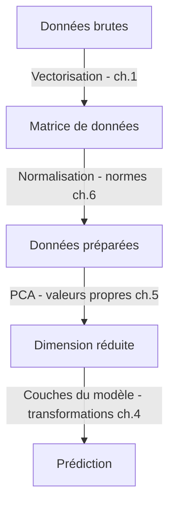

## Introduction

Ce dernier chapitre referme le cours en reliant explicitement chaque notion vue aux six chapitres précédents à sa place concrète dans un pipeline de données ou de machine learning — le même exercice de synthèse déjà réalisé au cours Mathématiques Appliquées, appliqué ici spécifiquement à l'algèbre linéaire.

## Panorama des liens établis

<CompareTable
  titleA="Notion"
  titleB="Usage concret"
  rows={[
    { a: "Vecteurs (ch.1)", b: "Représentation numérique de toute donnée (email, connexion réseau, document)" },
    { a: "Matrices (ch.2)", b: "Représentation d'un jeu de données entier (lignes = observations, colonnes = caractéristiques)" },
    { a: "Déterminant et inverse (ch.3)", b: "Résolution de systèmes d'équations, chiffre de Hill en cryptographie" },
    { a: "Transformations linéaires (ch.4)", b: "Fonctionnement des couches d'un réseau de neurones" },
    { a: "Valeurs/vecteurs propres (ch.5)", b: "Réduction de dimension (PCA), détection d'anomalies" },
    { a: "Normes et distances (ch.6)", b: "Classification (k-NN), similarité de documents, détection d'anomalies" },
]}
/>

## Où ces notions apparaissent dans un pipeline de machine learning

<CehCallout>
Ce pipeline simplifié illustre que l'algèbre linéaire n'intervient pas à une seule étape isolée, mais tout au long du traitement d'une donnée — de sa représentation initiale (vectorisation) jusqu'à la prédiction finale d'un modèle, en passant par la préparation et la réduction de dimension.
</CehCallout>

## Où aller ensuite selon ton objectif

<Steps steps={[
  { title: "Vers la data science appliquée", description: "Le cours Data Science Complète met en pratique directement ces notions sur des jeux de données réels de sécurité." },
  { title: "Vers l'IA et les agents en cybersécurité", description: "Les transformations linéaires (ch.4) et les valeurs propres (ch.5) sont le socle conceptuel des réseaux de neurones et de la détection d'anomalies par ML." },
  { title: "Vers la cryptographie approfondie", description: "Le déterminant et l'inverse (ch.3) éclairent des schémas historiques comme le chiffre de Hill, et complètent l'arithmétique modulaire du cours Mathématiques Appliquées." },
]} />

<TipCallout>
Comme pour le cours Mathématiques Appliquées, il n'est pas nécessaire de maîtriser parfaitement chaque calcul avant de continuer — reviens à ces notions dès qu'elles réapparaissent dans un cours plus appliqué (PCA en Data Science, couches de réseaux de neurones en IA & Cybersécurité).
</TipCallout>

## Lab — Mise en Pratique

**Environnement** : Réflexion guidée (sans terminal)

<Steps steps={[
  { title: "Relier une notion à une étape du pipeline", description: "Pour chacune des étapes suivantes d'un pipeline de détection de phishing par ML — vectorisation des emails, réduction de dimension, classification finale — identifie la notion d'algèbre linéaire la plus directement liée." },
  { title: "Choisir sa prochaine étape", description: "Si ton objectif est de comprendre le fonctionnement d'un détecteur d'anomalies réseau basé sur le ML, quel cours choisirais-tu en priorité après celui-ci : Data Science Complète ou Cryptographie Avancée ? Justifie." },
]} />

## En résumé

- Chaque notion de ce cours (vecteurs, matrices, déterminant/inverse, transformations, valeurs propres, normes) intervient à une étape précise d'un pipeline de traitement de données ou de machine learning.
- L'algèbre linéaire n'est pas cantonnée à une seule étape isolée mais traverse tout le pipeline, de la représentation initiale des données à la prédiction finale.
- Les cours Data Science Complète et IA & Agents en Cybersécurité mettent directement en pratique ces notions sur des cas concrets de sécurité.

## Questions de Révision

1. Quelle notion d'algèbre linéaire est directement liée à la vectorisation d'une donnée brute (comme un email) ?
2. Pourquoi les valeurs propres sont-elles centrales dans une étape de réduction de dimension ?
3. Cite deux cours de la roadmap Nyx qui mettent en pratique directement les notions vues dans ce cours.

Félicitations, tu viens de terminer le cours **Algèbre Linéaire** ! Ce socle mathématique nourrit directement les cours Data Science Complète et IA & Agents en Cybersécurité — continue vers **Data Science Complète** pour mettre ces notions en pratique sur des cas concrets.
