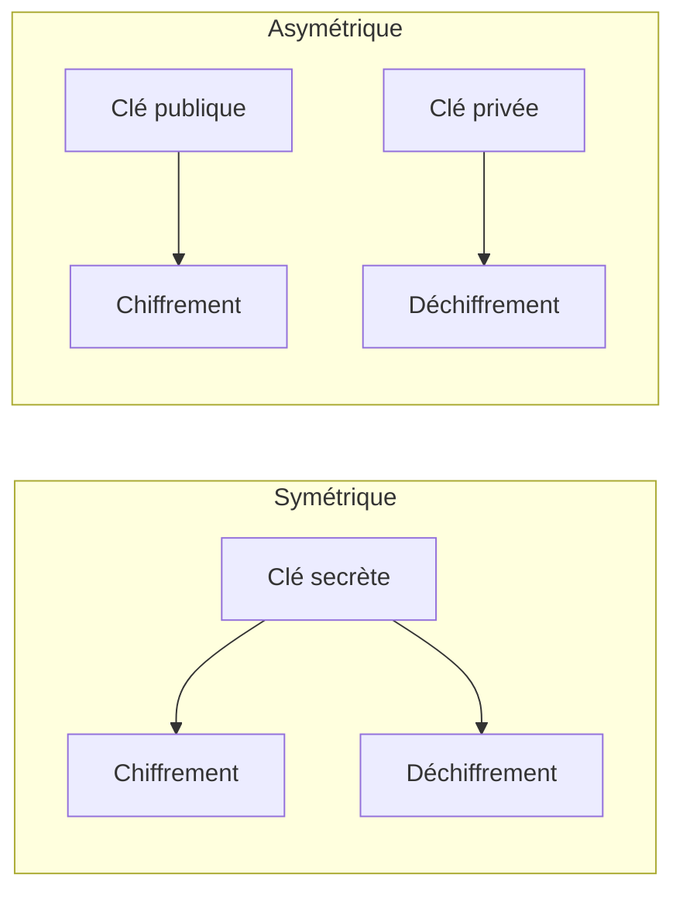

## Introduction

La cryptographie n'est pas qu'une affaire de mathématiciens isolés — c'est l'une des briques les plus utilisées quotidiennement en cybersécurité, du HTTPS de chaque site web visité au chiffrement des disques durs. Ce chapitre pose les objectifs fondamentaux et le vocabulaire indispensable au reste du cours.

## Les quatre objectifs fondamentaux de la cryptographie

<CompareTable
  titleA="Objectif"
  titleB="Ce qu'il garantit"
  rows={[
    { a: "Confidentialité", b: "Seul le destinataire légitime peut lire le message" },
    { a: "Intégrité", b: "Le message n'a pas été altéré en chemin" },
    { a: "Authentification", b: "L'expéditeur est bien celui qu'il prétend être" },
    { a: "Non-répudiation", b: "L'expéditeur ne peut pas nier avoir envoyé le message" },
]}
/>

<TipCallout>
Le chiffrement seul ne garantit que la confidentialité — un message chiffré peut être intercepté et modifié sans que le destinataire s'en aperçoive si aucun mécanisme d'intégrité (comme une signature ou un MAC) n'est associé au chiffrement.
</TipCallout>

## Chiffrement symétrique vs asymétrique

<CompareTable
  titleA="Chiffrement symétrique"
  titleB="Chiffrement asymétrique"
  rows={[
    { a: "Une seule clé, partagée entre les deux parties", b: "Une paire de clés : publique (partagée) et privée (secrète)" },
    { a: "Très rapide, adapté aux gros volumes de données", b: "Beaucoup plus lent, adapté aux petits volumes (clés, signatures)" },
    { a: "Problème : comment échanger la clé secrète en sécurité ?", b: "Résout le problème d'échange de clé, la clé publique peut circuler librement" },
    { a: "Exemples : AES, ChaCha20", b: "Exemples : RSA, ECC" },
]}
/>

<CehCallout>
En pratique, HTTPS combine les deux : un échange de clé asymétrique (RSA ou ECDHE) établit une clé de session partagée, puis toute la session utilise un chiffrement symétrique (AES) bien plus rapide — le meilleur des deux mondes, approfondi au chapitre 7.
</CehCallout>

## "Ne jamais inventer sa propre cryptographie"

<WarningCallout>
Concevoir son propre algorithme de chiffrement, même avec de bonnes intentions, est presque toujours une erreur grave en sécurité — les algorithmes standards (AES, RSA) ont survécu à des décennies d'analyse cryptographique publique par des milliers de chercheurs, ce qu'aucun algorithme "maison" ne peut égaler.
</WarningCallout>

<Steps steps={[
  { title: "Utiliser des bibliothèques éprouvées", description: "OpenSSL, libsodium ou les implémentations natives du langage utilisé, jamais une implémentation artisanale." },
  { title: "Suivre les recommandations d'organismes reconnus", description: "NIST, ANSSI publient des recommandations sur les algorithmes et tailles de clés à utiliser, mises à jour régulièrement." },
  { title: "Se méfier de la 'sécurité par l'obscurité'", description: "Un algorithme dont la sécurité repose sur le secret de son fonctionnement, plutôt que sur la robustesse mathématique de sa clé, est fragile par construction." },
]} />

<CehCallout>
Le principe de Kerckhoffs, formulé au 19e siècle, reste la règle d'or de la cryptographie moderne : un système cryptographique doit rester sûr même si tout son fonctionnement est public, à condition que la clé reste secrète — c'est exactement l'inverse de la sécurité par l'obscurité.
</CehCallout>

## Lab — Mise en Pratique

**Environnement** : Réflexion guidée (sans terminal)

<Steps steps={[
  { title: "Identifier l'objectif garanti", description: "Une signature numérique appliquée à un document garantit-elle la confidentialité, l'intégrité, l'authentification, ou plusieurs de ces objectifs à la fois ? Justifie." },
  { title: "Choisir symétrique ou asymétrique", description: "Pour chiffrer un fichier de 10 Go stocké localement, utiliserais-tu un algorithme symétrique ou asymétrique ? Et pour échanger une clé secrète avec un correspondant que tu n'as jamais rencontré physiquement ?" },
]} />

## En résumé

- La cryptographie poursuit quatre objectifs distincts : confidentialité, intégrité, authentification, non-répudiation.
- Le chiffrement symétrique est rapide mais pose un problème d'échange de clé ; l'asymétrique résout ce problème mais reste lent sur de gros volumes.
- Le principe de Kerckhoffs impose qu'un système reste sûr même si son fonctionnement est public — jamais de sécurité par l'obscurité, jamais d'algorithme maison.

## Questions de Révision

1. Quels sont les quatre objectifs fondamentaux de la cryptographie ?
2. Pourquoi HTTPS combine-t-il chiffrement asymétrique et symétrique plutôt que d'utiliser l'un ou l'autre seul ?
3. Que signifie le principe de Kerckhoffs, et pourquoi s'oppose-t-il à la "sécurité par l'obscurité" ?
