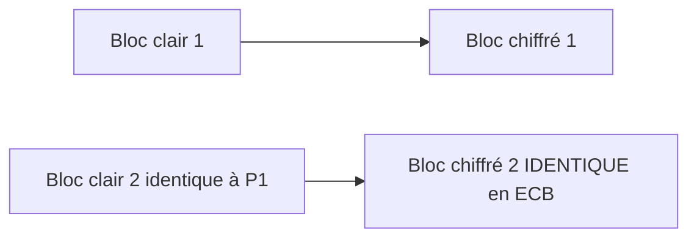

## Introduction

AES (Advanced Encryption Standard) est aujourd'hui l'algorithme de chiffrement symétrique de référence, utilisé partout du Wi-Fi WPA2/3 au chiffrement de disque. Mais un algorithme robuste mal utilisé (mauvais mode opératoire) reste vulnérable — ce chapitre couvre autant l'algorithme que la façon de l'employer correctement.

## AES en bref

<Steps steps={[
  { title: "Un algorithme par blocs", description: "AES chiffre des blocs de 128 bits à la fois, quelle que soit la taille de clé utilisée (128, 192 ou 256 bits)." },
  { title: "Plusieurs tours de transformation", description: "Chaque bloc subit une série de transformations répétées (substitution, permutation, mélange) — 10 à 14 tours selon la taille de clé." },
  { title: "Standardisé par le NIST", description: "AES a été sélectionné en 2001 après un concours public international, remplaçant l'ancien DES devenu trop faible." },
]} />

<CehCallout>
AES-256 n'est pas "plus sûr" qu'AES-128 dans un sens pratique immédiat — les deux sont considérés comme sûrs contre toute attaque connue avec les moyens de calcul actuels. AES-256 offre une marge de sécurité supplémentaire face à d'éventuelles avancées futures (dont l'informatique quantique), au prix d'une performance légèrement inférieure.
</CehCallout>

## Les modes opératoires — pourquoi ils comptent autant que l'algorithme

Un algorithme par blocs comme AES doit être combiné à un "mode opératoire" pour chiffrer des données plus longues qu'un seul bloc de 128 bits.

<CompareTable
  titleA="Mode"
  titleB="Caractéristique"
  rows={[
    { a: "ECB (Electronic Codebook)", b: "Chiffre chaque bloc indépendamment — des blocs identiques en clair produisent des blocs identiques chiffrés" },
    { a: "CBC (Cipher Block Chaining)", b: "Chaque bloc est combiné au bloc chiffré précédent avant chiffrement, via un vecteur d'initialisation (IV)" },
    { a: "GCM (Galois/Counter Mode)", b: "Mode moderne combinant chiffrement ET authentification (AEAD) en une seule opération" },
]}
/>

<WarningCallout>
Le mode ECB ne doit JAMAIS être utilisé en pratique : parce que des blocs de données identiques produisent des blocs chiffrés identiques, des motifs visuels du fichier original (célèbre exemple : une image chiffrée en ECB reste reconnaissable) restent visibles malgré le chiffrement — l'illusion de sécurité est totale mais la confidentialité réelle est largement compromise.
</WarningCallout>

## Pourquoi GCM est devenu le standard recommandé

<CehCallout>
GCM appartient à la famille des modes AEAD (Authenticated Encryption with Associated Data) : il produit à la fois un texte chiffré ET un tag d'authentification, garantissant simultanément confidentialité et intégrité en une seule opération — c'est pourquoi TLS 1.3 privilégie des suites de chiffrement basées sur AES-GCM.
</CehCallout>

<CompareTable
  titleA="CBC seul"
  titleB="GCM (AEAD)"
  rows={[
    { a: "Garantit uniquement la confidentialité", b: "Garantit confidentialité ET intégrité simultanément" },
    { a: "Nécessite un mécanisme d'intégrité séparé (HMAC) pour être sûr", b: "Le mécanisme d'intégrité est intégré nativement" },
    { a: "Vulnérable à des attaques de padding si mal implémenté", b: "Résistant à ce type d'attaque par construction" },
]}
/>

<TipCallout>
L'importance du vecteur d'initialisation (IV) est souvent sous-estimée : un IV réutilisé avec la même clé, en mode CBC comme en GCM, peut compromettre gravement la sécurité du chiffrement — un IV doit être unique (idéalement aléatoire) pour chaque opération de chiffrement, même avec la même clé.
</TipCallout>

## Lab — Mise en Pratique

**Environnement** : Kali Linux (terminal Nyx Shell)

<Steps steps={[
  { title: "Chiffrer un fichier avec AES-GCM", description: "Utilise OpenSSL pour chiffrer un fichier avec AES-256 en mode GCM.", code: 'echo "donnee confidentielle" > secret.txt\nopenssl enc -aes-256-gcm -salt -in secret.txt -out secret.enc -pass pass:motdepasse_fort\nopenssl enc -d -aes-256-gcm -in secret.enc -out secret_dechiffre.txt -pass pass:motdepasse_fort' },
  { title: "Expliquer le risque ECB", description: "Explique en quelques phrases pourquoi une image chiffrée en mode ECB peut rester visuellement reconnaissable, alors que le contenu est techniquement chiffré." },
]} />

## En résumé

- AES chiffre des blocs de 128 bits à travers plusieurs tours de transformation, avec des clés de 128, 192 ou 256 bits.
- Le mode opératoire (comment enchaîner le chiffrement de blocs multiples) est aussi critique que l'algorithme lui-même.
- Le mode ECB ne doit jamais être utilisé ; GCM (AEAD) est aujourd'hui le mode recommandé car il combine confidentialité et intégrité.

## Questions de Révision

1. Pourquoi le mode ECB est-il dangereux même si l'algorithme AES sous-jacent est robuste ?
2. Qu'est-ce qu'un mode AEAD, et pourquoi GCM est-il devenu le standard recommandé ?
3. Pourquoi la réutilisation d'un vecteur d'initialisation (IV) avec la même clé peut-elle compromettre la sécurité du chiffrement ?
