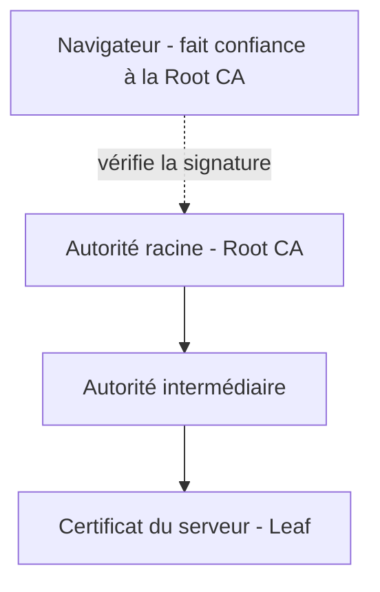

## Introduction

Une clé publique résout le problème de confidentialité vu au chapitre 3, mais soulève une nouvelle question : comment être certain qu'une clé publique appartient réellement à la personne ou au serveur qu'elle prétend représenter ? La PKI (Public Key Infrastructure) répond précisément à ce problème de confiance.

## Le rôle d'une autorité de certification (CA)

<CehCallout>
Une autorité de certification (Certificate Authority) est un tiers de confiance qui vérifie l'identité d'une entité (souvent un domaine web) avant de signer numériquement un certificat liant cette identité à une clé publique — c'est cette signature qui permet à n'importe quel navigateur de faire confiance au certificat sans avoir vérifié l'identité lui-même.
</CehCallout>

<Steps steps={[
  { title: "Génération d'une paire de clés", description: "L'entité (ex: un serveur web) génère sa propre paire de clés publique/privée." },
  { title: "Demande de signature de certificat (CSR)", description: "L'entité envoie sa clé publique et ses informations d'identité à une CA, sans jamais transmettre sa clé privée." },
  { title: "Vérification par la CA", description: "La CA vérifie que le demandeur contrôle bien le domaine ou l'identité revendiquée." },
  { title: "Signature du certificat", description: "La CA signe numériquement le certificat avec sa propre clé privée, créant un lien de confiance vérifiable." },
]} />

## La chaîne de confiance

<CompareTable
  titleA="Niveau"
  titleB="Rôle"
  rows={[
    { a: "Autorité racine (Root CA)", b: "Clé la plus sensible, gardée hors ligne, préinstallée dans les navigateurs/OS comme racine de confiance" },
    { a: "Autorité intermédiaire", b: "Signe les certificats au quotidien, révocable sans compromettre la racine en cas de problème" },
    { a: "Certificat serveur (Leaf)", b: "Le certificat effectivement présenté par le site web visité" },
]}
/>

<TipCallout>
L'utilisation d'autorités intermédiaires permet à une CA de révoquer une clé compromise sans devoir révoquer sa clé racine — un compromis architectural essentiel, car révoquer une racine invaliderait instantanément tous les certificats qui en dépendent, y compris ceux parfaitement légitimes.
</TipCallout>

## Scénarios d'attaque liés aux certificats

<Steps steps={[
  { title: "Certificat auto-signé accepté à tort", description: "Un utilisateur ignore un avertissement de certificat non fiable, ouvrant la porte à une interception de trafic (attaque de l'homme du milieu)." },
  { title: "Compromission d'une autorité de certification", description: "Un attaquant qui compromet une CA peut émettre de faux certificats valides pour n'importe quel domaine — un scénario rare mais documenté historiquement." },
  { title: "Certificat expiré ou révoqué non vérifié", description: "Un client qui ne vérifie pas la liste de révocation (CRL/OCSP) peut continuer à faire confiance à un certificat compromis après sa révocation officielle." },
]} />

<WarningCallout>
Ignorer un avertissement de certificat invalide dans un navigateur ("continuer quand même") revient à désactiver soi-même la principale protection contre les attaques de l'homme du milieu — ce réflexe, souvent pris par habitude face à des faux positifs, est exactement ce qu'un attaquant en position d'interception espère.
</WarningCallout>

## Lab — Mise en Pratique

**Environnement** : Kali Linux (terminal Nyx Shell)

<Steps steps={[
  { title: "Examiner un certificat X.509", description: "Génère un certificat auto-signé et examine sa structure.", code: 'openssl req -x509 -newkey rsa:4096 -keyout cle.pem -out cert.pem -days 365 -nodes -subj "/CN=test.local"\nopenssl x509 -in cert.pem -text -noout | head -20' },
  { title: "Expliquer un risque de chaîne de confiance", description: "Pourquoi la compromission d'une autorité intermédiaire est-elle grave, mais moins catastrophique que la compromission de l'autorité racine dont elle dépend ?" },
]} />

## En résumé

- Une autorité de certification vérifie une identité avant de signer un certificat, créant un lien de confiance vérifiable par des tiers.
- La chaîne de confiance (racine, intermédiaire, certificat serveur) permet de révoquer une clé compromise sans invalider toute la chaîne.
- Ignorer un avertissement de certificat invalide désactive la principale protection contre les attaques de l'homme du milieu.

## Questions de Révision

1. Quel problème de confiance la PKI résout-elle, au-delà du simple chiffrement asymétrique ?
2. Pourquoi une autorité racine est-elle gardée hors ligne, contrairement à une autorité intermédiaire ?
3. Pourquoi ignorer un avertissement de certificat invalide dans un navigateur est-il particulièrement risqué ?
