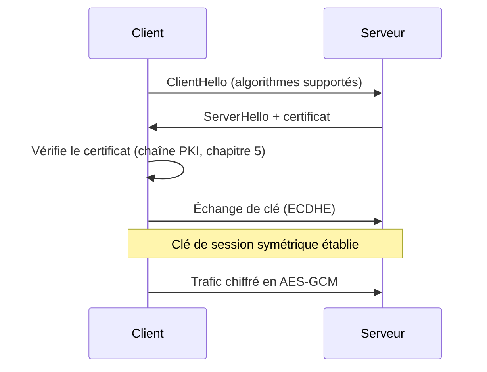

## Introduction

Ce chapitre réunit toutes les briques des chapitres précédents (symétrique, asymétrique, hachage, PKI) dans leur application la plus concrète et quotidienne : TLS, le protocole qui sécurise la quasi-totalité du trafic web moderne sous la forme HTTPS.

## Les grandes étapes du handshake TLS

<Steps steps={[
  { title: "ClientHello", description: "Le client propose les algorithmes cryptographiques (suites de chiffrement) qu'il supporte." },
  { title: "ServerHello et certificat", description: "Le serveur choisit une suite commune et présente son certificat X.509 (chapitre 5)." },
  { title: "Vérification du certificat", description: "Le client vérifie la chaîne de confiance jusqu'à une autorité racine connue." },
  { title: "Échange de clé", description: "Un échange de clé asymétrique (ECDHE en TLS 1.3) établit une clé de session partagée sans jamais la transmettre en clair." },
  { title: "Chiffrement symétrique de la session", description: "Tout le trafic ultérieur est chiffré avec un algorithme symétrique rapide (AES-GCM), en utilisant la clé de session établie." },
]} />

<CehCallout>
TLS 1.3, contrairement à TLS 1.2, a supprimé le support de nombreux algorithmes obsolètes (RSA pour l'échange de clé, CBC sans AEAD) et réduit le nombre d'allers-retours du handshake — une simplification qui améliore à la fois la sécurité et la performance.
</CehCallout>

## La confidentialité persistante (Forward Secrecy)

<CompareTable
  titleA="Sans forward secrecy (RSA pour l'échange de clé)"
  titleB="Avec forward secrecy (ECDHE)"
  rows={[
    { a: "Une clé de session unique dérivée directement de la clé privée du serveur", b: "Une nouvelle paire de clés éphémère générée pour chaque session" },
    { a: "Si la clé privée du serveur est compromise plus tard, TOUT le trafic passé peut être déchiffré rétroactivement", b: "La compromission future de la clé privée du serveur ne permet PAS de déchiffrer les sessions passées" },
]}
/>

<WarningCallout>
Sans forward secrecy, un attaquant qui enregistre du trafic chiffré aujourd'hui et compromet la clé privée du serveur des années plus tard peut déchiffrer rétroactivement toutes les conversations passées interceptées — c'est précisément ce risque que l'échange de clé éphémère (ECDHE) élimine, raison pour laquelle TLS 1.3 l'impose systématiquement.
</WarningCallout>

## Erreurs de configuration TLS courantes

<Steps steps={[
  { title: "Suites de chiffrement obsolètes activées", description: "Conserver le support de RC4, CBC sans AEAD ou de versions TLS anciennes (1.0, 1.1) par 'compatibilité' expose à des attaques documentées." },
  { title: "Certificat expiré ou mal configuré", description: "Un certificat expiré force les navigateurs à afficher un avertissement, incitant les utilisateurs à développer le réflexe dangereux de l'ignorer (chapitre 5)." },
  { title: "Absence de HSTS (HTTP Strict Transport Security)", description: "Sans cet en-tête, un utilisateur peut être redirigé vers une version non chiffrée du site par un attaquant en position d'interception (downgrade attack)." },
  { title: "Certificat auto-signé en production", description: "Acceptable en environnement de test, jamais en production où la chaîne de confiance PKI doit être vérifiable par n'importe quel visiteur." },
]} />

<TipCallout>
Des outils publics comme le SSL Labs Test de Qualys permettent d'auditer gratuitement la configuration TLS d'un serveur web et d'obtenir une note détaillée avec les points faibles précis à corriger — un réflexe utile après tout déploiement de service web.
</TipCallout>

## Lab — Mise en Pratique

**Environnement** : Kali Linux (terminal Nyx Shell)

<Steps steps={[
  { title: "Examiner un handshake TLS", description: "Observe les suites de chiffrement supportées par un serveur.", code: 'openssl s_client -connect example.com:443 -tls1_3 2>/dev/null | head -20' },
  { title: "Expliquer l'intérêt du forward secrecy", description: "Explique pourquoi un service qui traite des données sensibles devrait absolument utiliser un échange de clé avec forward secrecy (ECDHE) plutôt que RSA seul." },
]} />

## En résumé

- Le handshake TLS combine chiffrement asymétrique (échange de clé), PKI (vérification du certificat) et chiffrement symétrique (trafic de session).
- Le forward secrecy (ECDHE) empêche qu'une compromission future de la clé privée du serveur ne permette de déchiffrer rétroactivement le trafic passé.
- Suites obsolètes, certificats mal configurés et absence de HSTS comptent parmi les erreurs de configuration TLS les plus fréquentes.

## Questions de Révision

1. Quelles sont les grandes étapes d'un handshake TLS, dans l'ordre ?
2. Qu'est-ce que le forward secrecy, et pourquoi ECDHE l'apporte-t-il alors que RSA seul ne le permet pas ?
3. Pourquoi l'absence de l'en-tête HSTS peut-elle exposer un site à une attaque de downgrade ?
