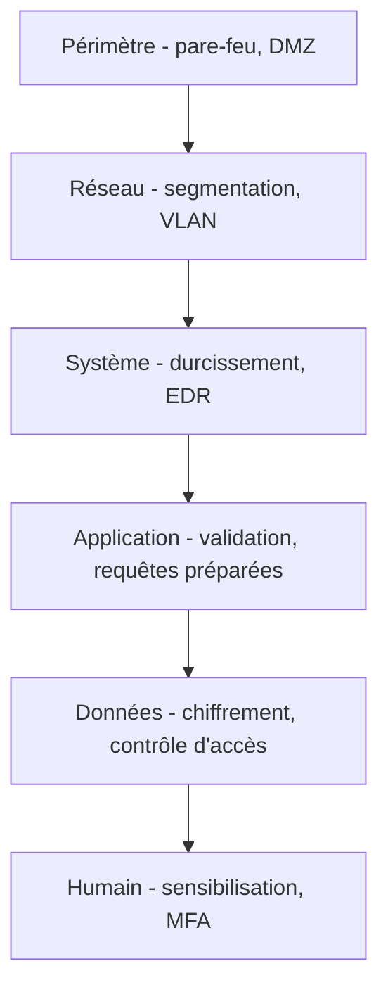

## Introduction

Ce cours referme le parcours cybersécurité de Nyx en adoptant le point de vue du défenseur — après avoir appris à attaquer méthodiquement (cours Cybersécurité Offensive), il s'agit maintenant de construire une défense capable de résister à exactement ce type de mission.

## Le principe de la défense en profondeur

<CehCallout>
La défense en profondeur consiste à superposer plusieurs couches de sécurité indépendantes, de sorte que la défaillance d'une seule couche ne compromette pas l'ensemble du système — un principe directement inspiré des fortifications militaires historiques à plusieurs enceintes successives.
</CehCallout>

## Pourquoi aucune couche seule ne suffit

<WarningCallout>
Rappel du cours Cybersécurité Offensive (chapitre 9) : une mission de pentest réussie combine souvent plusieurs techniques enchaînées — accès initial par phishing, élévation de privilèges, mouvement latéral. Une défense reposant sur une seule couche (par exemple, un antivirus seul) aurait échoué à stopper cette chaîne complète, alors qu'une défense en profondeur multiplie les occasions de détecter ou bloquer l'attaquant à chaque étape.
</WarningCallout>

<CompareTable
  titleA="Couche de défense"
  titleB="Cours Nyx correspondant"
  rows={[
    { a: "Périmètre et réseau", b: "Réseaux (pare-feu, VLAN), Administration Systèmes et Réseaux" },
    { a: "Système et durcissement", b: "Linux, Administration Systèmes et Réseaux (chapitre 8)" },
    { a: "Application", b: "Sécurité Web (requêtes préparées, validation)" },
    { a: "Données", b: "Cryptographie Avancée (chiffrement)" },
    { a: "Identité et accès", b: "Administration Systèmes et Réseaux (chapitre 7, IAM)" },
    { a: "Humain", b: "Psychologie & Ingénierie Sociale" },
]}
/>

## Le modèle du Swiss cheese

<TipCallout>
Une image utile pour comprendre la défense en profondeur : chaque couche de sécurité est comme une tranche de fromage suisse, percée de trous (des faiblesses inévitables) — mais empiler plusieurs tranches indépendantes rend statistiquement très improbable qu'un trou de chaque tranche s'aligne parfaitement pour laisser passer une attaque de bout en bout.
</TipCallout>

## Lab — Mise en Pratique

**Environnement** : Réflexion guidée (sans terminal)

<Steps steps={[
  { title: "Cartographier les couches d'une mission connue", description: "Pour la mission décrite au cours Cybersécurité Offensive (chapitre 9, phishing puis mouvement latéral AD), identifie à quelle(s) couche(s) de défense en profondeur chaque étape aurait pu être stoppée." },
  { title: "Expliquer le modèle du Swiss cheese", description: "Pourquoi une défense à une seule couche, même très robuste, reste-t-elle plus vulnérable qu'une défense à plusieurs couches indépendantes moins parfaites individuellement ?" },
]} />

## En résumé

- La défense en profondeur superpose plusieurs couches indépendantes, périmètre, réseau, système, application, données et humain.
- Aucune couche seule ne suffit — une attaque combinant plusieurs techniques (rappel du cours Cybersécurité Offensive) doit pouvoir être stoppée à n'importe quelle étape de la chaîne.
- Le modèle du Swiss cheese illustre pourquoi plusieurs couches imparfaites valent mieux qu'une seule couche, même très robuste.

## Questions de Révision

1. Pourquoi la défense en profondeur superpose-t-elle plusieurs couches indépendantes plutôt que de renforcer une seule couche ?
2. Cite trois couches de défense en profondeur et le cours Nyx qui leur correspond le plus directement.
3. Qu'illustre le modèle du Swiss cheese appliqué à la cybersécurité ?
