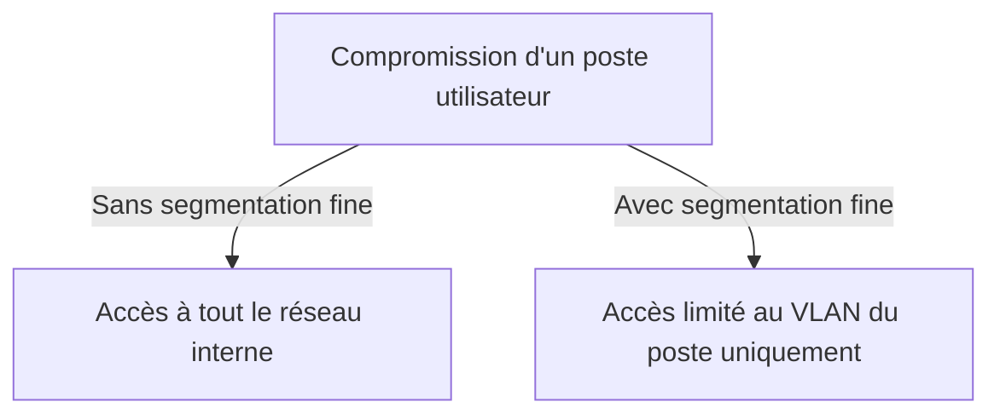

## Introduction

Ce chapitre approfondit la segmentation réseau déjà introduite au cours Administration Systèmes et Réseaux (chapitre 1), en la reliant au modèle plus récent du Zero Trust — une réponse directe au mouvement latéral étudié au cours Cybersécurité Offensive (chapitre 7).

## Rappel et approfondissement de la segmentation

<CehCallout>
Rappel du cours Administration Systèmes et Réseaux (chapitre 1) : le zonage réseau (DMZ, LAN, zone critique) limite la propagation d'une compromission d'une zone à l'autre — une segmentation plus fine, par VLAN et par fonction métier, réduit encore davantage la surface accessible depuis un point de compromission initial.
</CehCallout>

## Le principe du Zero Trust

<CehCallout>
Le modèle Zero Trust part d'un principe radical : ne jamais faire confiance implicitement à un utilisateur ou un appareil du seul fait qu'il se trouve à l'intérieur du réseau interne — chaque accès doit être vérifié explicitement, indépendamment de sa localisation réseau, contrairement au modèle traditionnel de "château fort" qui fait confiance à tout ce qui a franchi le périmètre.
</CehCallout>

<CompareTable
  titleA="Modèle traditionnel (château fort)"
  titleB="Zero Trust"
  rows={[
    { a: "Confiance implicite une fois à l'intérieur du réseau", b: "Vérification explicite à chaque accès, quelle que soit la localisation" },
    { a: "Périmètre unique fortement défendu", b: "Micro-segmentation avec vérification à chaque frontière" },
    { a: "Un attaquant ayant franchi le périmètre se déplace librement", b: "Un attaquant ayant compromis un point doit re-authentifier à chaque nouvelle ressource" },
]}
/>

## Pourquoi le Zero Trust répond directement au mouvement latéral

<WarningCallout>
Rappel du cours Cybersécurité Offensive (chapitre 7) : le mouvement latéral exploite précisément la confiance implicite accordée à un compte ou un poste une fois à l'intérieur du réseau — un modèle Zero Trust correctement implémenté exige une nouvelle vérification à chaque tentative d'accès à une ressource différente, rendant le mouvement latéral considérablement plus difficile même après une compromission initiale.
</WarningCallout>

<Steps steps={[
  { title: "Vérifier l'identité à chaque accès", description: "Rappel du cours Administration Systèmes et Réseaux (chapitre 7, IAM) : authentification forte systématique, pas seulement à la connexion initiale." },
  { title: "Vérifier le contexte de l'appareil", description: "L'appareil est-il à jour, conforme aux politiques de sécurité de l'organisation, avant d'accorder l'accès ?" },
  { title: "Limiter chaque accès au strict nécessaire", description: "Rappel du principe du moindre privilège (cours Administration Systèmes et Réseaux, chapitre 7)." },
]} />

## Lab — Mise en Pratique

**Environnement** : Réflexion guidée (sans terminal)

<Steps steps={[
  { title: "Concevoir une segmentation fine", description: "Pour une entreprise avec un service comptabilité, un service développement et une zone serveurs critiques, propose une segmentation VLAN qui limiterait un mouvement latéral en cas de compromission du service développement." },
  { title: "Expliquer l'impact Zero Trust sur une chaîne d'attaque", description: "Rappel du cours Cybersécurité Offensive (chapitre 7) : à quelle étape précise de la chaîne d'attaque AD un modèle Zero Trust correctement implémenté aurait-il pu bloquer la progression de l'attaquant ?" },
]} />

## En résumé

- La segmentation réseau fine (VLAN par fonction métier) limite plus efficacement la propagation d'une compromission qu'un zonage large.
- Le Zero Trust remplace la confiance implicite du modèle "château fort" par une vérification explicite à chaque accès, indépendamment de la localisation réseau.
- Le Zero Trust répond directement au mouvement latéral en exigeant une nouvelle vérification à chaque nouvelle ressource accédée.

## Questions de Révision

1. Quelle est la différence entre le modèle traditionnel "château fort" et le modèle Zero Trust ?
2. Pourquoi une segmentation VLAN fine limite-t-elle mieux la propagation d'une compromission qu'un zonage large (DMZ/LAN) ?
3. Pourquoi le Zero Trust complique-t-il directement le mouvement latéral étudié côté offensif ?
