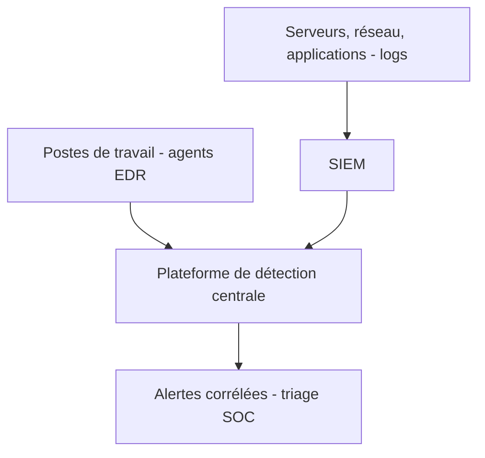

## Introduction

Ce chapitre met en pratique la couche de détection de la défense en profondeur (chapitre 1), en réunissant le SIEM déjà détaillé au cours Analyse SOC (chapitre 3) avec l'EDR (Endpoint Detection and Response), un complément indispensable au niveau du poste de travail.

## SIEM et EDR — deux niveaux de détection complémentaires

<CompareTable
  titleA="SIEM (cours Analyse SOC, ch.3)"
  titleB="EDR"
  rows={[
    { a: "Corrèle des logs de sources multiples à l'échelle du SI", b: "Surveille en détail le comportement d'un poste ou serveur individuel" },
    { a: "Vue d'ensemble, détecte des motifs entre systèmes", b: "Vue en profondeur, détecte un comportement suspect au niveau processus" },
    { a: "Dépend de la qualité des logs remontés", b: "Observe directement l'activité (appels système, injections mémoire) sans dépendre des logs" },
]}
/>

<CehCallout>
Rappel du cours Forensics & DFIR (chapitre 3, analyse mémoire) : un EDR peut détecter en temps réel une injection de processus ou un comportement mémoire suspect, exactement le type d'indicateur qu'un analyste DFIR recherche manuellement après coup avec Volatility — l'EDR automatise et accélère cette détection.
</CehCallout>

## Relier chaque outil à un vecteur d'attaque étudié

<Steps steps={[
  { title: "SIEM détecte le bruteforce réussi", description: "Rappel du cours Analyse SOC (chapitre 3) : corrélation Event ID 4625 répétés puis 4624 sur le même compte." },
  { title: "EDR détecte l'exécution de LinPEAS/WinPEAS", description: "Rappel du cours Cybersécurité Offensive (chapitre 6) : un comportement d'énumération intensive de fichiers système est un motif détectable par un EDR comportemental." },
  { title: "SIEM détecte la création de tâche planifiée suspecte", description: "Rappel du cours Cybersécurité Offensive (chapitre 8) : Event ID 4698, corrélé avec un compte n'en créant habituellement jamais." },
  { title: "EDR détecte l'injection de processus", description: "Rappel du cours IA & Agents en Cybersécurité (chapitre 2) : un comportement mémoire anormal, similaire à ce que révèle malfind en analyse forensique manuelle." },
]} />

## Construire une architecture de détection cohérente

<WarningCallout>
Déployer un SIEM sans EDR (ou inversement) laisse un angle mort significatif : le SIEM seul dépend de la qualité et de l'exhaustivité des logs remontés par chaque système, tandis que l'EDR seul ne voit que les postes/serveurs sur lesquels il est installé, sans vue d'ensemble corrélée entre systèmes — les deux se complètent, rappel du principe de défense en profondeur (chapitre 1).
</WarningCallout>

## Lab — Mise en Pratique

**Environnement** : Réflexion guidée (sans terminal)

<Steps steps={[
  { title: "Choisir l'outil de détection adapté", description: "Pour détecter une injection de processus mémoire (rappel du cours Forensics & DFIR, chapitre 3), SIEM ou EDR serait-il le plus adapté, et pourquoi ?" },
  { title: "Identifier un angle mort", description: "Une organisation dispose d'un EDR sur tous ses postes mais aucun SIEM. Quel type de détection lui manque-t-il, illustré par un exemple concret du cours Analyse SOC ?" },
]} />

## En résumé

- Le SIEM corrèle des logs à l'échelle du système d'information, l'EDR surveille en détail le comportement de chaque poste individuellement.
- Chaque technique d'attaque étudiée dans le parcours (bruteforce, énumération privesc, tâche planifiée, injection de processus) a un outil de détection correspondant.
- SIEM et EDR se complètent — l'un sans l'autre laisse un angle mort significatif, dans l'esprit de la défense en profondeur.

## Questions de Révision

1. Quelle est la différence de niveau d'observation entre un SIEM et un EDR ?
2. Quel outil détecterait le plus directement une exécution de LinPEAS sur un poste compromis ?
3. Pourquoi une organisation disposant uniquement d'un EDR, sans SIEM, présente-t-elle un angle mort de détection ?
