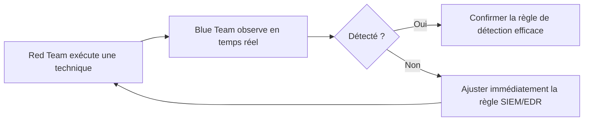

## Introduction

Ce chapitre réunit littéralement les deux moitiés du parcours Nyx — offensif et défensif — dans un même exercice organisationnel : les simulations Red Team / Blue Team, dont le Purple Team représente l'évolution la plus collaborative.

## Red Team, Blue Team et Purple Team

<CompareTable
  titleA="Type d'exercice"
  titleB="Principe"
  rows={[
    { a: "Red Team", b: "Simule une attaque réelle (rappel du cours Cybersécurité Offensive) sans que la Blue Team ne soit prévenue, pour tester la détection en conditions réalistes" },
    { a: "Blue Team", b: "L'équipe défensive (rappel des cours Analyse SOC et Forensics & DFIR) qui détecte et répond, sans connaître à l'avance le scénario d'attaque" },
    { a: "Purple Team", b: "Collaboration explicite entre Red et Blue en temps réel, avec partage immédiat des observations des deux côtés" },
]}
/>

<CehCallout>
Un exercice Red Team classique (sans collaboration Purple) mesure la capacité de détection réelle de l'organisation, mais l'apprentissage reste souvent limité à un rapport final produit après coup — rappel du cours Rédaction de Rapports (chapitre 1) : le rapport donne sa valeur à la mission, mais un délai entre l'action et le retour d'expérience réduit l'efficacité pédagogique immédiate.
</CehCallout>

## Pourquoi le Purple Team maximise l'apprentissage collectif

<TipCallout>
Rappel du cours Analyse SOC (chapitre 3, corrélation) : dans un exercice Purple Team, si la Blue Team ne détecte pas une technique Red Team précise (par exemple un Kerberoasting), les deux équipes collaborent immédiatement pour comprendre pourquoi et ajuster la règle de corrélation SIEM sur-le-champ — un cycle d'amélioration bien plus rapide qu'un rapport final produit des semaines après l'exercice.
</TipCallout>

## Concevoir un exercice Purple Team efficace

<Steps steps={[
  { title: "Sélectionner des techniques MITRE ATT&CK précises", description: "Rappel du cours Analyse SOC (chapitre 4) : cibler des techniques réellement pertinentes pour l'organisation, pas un scénario générique." },
  { title: "Exécuter et observer simultanément", description: "La Red Team exécute une technique pendant que la Blue Team surveille activement ses outils de détection." },
  { title: "Documenter chaque résultat immédiatement", description: "Détecté ou non détecté, avec le détail de la règle ayant (ou n'ayant pas) fonctionné." },
  { title: "Ajuster et retester", description: "Une règle de détection ajustée doit être retestée avec la même technique pour confirmer son efficacité réelle." },
]} />

<WarningCallout>
Un exercice Red Team traditionnel mal encadré peut créer une dynamique de confrontation contre-productive entre équipes offensive et défensive — rappel du principe éthique du cours Psychologie & Ingénierie Sociale (chapitre 6) : l'objectif reste l'amélioration collective de la posture de sécurité, jamais la démonstration compétitive de la supériorité d'une équipe sur l'autre.
</WarningCallout>

## Lab — Mise en Pratique

**Environnement** : Réflexion guidée (sans terminal)

<Steps steps={[
  { title: "Concevoir un scénario Purple Team", description: "Choisis une technique du cours Cybersécurité Offensive (par exemple, l'énumération LinPEAS du chapitre 6) et décris comment un exercice Purple Team la testerait, en précisant ce que la Blue Team devrait observer pour la détecter." },
  { title: "Expliquer l'avantage du Purple Team", description: "Pourquoi le cycle d'ajustement immédiat du Purple Team est-il plus efficace qu'un rapport Red Team classique produit après coup ?" },
]} />

## En résumé

- Le Red Team simule une attaque réelle, le Blue Team défend sans connaître le scénario, le Purple Team fait collaborer les deux en temps réel.
- Le Purple Team permet un cycle d'ajustement immédiat des règles de détection, bien plus rapide qu'un rapport final produit des semaines après.
- Un exercice Red/Blue Team mal encadré peut créer une confrontation contre-productive — l'objectif reste toujours l'amélioration collective, jamais la compétition entre équipes.

## Questions de Révision

1. Quelle est la différence fondamentale entre un exercice Red Team classique et un exercice Purple Team ?
2. Pourquoi le cycle d'ajustement immédiat du Purple Team accélère-t-il l'amélioration de la détection ?
3. Pourquoi un exercice Red/Blue Team mal encadré peut-il devenir contre-productif ?
