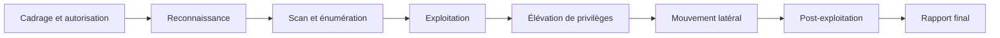

## Introduction

Ce cours réunit et met en pratique, de façon intégrée, l'ensemble des compétences offensives acquises dans les cours précédents — Linux, Réseaux, Sécurité Web, Active Directory, Cryptographie, Psychologie & Ingénierie Sociale, Rédaction de Rapports. Il ne s'agit plus d'apprendre une technique isolée, mais de les enchaîner dans une mission de pentest complète, alignée sur les référentiels professionnels CEH et OSCP.

## Les grandes phases d'un pentest professionnel

<CehCallout>
Rappel du cours Droit et Réglementation (chapitre 1) : aucune phase de ce cycle ne peut légalement commencer sans une autorisation écrite précise définissant le périmètre — c'est la toute première étape, avant même la reconnaissance, et elle conditionne la légalité de tout ce qui suit.
</CehCallout>

## Ce que ce cours réunit — panorama des prérequis

<CompareTable
  titleA="Phase de ce cours"
  titleB="Cours Nyx mobilisé"
  rows={[
    { a: "Reconnaissance (ch.2)", b: "Réseaux, Cybersécurité Offensive elle-même" },
    { a: "Scan et énumération (ch.3)", b: "Réseaux (TP Nmap), Linux" },
    { a: "Exploitation web (ch.4)", b: "Sécurité Web (OWASP Top 10 complet)" },
    { a: "Exploitation réseau (ch.5)", b: "Réseaux, Linux" },
    { a: "Élévation de privilèges (ch.6)", b: "Linux (TP privesc), lab Élévation Silencieuse" },
    { a: "Mouvement latéral (ch.7)", b: "Active Directory & Windows" },
    { a: "Ingénierie sociale (ch.9)", b: "Psychologie & Ingénierie Sociale" },
    { a: "Rapport final (ch.10)", b: "Rédaction de Rapports et Documentation Technique" },
]}
/>

## CEH et OSCP — deux approches complémentaires

<CompareTable
  titleA="CEH (Certified Ethical Hacker)"
  titleB="OSCP (Offensive Security Certified Professional)"
  rows={[
    { a: "Approche large, couvrant de nombreux domaines et outils", b: "Approche approfondie et pratique, centrée sur l'exploitation réelle en laboratoire" },
    { a: "Évaluation par examen à choix multiples", b: "Évaluation par examen pratique de 24h sur des machines réelles à compromettre" },
    { a: "Reconnu comme référentiel de connaissances généraliste", b: "Reconnu pour sa rigueur pratique, très valorisé par les recruteurs techniques" },
]}
/>

<TipCallout>
Ce cours vise à préparer aux deux référentiels simultanément : la largeur de couverture façon CEH (chaque chapitre correspond à un domaine distinct), combinée à la pratique intensive en labs façon OSCP — c'est pourquoi chaque chapitre de ce cours s'appuie sur un lab ou TP Nyx déjà réalisé.
</TipCallout>

## Lab — Mise en Pratique

**Environnement** : Réflexion guidée (sans terminal)

<Steps steps={[
  { title: "Retracer une mission complète", description: "Pour le lab web-001 (La Boutique Piratée) déjà réalisé sur Nyx, retrace les phases de la méthodologie ci-dessus que tu as traversées, même sans t'en rendre compte formellement." },
  { title: "Identifier un prérequis manquant", description: "Si tu devais mener une mission de mouvement latéral en environnement Active Directory demain, quel cours Nyx réviserais-tu en priorité ?" },
]} />

## En résumé

- Ce cours réunit en une méthodologie unique les compétences offensives acquises dans les cours précédents du parcours Nyx.
- Les grandes phases d'un pentest professionnel vont du cadrage/autorisation à la rédaction du rapport final, en passant par reconnaissance, exploitation et élévation de privilèges.
- CEH et OSCP représentent deux approches complémentaires, l'une généraliste, l'autre intensément pratique — ce cours vise les deux à la fois.

## Questions de Révision

1. Quelle est la toute première étape d'un pentest professionnel, avant même la reconnaissance ?
2. Cite deux cours Nyx mobilisés par la phase d'exploitation web de ce cours.
3. Quelle est la différence d'approche entre la certification CEH et la certification OSCP ?
