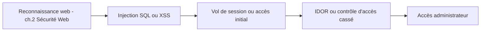

## Introduction

Ce chapitre met en pratique, de façon combinée, l'ensemble des vulnérabilités web étudiées au cours Sécurité Web — injection SQL, XSS, authentification, IDOR, SSRF — dans le contexte d'une mission de pentest réaliste où plusieurs failles coexistent souvent sur une même application.

## Une application réelle combine rarement une seule faille

<CehCallout>
Rappel du lab web-002 (Le Compte Administrateur) : une application réelle présente souvent plusieurs vulnérabilités combinées — un XSS stocké permettant de voler une session, une authentification vulnérable au bruteforce, et une IDOR donnant accès à un panneau d'administration. L'enjeu n'est pas seulement de trouver UNE faille, mais de les enchaîner intelligemment.
</CehCallout>

## Prioriser l'exploitation selon impact et facilité

<CompareTable
  titleA="Critère"
  titleB="Question à se poser"
  rows={[
    { a: "Impact potentiel", b: "Cette faille donne-t-elle accès à des données sensibles, ou seulement à une information mineure ?" },
    { a: "Facilité d'exploitation", b: "Cette faille est-elle immédiatement exploitable, ou nécessite-t-elle des conditions complexes à réunir ?" },
    { a: "Combinabilité", b: "Cette faille peut-elle servir de tremplin vers une autre (ex : XSS pour voler une session, puis IDOR pour accéder à des données) ?" },
]}
/>

<TipCallout>
Rappel du cours Sécurité Web (chapitre 8) : documenter chaque vulnérabilité au fur et à mesure de leur découverte, avec preuve de concept immédiate, évite de devoir tout reproduire de mémoire au moment de rédiger le rapport final (chapitre 10 de ce cours).
</TipCallout>

## Automatiser ce qui peut l'être

<Steps steps={[
  { title: "Détection automatisée d'injection SQL", description: "Rappel du TP sqlmap (cours Sécurité Web, chapitre 3) — automatiser la détection initiale libère du temps pour l'analyse manuelle des cas plus subtils." },
  { title: "Bruteforce ciblé d'authentification", description: "Rappel du TP Hydra (cours Sécurité Web, chapitre 5) — à utiliser uniquement dans le périmètre autorisé, jamais en aveugle." },
  { title: "Vérification manuelle systématique de l'IDOR", description: "Rappel du cours Sécurité Web (chapitre 6) : l'IDOR nécessite une vérification manuelle méthodique, difficile à automatiser complètement sans faux négatifs." },
]} />

<WarningCallout>
S'appuyer uniquement sur des scanners automatisés donne une fausse impression de couverture complète — de nombreuses vulnérabilités de logique métier (comme l'IDOR ou le contrôle d'accès cassé) échappent systématiquement aux outils automatisés et nécessitent une analyse manuelle experte.
</WarningCallout>

## Lab — Mise en Pratique

**Environnement** : Kali Linux (terminal Nyx Shell) — labs web-001 et web-002

<Steps steps={[
  { title: "Enchaîner deux vulnérabilités", description: "Sur le lab web-002 (Le Compte Administrateur), enchaîne le XSS stocké pour obtenir une session, puis exploite l'IDOR pour accéder au panneau d'administration." },
  { title: "Documenter au fil de l'eau", description: "Pour chaque étape de l'enchaînement précédent, rédige immédiatement une fiche de vulnérabilité complète (rappel du cours Rédaction de Rapports, chapitre 3)." },
]} />

## En résumé

- Une application réelle combine souvent plusieurs vulnérabilités web, à enchaîner plutôt qu'à traiter isolément.
- La priorisation de l'exploitation combine impact, facilité et capacité à servir de tremplin vers une autre faille.
- L'automatisation (sqlmap, Hydra) accélère la détection initiale, mais ne remplace jamais l'analyse manuelle des failles de logique métier comme l'IDOR.

## Questions de Révision

1. Pourquoi une application réelle présente-t-elle rarement une seule vulnérabilité isolée ?
2. Donne un exemple d'enchaînement possible entre un XSS stocké et une IDOR.
3. Pourquoi un scanner automatisé ne suffit-il jamais à couvrir complètement les vulnérabilités de logique métier ?
