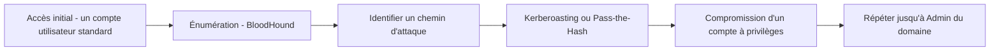

## Introduction

Ce chapitre met en pratique, dans le contexte d'une mission de pentest complète, l'ensemble des techniques Active Directory déjà étudiées en détail au cours dédié — énumération, Kerberoasting, Pass-the-Hash, abus de délégation, persistance.

## Rappel de la chaîne d'attaque Active Directory

<CehCallout>
Rappel du cours Active Directory & Windows (chapitre 2) et du cours Mathématiques Appliquées (chapitre 7, théorie des graphes) : BloodHound modélise le domaine comme un graphe de relations de privilège, et calcule automatiquement le chemin le plus court vers la cible — une capacité qui transforme radicalement l'efficacité de cette phase par rapport à une énumération manuelle.
</CehCallout>

## Enchaîner les techniques dans une mission réelle

<Steps steps={[
  { title: "Obtenir un premier compte", description: "Souvent via phishing (cours Psychologie & Ingénierie Sociale) ou exploitation d'un service exposé (chapitre 5 de ce cours)." },
  { title: "Collecter les données avec BloodHound", description: "Une fois un compte standard obtenu, l'énumération du domaine révèle la structure complète des relations de privilège." },
  { title: "Identifier et exploiter le chemin le plus court", description: "Rappel du cours Active Directory, chapitre 3 (Kerberoasting) ou chapitre 4 (Pass-the-Hash), selon la nature du chemin identifié." },
  { title: "Répéter jusqu'à l'objectif", description: "Chaque compte compromis peut ouvrir de nouveaux chemins, dans une boucle d'énumération et d'exploitation successive." },
]} />

## L'apport concret de BloodHound en mission réelle

<TipCallout>
Sur un domaine de taille réelle (plusieurs milliers d'objets), une énumération manuelle exhaustive des relations de privilège serait humainement impraticable dans le temps imparti à une mission de pentest — BloodHound rend cette analyse possible en quelques minutes, ce qui explique son adoption quasi universelle dans les missions AD professionnelles.
</TipCallout>

<WarningCallout>
Rappel du cours Administration Systèmes et Réseaux (chapitre 2, modèle de tiering) : un domaine correctement durci selon ce modèle réduit drastiquement le nombre de chemins d'attaque exploitables identifiés par BloodHound — l'absence de chemin court vers l'Admin du domaine est précisément l'objectif d'un durcissement AD réussi.
</WarningCallout>

## Lab — Mise en Pratique

**Environnement** : Réflexion guidée (sans terminal)

<Steps steps={[
  { title: "Retracer une chaîne d'attaque AD complète", description: "En t'appuyant sur les chapitres du cours Active Directory & Windows, décris une chaîne d'attaque complète depuis un compte standard jusqu'à Admin du domaine, en citant la technique utilisée à chaque étape." },
  { title: "Expliquer l'impact d'un bon durcissement", description: "Pourquoi un domaine correctement segmenté selon le modèle de tiering présente-t-il beaucoup moins de chemins d'attaque identifiables par BloodHound ?" },
]} />

## En résumé

- Une mission AD réelle enchaîne accès initial, énumération BloodHound, exploitation du chemin le plus court, et répétition jusqu'à l'objectif.
- BloodHound rend praticable en quelques minutes une analyse qui serait humainement impossible à mener manuellement sur un domaine de taille réelle.
- Un domaine correctement durci selon le modèle de tiering réduit drastiquement les chemins d'attaque exploitables.

## Questions de Révision

1. Pourquoi BloodHound est-il devenu quasi incontournable dans les missions de pentest Active Directory réelles ?
2. Décris les grandes étapes d'une chaîne d'attaque AD, depuis un compte standard jusqu'à Admin du domaine.
3. Pourquoi le modèle de tiering réduit-il directement l'efficacité d'une analyse BloodHound pour l'attaquant ?
