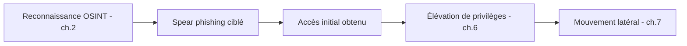

## Introduction

Ce chapitre met en pratique, dans le contexte technique de ce cours, les principes déjà détaillés au cours Psychologie & Ingénierie Sociale — comment intégrer une composante d'ingénierie sociale dans une mission de pentest globale, souvent le moyen le plus efficace d'obtenir un accès initial.

## Pourquoi combiner ingénierie sociale et pentest technique

<CehCallout>
Rappel du cours Psychologie & Ingénierie Sociale (chapitre 1) : l'humain reste le vecteur le plus exploité — une mission de pentest limitée aux seules techniques (chapitres 2 à 8 de ce cours) peut passer à côté du vecteur d'accès initial le plus réaliste et le plus fréquemment utilisé par de véritables attaquants.
</CehCallout>



## Concevoir une campagne de phishing simulé encadrée

<Steps steps={[
  { title: "Définir un périmètre précis dans l'autorisation", description: "Rappel du cours Droit et Réglementation (chapitre 1) et du cours Psychologie (chapitre 6) : quelles techniques sont autorisées (email uniquement ? vishing ? tailgating physique ?), quels employés sont concernés." },
  { title: "Construire un prétexte réaliste mais éthique", description: "Rappel du cours Psychologie (chapitre 3-4) : un scénario crédible, sans exploiter d'informations personnelles sensibles hors cadre professionnel." },
  { title: "Mesurer sans nommer les individus", description: "Rappel du cours Psychologie (chapitre 5) : le taux de clic global informe la posture de l'organisation, jamais un blâme individuel dans le rapport." },
]} />

<WarningCallout>
Une campagne de phishing simulé dans le cadre d'un pentest doit suivre exactement les mêmes garde-fous éthiques détaillés au cours Psychologie & Ingénierie Sociale (chapitre 6) — le rapport final ne doit jamais nommer publiquement les employés ayant cliqué, sous peine de nuire à la confiance envers l'équipe sécurité.
</WarningCallout>

## Combiner accès social et exploitation technique

```text
Exemple de scénario combiné :

1. Reconnaissance OSINT (ch.2) identifie un projet en cours mentionné
   publiquement par un employé sur LinkedIn.
2. Email de spear phishing personnalisé mentionnant ce projet,
   contenant une pièce jointe piégée (dans le cadre autorisé).
3. Ouverture de la pièce jointe → accès initial à un poste utilisateur.
4. Élévation de privilèges locale (ch.6) sur ce poste.
5. Énumération Active Directory (ch.7) depuis ce point d'accès.
```

<TipCallout>
Ce scénario illustre la valeur d'une mission de pentest complète par rapport à un test purement technique isolé : l'accès initial le plus réaliste est souvent social, mais toute la chaîne d'exploitation technique qui suit reste identique à celle étudiée dans les chapitres précédents.
</TipCallout>

## Lab — Mise en Pratique

**Environnement** : Réflexion guidée (sans terminal)

<Steps steps={[
  { title: "Concevoir un scénario combiné", description: "Propose un scénario de mission combinant reconnaissance OSINT, spear phishing et exploitation technique, pour une entreprise fictive de ton choix." },
  { title: "Vérifier les garde-fous éthiques", description: "Pour la campagne de phishing simulé de ce scénario, quelles clauses de l'autorisation écrite seraient indispensables selon le cours Psychologie (chapitre 6) ?" },
]} />

## En résumé

- L'humain reste souvent le vecteur d'accès initial le plus réaliste, faisant de l'ingénierie sociale une composante précieuse d'une mission de pentest complète.
- Une campagne de phishing simulé en pentest doit suivre les mêmes garde-fous éthiques stricts détaillés au cours Psychologie & Ingénierie Sociale.
- Un accès obtenu par ingénierie sociale s'intègre naturellement dans la suite de la chaîne d'exploitation technique déjà étudiée (élévation, mouvement latéral).

## Questions de Révision

1. Pourquoi une mission de pentest limitée aux seules techniques peut-elle manquer le vecteur d'accès le plus réaliste ?
2. Quelles précisions doit contenir l'autorisation écrite d'une campagne de phishing simulé intégrée à un pentest ?
3. Une fois un accès initial obtenu par spear phishing, quelles étapes techniques déjà étudiées dans ce cours suivent typiquement ?
