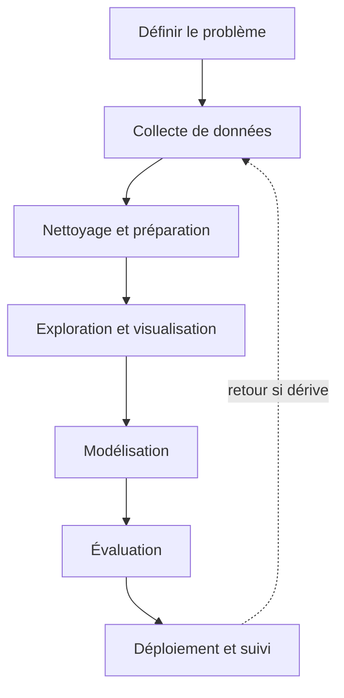

## Introduction

Ce cours met en pratique les fondations mathématiques posées aux cours Mathématiques Appliquées et Algèbre Linéaire, en les appliquant à des cas concrets de cybersécurité — détection de phishing, analyse de logs, identification d'anomalies réseau. Ce premier chapitre pose le cadre méthodologique global avant d'entrer dans le détail technique.

## Les grandes étapes d'un projet de data science

<CehCallout>
Contrairement à une idée reçue répandue, la modélisation (entraîner un algorithme de machine learning) ne représente généralement qu'une petite fraction du temps d'un projet de data science — la collecte, le nettoyage et l'exploration des données en consomment la majorité, souvent 60 à 80% selon les estimations couramment citées dans l'industrie.
</CehCallout>

## Data science, machine learning, IA — clarifier le vocabulaire

<CompareTable
  titleA="Terme"
  titleB="Périmètre"
  rows={[
    { a: "Data science", b: "Discipline englobante : collecte, nettoyage, analyse et exploitation de données pour en tirer des décisions" },
    { a: "Machine learning", b: "Sous-ensemble de la data science : algorithmes qui apprennent des motifs à partir de données plutôt que d'être programmés explicitement" },
    { a: "Intelligence artificielle", b: "Champ plus large englobant le ML, mais aussi des approches non statistiques (systèmes à base de règles, agents logiques)" },
]}
/>

<TipCallout>
Un détecteur de spam basé sur une liste de mots interdits codée en dur relève de l'IA (un système à base de règles) mais pas du machine learning — un détecteur qui apprend à partir de milliers d'emails déjà classés relève, lui, du machine learning, approfondi au cours IA & Agents en Cybersécurité.
</TipCallout>

## Pourquoi ce cadre méthodologique compte particulièrement en sécurité

<WarningCallout>
Sauter directement à la modélisation sans comprendre la qualité et les biais des données collectées est une erreur fréquente et coûteuse en sécurité : un modèle de détection d'intrusion entraîné sur des logs incomplets ou non représentatifs du trafic réel de production donnera une fausse impression de performance en test, avant de échouer largement une fois déployé.
</WarningCallout>

<Steps steps={[
  { title: "Définir précisément le problème", description: "Ex : 'détecter les emails de phishing' est trop vague — préciser le taux de faux positifs acceptable, la latence tolérée, les types de phishing ciblés." },
  { title: "Collecter des données représentatives", description: "Des données non représentatives du contexte réel de déploiement produisent un modèle qui ne généralise pas." },
  { title: "Nettoyer avant d'explorer", description: "Des données brutes contiennent presque toujours des valeurs manquantes, dupliquées ou aberrantes à traiter avant toute analyse fiable." },
  { title: "Évaluer avec les bonnes métriques", description: "Une métrique mal choisie (approfondi au chapitre 7) peut donner une illusion de succès sur un problème de sécurité déséquilibré (peu d'attaques parmi énormément de trafic normal)." },
]} />

## Lab — Mise en Pratique

**Environnement** : Réflexion guidée (sans terminal)

<Steps steps={[
  { title: "Identifier une étape manquante", description: "Une équipe entraîne directement un modèle de détection de phishing sur un jeu de données brut téléchargé en ligne, sans l'explorer ni le nettoyer au préalable. Quelles étapes du cycle de vie ont été sautées, et quel risque cela fait-il courir ?" },
  { title: "Distinguer IA, ML et data science", description: "Un pare-feu qui bloque le trafic selon une liste de règles fixes relève-t-il du machine learning ? Justifie." },
]} />

## En résumé

- Un projet de data science suit un cycle : définition du problème, collecte, nettoyage, exploration, modélisation, évaluation, déploiement.
- La collecte et le nettoyage des données consomment généralement la majorité du temps d'un projet, bien avant la modélisation.
- La data science englobe le machine learning, qui est lui-même un sous-ensemble de l'intelligence artificielle au sens large.

## Questions de Révision

1. Pourquoi la modélisation ne représente-t-elle généralement qu'une petite partie du temps d'un projet de data science ?
2. Quelle est la différence entre intelligence artificielle et machine learning ?
3. Pourquoi des données non représentatives du contexte réel de déploiement posent-elles un problème particulièrement grave en sécurité ?
