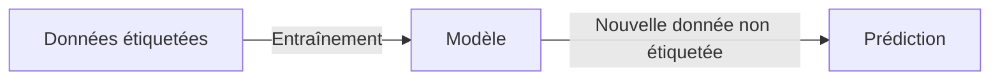
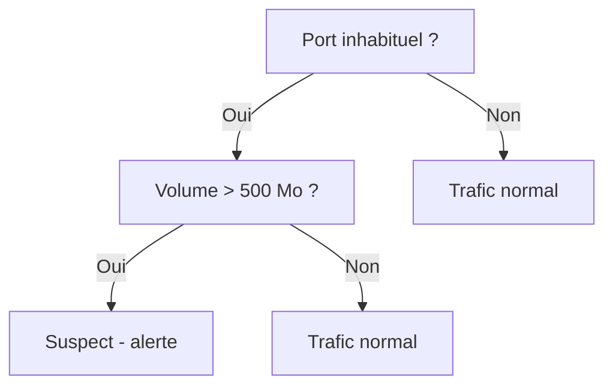

## Introduction

Ce chapitre introduit le machine learning supervisé — la famille d'algorithmes la plus utilisée en pratique, où le modèle apprend à partir d'exemples déjà étiquetés (par exemple, des emails déjà classés "phishing" ou "légitime").

## Le principe de l'apprentissage supervisé

<CehCallout>
"Supervisé" signifie que chaque exemple d'entraînement est accompagné de la bonne réponse (l'étiquette) — un modèle de détection de phishing supervisé s'entraîne sur des milliers d'emails déjà classés par des humains, puis apprend à généraliser cette classification à de nouveaux emails jamais vus.
</CehCallout>

## Classification vs régression

<CompareTable
  titleA="Classification"
  titleB="Régression"
  rows={[
    { a: "Prédit une catégorie discrète", b: "Prédit une valeur numérique continue" },
    { a: "Exemple : phishing ou légitime", b: "Exemple : temps estimé avant qu'une vulnérabilité soit exploitée" },
    { a: "Exemple : type de malware (ransomware, spyware, ver...)", b: "Exemple : volume de trafic attendu la semaine prochaine" },
]}
/>

## Les k plus proches voisins (k-NN)

<Steps steps={[
  { title: "Représenter chaque exemple comme un vecteur", description: "Rappel du cours Algèbre Linéaire, chapitre 1 — chaque email, connexion ou fichier devient un vecteur de caractéristiques." },
  { title: "Calculer la distance à tous les exemples connus", description: "Utiliser une distance euclidienne ou une similarité cosinus (cours Algèbre Linéaire, chapitre 6)." },
  { title: "Regarder les k voisins les plus proches", description: "Prendre les k exemples déjà étiquetés les plus proches de la nouvelle donnée." },
  { title: "Voter la classe majoritaire", description: "La classe la plus représentée parmi ces k voisins devient la prédiction." },
]} />

<TipCallout>
Le choix de k influence fortement le résultat : un k trop petit (ex : 1) rend le modèle très sensible au bruit d'un seul exemple mal étiqueté ; un k trop grand lisse excessivement les frontières entre classes, au risque de perdre en précision sur des cas limites.
</TipCallout>

## Les arbres de décision

<CehCallout>
Un arbre de décision pose une série de questions successives sur les caractéristiques d'une donnée ("le volume de trafic dépasse-t-il 500 Mo ?", "le port est-il inhabituel ?") pour arriver à une classification finale — sa structure est directement lisible et interprétable par un humain, contrairement à de nombreux autres modèles de machine learning.
</CehCallout>

<WarningCallout>
Un arbre de décision trop profond (trop de questions successives) peut mémoriser exactement les exemples d'entraînement plutôt que d'apprendre des motifs généralisables — un phénomène appelé surapprentissage (overfitting), approfondi au chapitre 7 de ce cours.
</WarningCallout>

## Lab — Mise en Pratique

**Environnement** : Python 3 (terminal Nyx Shell ou environnement local avec `pandas`/`numpy`/`matplotlib` installés)

<Steps steps={[
  { title: "Représenter des connexions comme des vecteurs", description: "Crée un petit jeu d'entraînement étiqueté (trafic normal vs intrusion suspectée) sous forme de vecteurs [volume_Mo, duree_s], ainsi qu'une nouvelle connexion à classer.", code: 'import numpy as np\n\n# Chaque connexion est un vecteur [volume_Mo, duree_s], avec son etiquette connue\nX_entrainement = np.array([\n    [10, 30], [12, 28], [8, 25],       # trafic normal\n    [600, 5], [550, 4], [700, 6]       # intrusion suspectee\n])\ny_entrainement = np.array(["normal", "normal", "normal", "intrusion", "intrusion", "intrusion"])\n\nnouvelle_connexion = np.array([580, 5])' },
  { title: "Calculer la distance aux exemples connus", description: "Calcule la distance euclidienne entre la nouvelle connexion et chaque exemple d'entraînement.", code: 'distances = np.linalg.norm(X_entrainement - nouvelle_connexion, axis=1)\nprint("Distances aux exemples connus :", distances)' },
  { title: "Voter la classe majoritaire (k-NN)", description: "Retiens les k=3 voisins les plus proches et détermine la classe majoritaire parmi eux.", code: 'k = 3\nindices_plus_proches = np.argsort(distances)[:k]\nvoisins = y_entrainement[indices_plus_proches]\n\nfrom collections import Counter\nprediction = Counter(voisins).most_common(1)[0][0]\nprint("Classe predite pour la nouvelle connexion :", prediction)' },
  { title: "Relier au choix de k", description: "'Prédire si une connexion réseau est une intrusion ou non' est-il un problème de classification ou de régression ? Et 'estimer la bande passante consommée dans l'heure suivante' ? Avec le code ci-dessus, pourquoi un k=1 rendrait-il la prédiction beaucoup plus sensible à un seul exemple d'entraînement mal étiqueté qu'un k=3 ?" },
]} />

## En résumé

- L'apprentissage supervisé entraîne un modèle à partir d'exemples déjà étiquetés, pour généraliser à de nouvelles données.
- La classification prédit une catégorie discrète, la régression une valeur numérique continue.
- Les k plus proches voisins classent selon la proximité (distance) aux exemples connus ; les arbres de décision classent via une série de questions interprétables.

## Questions de Révision

1. Que signifie "supervisé" dans l'apprentissage supervisé ?
2. Donne un exemple de problème de classification et un exemple de problème de régression en cybersécurité.
3. Pourquoi un arbre de décision trop profond risque-t-il de mal généraliser à de nouvelles données ?
