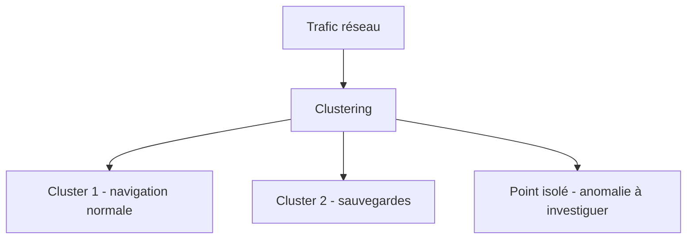

## Introduction

Contrairement au chapitre précédent, l'apprentissage non supervisé travaille sur des données SANS étiquette connue — une situation très fréquente en sécurité, où l'on ne dispose pas toujours d'exemples déjà classés d'attaques (notamment pour des menaces inédites, dites "zero-day").

## Pourquoi le non supervisé compte particulièrement en sécurité

<CehCallout>
Un modèle supervisé de détection d'intrusion ne peut détecter que des types d'attaques déjà vus et étiquetés dans son jeu d'entraînement. Une attaque totalement inédite ("zero-day" en termes de comportement, pas nécessairement de vulnérabilité) échappera à un modèle purement supervisé — c'est précisément ce que le non supervisé, en cherchant des motifs sans étiquette préalable, peut aider à repérer.
</CehCallout>

## Le clustering — regrouper sans étiquette

<Steps steps={[
  { title: "Choisir un nombre de groupes (k)", description: "Décider combien de groupes distincts on cherche à identifier dans les données." },
  { title: "Initialiser des centres de groupe au hasard", description: "Des points de départ arbitraires dans l'espace des caractéristiques (cours Algèbre Linéaire, chapitre 1)." },
  { title: "Assigner chaque point au centre le plus proche", description: "Utiliser une distance (cours Algèbre Linéaire, chapitre 6) pour déterminer l'appartenance." },
  { title: "Recalculer les centres et répéter", description: "Le centre de chaque groupe devient la moyenne de tous les points qui lui sont assignés, jusqu'à stabilisation." },
]} />

<TipCallout>
L'algorithme k-means, le plus utilisé pour le clustering, ne garantit pas de trouver la meilleure solution globale — le résultat peut dépendre de l'initialisation aléatoire des centres, d'où la pratique courante de relancer l'algorithme plusieurs fois et de garder le meilleur résultat obtenu.
</TipCallout>

## Application du clustering à la sécurité

<CompareTable
  titleA="Cas d'usage"
  titleB="Ce que révèle le clustering"
  rows={[
    { a: "Segmentation du trafic réseau", b: "Regroupe les connexions en profils similaires (navigation web normale, sauvegardes automatisées, streaming...)" },
    { a: "Regroupement de malwares", b: "Identifie des familles de malwares aux comportements similaires, sans connaître leur nom au préalable" },
    { a: "Profils utilisateurs", b: "Regroupe les comportements utilisateurs typiques, pour repérer ensuite ceux qui s'en écartent fortement" },
]}
/>

## La détection d'anomalies par le non supervisé

<CehCallout>
Le principe central : la grande majorité du trafic ou des comportements est "normale" et se regroupe naturellement en quelques clusters denses — une observation qui n'appartient clairement à aucun cluster existant, ou qui en est très éloignée, constitue une anomalie candidate à investiguer, sans jamais avoir eu besoin d'exemples étiquetés d'attaques.
</CehCallout>

<WarningCallout>
La détection d'anomalies non supervisée produit inévitablement des faux positifs : un comportement légitime mais rare (un employé qui se connecte depuis un nouveau pays lors d'un déplacement professionnel) peut être signalé comme anomalie alors qu'il ne s'agit pas d'une attaque — ces alertes doivent être triées par un analyste, un lien direct avec le travail quotidien décrit au cours Analyse SOC.
</WarningCallout>

## Lab — Mise en Pratique

**Environnement** : Réflexion guidée (sans terminal)

<Steps steps={[
  { title: "Justifier le choix du non supervisé", description: "Pourquoi une équipe de sécurité qui veut détecter des attaques encore jamais documentées choisirait-elle une approche non supervisée plutôt que supervisée ?" },
  { title: "Anticiper un faux positif", description: "Un employé en voyage se connecte depuis un pays inhabituel pour la première fois. Pourquoi un système de détection d'anomalies non supervisé pourrait-il le signaler à tort, et comment un analyste SOC devrait-il réagir ?" },
]} />

## En résumé

- L'apprentissage non supervisé travaille sans étiquettes connues, particulièrement utile pour détecter des menaces inédites.
- Le clustering (k-means) regroupe des données similaires sans connaître leurs catégories à l'avance.
- La détection d'anomalies non supervisée repère les observations qui s'écartent fortement des clusters normaux, au prix de faux positifs à trier.

## Questions de Révision

1. Pourquoi un modèle supervisé ne peut-il pas détecter une attaque totalement inédite ?
2. Décris les grandes étapes de l'algorithme k-means.
3. Pourquoi la détection d'anomalies non supervisée produit-elle nécessairement des faux positifs ?
