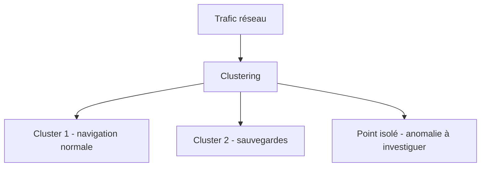

## Introduction

Contrairement au chapitre précédent, l'apprentissage non supervisé travaille sur des données SANS étiquette connue — une situation très fréquente en sécurité, où l'on ne dispose pas toujours d'exemples déjà classés d'attaques (notamment pour des menaces inédites, dites "zero-day").

## Pourquoi le non supervisé compte particulièrement en sécurité

<CehCallout>
Un modèle supervisé de détection d'intrusion ne peut détecter que des types d'attaques déjà vus et étiquetés dans son jeu d'entraînement. Une attaque totalement inédite ("zero-day" en termes de comportement, pas nécessairement de vulnérabilité) échappera à un modèle purement supervisé — c'est précisément ce que le non supervisé, en cherchant des motifs sans étiquette préalable, peut aider à repérer.
</CehCallout>

## Le clustering — regrouper sans étiquette

<Steps steps={[
  { title: "Choisir un nombre de groupes (k)", description: "Décider combien de groupes distincts on cherche à identifier dans les données." },
  { title: "Initialiser des centres de groupe au hasard", description: "Des points de départ arbitraires dans l'espace des caractéristiques (cours Algèbre Linéaire, chapitre 1)." },
  { title: "Assigner chaque point au centre le plus proche", description: "Utiliser une distance (cours Algèbre Linéaire, chapitre 6) pour déterminer l'appartenance." },
  { title: "Recalculer les centres et répéter", description: "Le centre de chaque groupe devient la moyenne de tous les points qui lui sont assignés, jusqu'à stabilisation." },
]} />

<TipCallout>
L'algorithme k-means, le plus utilisé pour le clustering, ne garantit pas de trouver la meilleure solution globale — le résultat peut dépendre de l'initialisation aléatoire des centres, d'où la pratique courante de relancer l'algorithme plusieurs fois et de garder le meilleur résultat obtenu.
</TipCallout>

## Application du clustering à la sécurité

<CompareTable
  titleA="Cas d'usage"
  titleB="Ce que révèle le clustering"
  rows={[
    { a: "Segmentation du trafic réseau", b: "Regroupe les connexions en profils similaires (navigation web normale, sauvegardes automatisées, streaming...)" },
    { a: "Regroupement de malwares", b: "Identifie des familles de malwares aux comportements similaires, sans connaître leur nom au préalable" },
    { a: "Profils utilisateurs", b: "Regroupe les comportements utilisateurs typiques, pour repérer ensuite ceux qui s'en écartent fortement" },
]}
/>

## La détection d'anomalies par le non supervisé

<CehCallout>
Le principe central : la grande majorité du trafic ou des comportements est "normale" et se regroupe naturellement en quelques clusters denses — une observation qui n'appartient clairement à aucun cluster existant, ou qui en est très éloignée, constitue une anomalie candidate à investiguer, sans jamais avoir eu besoin d'exemples étiquetés d'attaques.
</CehCallout>

<WarningCallout>
La détection d'anomalies non supervisée produit inévitablement des faux positifs : un comportement légitime mais rare (un employé qui se connecte depuis un nouveau pays lors d'un déplacement professionnel) peut être signalé comme anomalie alors qu'il ne s'agit pas d'une attaque — ces alertes doivent être triées par un analyste, un lien direct avec le travail quotidien décrit au cours Analyse SOC.
</WarningCallout>

## Lab — Mise en Pratique

**Environnement** : Python 3 (terminal Nyx Shell ou environnement local avec `pandas`/`numpy`/`matplotlib` installés)

<Steps steps={[
  { title: "Créer un jeu de connexions avec un point isolé", description: "Génère deux groupes de comportements réseau normaux (navigation, sauvegardes) plus un point clairement isolé, comme dans le schéma du chapitre.", code: 'import numpy as np\n\nnp.random.seed(1)\ncluster_navigation = np.random.normal([20, 5], 2, size=(20, 2))     # duree, volume\ncluster_sauvegardes = np.random.normal([300, 800], 15, size=(15, 2))\npoint_isole = np.array([[900, 50]])                                   # comportement inhabituel\n\nX = np.vstack([cluster_navigation, cluster_sauvegardes, point_isole])\nprint(X.shape)' },
  { title: "Implémenter les étapes du k-means", description: "Initialise deux centres au hasard, puis répète assignation et recalcul des centres jusqu'à stabilisation — les quatre étapes décrites plus haut.", code: 'k = 2\ncentres = X[np.random.choice(len(X), k, replace=False)]\n\nfor iteration in range(10):\n    distances = np.array([np.linalg.norm(X - centre, axis=1) for centre in centres])\n    assignations = np.argmin(distances, axis=0)\n    centres = np.array([X[assignations == c].mean(axis=0) for c in range(k)])\n\nprint("Centres finaux :", centres)' },
  { title: "Repérer l'anomalie", description: "Identifie le point le plus éloigné du centre de son propre cluster : c'est l'anomalie candidate à investiguer, sans avoir utilisé aucune étiquette d'attaque.", code: 'distances_au_centre = np.linalg.norm(X - centres[assignations], axis=1)\nindice_anomalie = np.argmax(distances_au_centre)\nprint("Point le plus eloigne de son cluster (anomalie candidate) :", X[indice_anomalie])' },
  { title: "Anticiper un faux positif malgré le clustering", description: "Pourquoi une équipe de sécurité qui veut détecter des attaques encore jamais documentées choisirait-elle une approche non supervisée comme celle ci-dessus plutôt que supervisée ? Si le point isolé détecté à l'étape précédente correspondait en réalité à un employé en déplacement se connectant depuis un pays inhabituel, pourquoi le système le signalerait-il à tort, et comment un analyste SOC devrait-il réagir ?" },
]} />

## En résumé

- L'apprentissage non supervisé travaille sans étiquettes connues, particulièrement utile pour détecter des menaces inédites.
- Le clustering (k-means) regroupe des données similaires sans connaître leurs catégories à l'avance.
- La détection d'anomalies non supervisée repère les observations qui s'écartent fortement des clusters normaux, au prix de faux positifs à trier.

## Questions de Révision

1. Pourquoi un modèle supervisé ne peut-il pas détecter une attaque totalement inédite ?
2. Décris les grandes étapes de l'algorithme k-means.
3. Pourquoi la détection d'anomalies non supervisée produit-elle nécessairement des faux positifs ?
