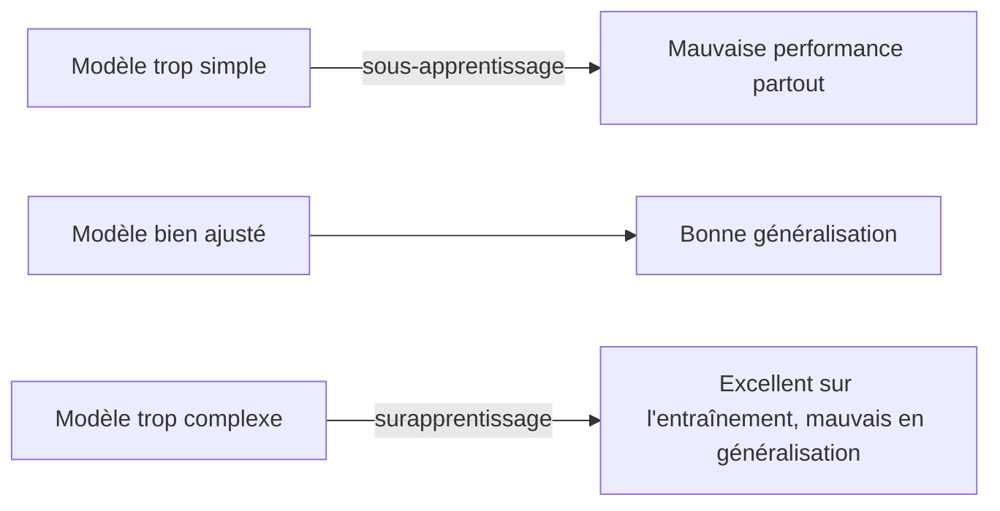

## Introduction

Un modèle qui affiche "99% de précision" peut être soit excellent, soit totalement inutile — tout dépend de la métrique employée et de la nature des données. Ce chapitre couvre les pièges d'évaluation les plus fréquents, particulièrement critiques en sécurité où les données sont presque toujours déséquilibrées (très peu d'attaques parmi énormément de trafic normal).

## La matrice de confusion

<CompareTable
  titleA="Résultat"
  titleB="Signification"
  rows={[
    { a: "Vrai positif (VP)", b: "Le modèle prédit une attaque, c'en est réellement une" },
    { a: "Faux positif (FP)", b: "Le modèle prédit une attaque, mais c'était du trafic normal (fausse alerte)" },
    { a: "Vrai négatif (VN)", b: "Le modèle prédit du trafic normal, c'en est réellement" },
    { a: "Faux négatif (FN)", b: "Le modèle prédit du trafic normal, mais c'était une attaque manquée" },
]}
/>

<WarningCallout>
En sécurité, un faux négatif (une attaque manquée) est généralement bien plus coûteux qu'un faux positif (une fausse alerte à trier) — un système de détection doit souvent être réglé en tenant compte de cette asymétrie de coût, pas seulement en cherchant à minimiser le nombre total d'erreurs.
</WarningCallout>

## Pourquoi l'accuracy est trompeuse sur des données déséquilibrées

<CehCallout>
Sur un jeu de données où seulement 1% du trafic est une attaque réelle, un modèle "paresseux" qui prédit systématiquement "trafic normal" obtient déjà 99% d'accuracy — un chiffre impressionnant mais totalement inutile, puisque ce modèle ne détecte jamais aucune attaque. C'est le piège classique de l'accuracy sur des données fortement déséquilibrées, la norme en sécurité.
</CehCallout>

## Précision, rappel et F1-score

<CompareTable
  titleA="Métrique"
  titleB="Calcul et signification"
  rows={[
    { a: "Précision (precision)", b: "VP / (VP + FP) — parmi les alertes déclenchées, quelle proportion est réellement une attaque ?" },
    { a: "Rappel (recall)", b: "VP / (VP + FN) — parmi les attaques réelles, quelle proportion a été détectée ?" },
    { a: "F1-score", b: "Moyenne harmonique de la précision et du rappel — un compromis unique entre les deux" },
]}
/>

<TipCallout>
Un SOC qui privilégie ne rater aucune attaque (chapitre lié : Analyse SOC) acceptera un rappel élevé au prix d'une précision plus faible (plus de fausses alertes à trier) — le choix du compromis précision/rappel dépend directement du coût relatif des faux positifs et des faux négatifs pour l'organisation concernée.
</TipCallout>

## Le surapprentissage (overfitting)

<CehCallout>
Un modèle en surapprentissage a "mémorisé" les exemples d'entraînement (y compris leur bruit et leurs particularités non généralisables) plutôt que d'apprendre des motifs réellement transférables — il obtient d'excellents résultats sur les données d'entraînement mais échoue sur des données nouvelles jamais vues.
</CehCallout>

<Steps steps={[
  { title: "Séparer les données en jeux distincts", description: "Entraînement (pour apprendre), validation (pour ajuster), test (pour l'évaluation finale, jamais utilisé pendant l'entraînement)." },
  { title: "Surveiller l'écart entraînement/validation", description: "Un modèle en surapprentissage montre une performance qui continue de s'améliorer sur l'entraînement tout en stagnant ou se dégradant sur la validation." },
  { title: "Simplifier le modèle si nécessaire", description: "Réduire la profondeur d'un arbre de décision, ou utiliser des techniques de régularisation, pour limiter la mémorisation excessive." },
]} />

<WarningCallout>
Évaluer un modèle sur les mêmes données que celles utilisées pour l'entraîner donne systématiquement une estimation optimiste et trompeuse de sa performance réelle — c'est pourquoi le jeu de test doit rester strictement séparé et jamais consulté avant l'évaluation finale.
</WarningCallout>

## Lab — Mise en Pratique

**Environnement** : Réflexion guidée (sans terminal)

<Steps steps={[
  { title: "Calculer précision et rappel", description: "Un modèle de détection produit 80 vrais positifs, 20 faux positifs, et 10 faux négatifs. Calcule sa précision et son rappel." },
  { title: "Identifier un piège d'accuracy", description: "Un modèle de détection de fraude annonce 98% d'accuracy sur un jeu de données où seulement 2% des transactions sont frauduleuses. Que faut-il vérifier avant de juger ce modèle réellement performant ?" },
]} />

## En résumé

- La matrice de confusion (VP, FP, VN, FN) est la base de toutes les métriques d'évaluation d'un modèle de classification.
- L'accuracy est trompeuse sur des données déséquilibrées, la norme en sécurité — précision, rappel et F1-score sont souvent plus pertinents.
- Le surapprentissage se détecte en comparant la performance sur l'entraînement et sur un jeu de validation distinct, jamais sur les mêmes données que l'entraînement.

## Questions de Révision

1. Pourquoi un faux négatif est-il généralement plus coûteux qu'un faux positif en sécurité ?
2. Pourquoi l'accuracy peut-elle donner une impression trompeuse de performance sur un jeu de données déséquilibré ?
3. Comment détecte-t-on qu'un modèle est en situation de surapprentissage ?
