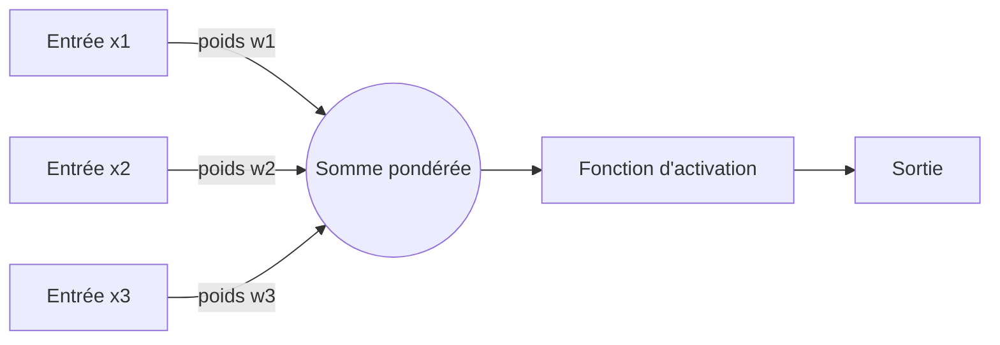

## Introduction

Ce cours prolonge le cours Machine Learning en abordant les réseaux de neurones et le deep learning — des modèles inspirés (très librement) du fonctionnement des neurones biologiques, à l'origine des avancées les plus spectaculaires de l'intelligence artificielle moderne, de la reconnaissance d'image à la génération de texte.

## Le perceptron — l'unité de base

<CehCallout>
Un perceptron est l'unité de calcul la plus simple d'un réseau de neurones : il reçoit plusieurs entrées, calcule leur somme pondérée (rappel du cours Algèbre Linéaire, produit scalaire), puis applique une fonction d'activation pour produire une sortie — une structure qui rappelle directement la régression linéaire du cours Machine Learning (chapitre 2), à laquelle s'ajoute cette fonction d'activation.
</CehCallout>



```text
Calcul d'un perceptron :
somme = w1*x1 + w2*x2 + w3*x3 + b
sortie = fonction_activation(somme)
```

## Les fonctions d'activation

<CehCallout>
Sans fonction d'activation non linéaire, un perceptron (ou même un empilement de perceptrons) ne pourrait modéliser que des relations linéaires, quel que soit le nombre de couches — la fonction d'activation introduit la non-linéarité qui permet aux réseaux de neurones d'apprendre des motifs complexes.
</CehCallout>

<CompareTable
  titleA="Fonction d'activation"
  titleB="Caractéristique"
  rows={[
    { a: "Sigmoïde", b: "Rappel du cours Machine Learning (chapitre 2) : transforme la somme en une valeur entre 0 et 1, utile en sortie pour une probabilité" },
    { a: "ReLU (Rectified Linear Unit)", b: "Retourne 0 pour toute entrée négative, l'entrée elle-même sinon — la plus utilisée dans les couches internes des réseaux profonds" },
    { a: "Tanh", b: "Similaire à la sigmoïde mais centrée sur 0, valeurs entre -1 et 1" },
]}
/>

## La limite historique du perceptron isolé

<WarningCallout>
Un perceptron isolé ne peut résoudre que des problèmes linéairement séparables — il est par exemple incapable d'apprendre la fonction logique XOR (OU exclusif), un problème simple mais non linéairement séparable, ce qui a considérablement freiné la recherche sur les réseaux de neurones jusqu'à la découverte de méthodes permettant d'entraîner des réseaux à plusieurs couches.
</WarningCallout>

## La descente de gradient appliquée au perceptron

<CehCallout>
Rappel du cours Machine Learning (chapitre 2) : la descente de gradient ajuste progressivement les poids et le biais d'un perceptron pour minimiser l'erreur entre la sortie prédite et la sortie attendue — exactement le même principe que pour la régression linéaire, appliqué ici à une unité de calcul qui inclut une fonction d'activation.
</CehCallout>

<Steps steps={[
  { title: "Calculer la sortie du perceptron", description: "À partir des entrées, des poids actuels et de la fonction d'activation." },
  { title: "Calculer l'erreur", description: "La différence entre la sortie prédite et la sortie attendue." },
  { title: "Ajuster les poids via la descente de gradient", description: "Chaque poids est légèrement modifié dans la direction qui réduit l'erreur, selon le taux d'apprentissage (rappel cours Machine Learning, chapitre 2)." },
]} />

## Lab — Mise en Pratique

**Environnement** : Python 3 (terminal Nyx Shell ou environnement local avec `numpy` installé — pas besoin de framework deep learning complet pour ces exercices)

<Steps steps={[
  { title: "Implémenter un perceptron avec numpy", description: "Définis un perceptron à 3 entrées et calcule sa sortie via une somme pondérée suivie de la sigmoïde, exactement comme décrit dans ce chapitre.", code: "import numpy as np\n\nx = np.array([0.5, -0.2, 0.1])\nw = np.array([0.4, 0.3, -0.5])\nb = 0.1\n\ndef sigmoid(z):\n    return 1 / (1 + np.exp(-z))\n\ndef forward(x, w, b):\n    return sigmoid(np.dot(w, x) + b)\n\ny_pred = forward(x, w, b)\nprint('Sortie du perceptron :', y_pred)" },
  { title: "Appliquer un pas de descente de gradient", description: "Calcule l'erreur puis ajuste manuellement les poids et le biais, en suivant les mêmes étapes que la section précédente de ce chapitre.", code: "y_true = 1.0\nlearning_rate = 0.1\n\nerror = y_pred - y_true\n# derivee de la sigmoide : sigmoid(z) * (1 - sigmoid(z))\ngrad_w = error * y_pred * (1 - y_pred) * x\ngrad_b = error * y_pred * (1 - y_pred)\n\nw = w - learning_rate * grad_w\nb = b - learning_rate * grad_b\nprint('Nouveaux poids :', w)\nprint('Nouveau biais :', b)" },
  { title: "Vérifier que l'erreur a diminué", description: "Recalcule la sortie du perceptron avec les poids mis à jour et compare l'erreur avant et après ce pas de gradient.", code: "y_pred_new = forward(x, w, b)\nprint('Erreur avant :', abs(y_pred - y_true))\nprint('Erreur apres :', abs(y_pred_new - y_true))" },
  { title: "Constater la limite du perceptron sur XOR", description: "Entraîne ce même perceptron sur la fonction logique XOR pendant 2000 époques et observe qu'il ne parvient jamais à la séparer correctement, confirmant la limite historique décrite dans ce chapitre.", code: "np.random.seed(42)\nX_xor = np.array([[0,0],[0,1],[1,0],[1,1]])\ny_xor = np.array([0,1,1,0])\nw = np.random.randn(2)\nb = 0.0\nlr = 0.5\n\nfor epoch in range(2000):\n    for xi, yi in zip(X_xor, y_xor):\n        y_hat = forward(xi, w, b)\n        err = y_hat - yi\n        w -= lr * err * y_hat * (1 - y_hat) * xi\n        b -= lr * err * y_hat * (1 - y_hat)\n\nfor xi in X_xor:\n    print(xi, '->', round(forward(xi, w, b), 2))" },
]} />

## En résumé

- Un perceptron calcule une somme pondérée de ses entrées puis applique une fonction d'activation, un calcul proche de la régression linéaire enrichi de non-linéarité.
- Les fonctions d'activation (sigmoïde, ReLU, tanh) introduisent la non-linéarité indispensable pour modéliser des motifs complexes.
- Un perceptron isolé reste limité aux problèmes linéairement séparables — une limite qui a motivé le développement de réseaux à plusieurs couches, objet du prochain chapitre.

## Questions de Révision

1. Que calcule un perceptron avant d'appliquer sa fonction d'activation ?
2. Pourquoi la non-linéarité de la fonction d'activation est-elle indispensable ?
3. Pourquoi un perceptron isolé ne peut-il pas résoudre un problème comme XOR ?
