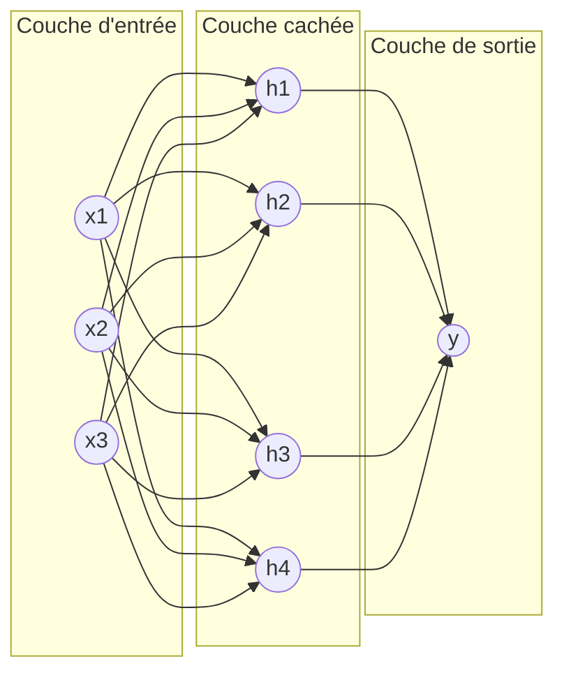
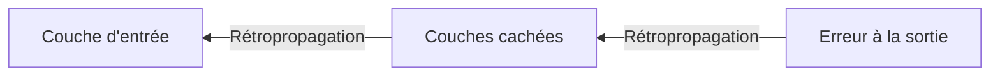

## Introduction

Ce chapitre résout la limite du perceptron isolé identifiée au chapitre précédent — empiler plusieurs couches de perceptrons permet de modéliser des relations bien plus complexes, à condition de disposer d'un algorithme capable d'entraîner efficacement l'ensemble de ces couches simultanément : la rétropropagation.

## L'architecture d'un réseau de neurones à plusieurs couches

<CehCallout>
Un réseau de neurones profond empile plusieurs couches de perceptrons (chapitre 1) : une couche d'entrée qui reçoit les données brutes, une ou plusieurs couches cachées qui transforment progressivement l'information, et une couche de sortie qui produit la prédiction finale.
</CehCallout>

<TipCallout>
C'est précisément cet empilement de couches, chacune apportant sa propre non-linéarité (rappel du chapitre 1), qui permet à un réseau de neurones profond de résoudre des problèmes comme XOR, impossibles pour un perceptron isolé — chaque couche cachée peut être vue comme apprenant une représentation intermédiaire de plus en plus abstraite des données.
</TipCallout>

## La propagation avant (forward pass)

<Steps steps={[
  { title: "Calculer la sortie de la couche d'entrée", description: "Les données brutes traversent directement la première couche." },
  { title: "Propager vers les couches cachées", description: "Chaque neurone de chaque couche cachée calcule sa somme pondérée puis applique sa fonction d'activation (rappel chapitre 1), en utilisant les sorties de la couche précédente comme entrées." },
  { title: "Calculer la sortie finale", description: "La couche de sortie produit la prédiction finale du réseau." },
]} />

## Le problème central — comment ajuster des milliers de poids

<WarningCallout>
Un réseau de neurones profond peut contenir des milliers, voire des millions de poids répartis sur plusieurs couches — la descente de gradient simple du perceptron (chapitre 1) ne suffit pas : il faut un moyen efficace de calculer la contribution de chaque poids, y compris ceux des couches les plus profondes, à l'erreur finale.
</WarningCallout>

## La rétropropagation du gradient

<CehCallout>
La rétropropagation (backpropagation) calcule l'erreur à la couche de sortie, puis la propage en arrière à travers le réseau, couche par couche, en utilisant la règle de dérivation en chaîne (rappel du cours Mathématiques Appliquées) pour déterminer précisément combien chaque poids, à chaque couche, a contribué à l'erreur finale.
</CehCallout>

<Steps steps={[
  { title: "Propagation avant", description: "Calculer la sortie du réseau pour un exemple donné (voir section précédente)." },
  { title: "Calculer l'erreur finale", description: "Comparer la sortie prédite à la sortie attendue." },
  { title: "Propager l'erreur en arrière", description: "Calculer, couche par couche en remontant de la sortie vers l'entrée, la contribution de chaque poids à l'erreur totale, via la règle de dérivation en chaîne." },
  { title: "Ajuster tous les poids", description: "Chaque poids du réseau est mis à jour via la descente de gradient (rappel cours Machine Learning, chapitre 2), proportionnellement à sa contribution calculée à l'erreur." },
]} />

<TipCallout>
La rétropropagation est l'innovation qui a rendu possible l'entraînement pratique de réseaux profonds à de nombreuses couches — sans elle, ajuster individuellement chaque poids d'un grand réseau serait numériquement intraitable.
</TipCallout>

## Lab — Mise en Pratique

**Environnement** : Python 3 (terminal Nyx Shell ou environnement local avec `numpy` installé — pas besoin de framework deep learning complet pour ces exercices)

<Steps steps={[
  { title: "Construire un mini réseau à une couche cachée", description: "Définis un réseau à 2 entrées, 2 neurones cachés et 1 sortie, puis calcule sa propagation avant, comme décrit dans la section correspondante de ce chapitre.", code: "import numpy as np\n\ndef sigmoid(z):\n    return 1 / (1 + np.exp(-z))\n\nx = np.array([0.5, 0.8])\n\n# Couche cachee : 2 neurones, chacun avec 2 poids + biais\nW1 = np.array([[0.2, -0.4], [0.7, 0.1]])\nb1 = np.array([0.0, 0.0])\n\n# Couche de sortie : 1 neurone, 2 poids + biais\nW2 = np.array([0.5, -0.3])\nb2 = 0.0\n\nz1 = W1.dot(x) + b1\nh = sigmoid(z1)\ny_pred = sigmoid(W2.dot(h) + b2)\n\nprint('Activations couche cachee :', h)\nprint('Sortie du reseau :', y_pred)" },
  { title: "Rétropropager l'erreur avec la règle de dérivation en chaîne", description: "Calcule le gradient de chaque poids, de la sortie vers la couche cachée, en appliquant exactement les étapes décrites dans la section sur la rétropropagation.", code: "def sigmoid_deriv(a):\n    return a * (1 - a)\n\ny_true = 1.0\nlr = 0.5\n\ndelta_output = (y_pred - y_true) * sigmoid_deriv(y_pred)\ndelta_hidden = delta_output * W2 * sigmoid_deriv(h)\n\ngrad_W2 = delta_output * h\ngrad_b2 = delta_output\ngrad_W1 = np.outer(delta_hidden, x)\ngrad_b1 = delta_hidden\n\nprint('Gradient couche de sortie (W2) :', grad_W2)\nprint('Gradient couche cachee (W1) :', grad_W1)" },
  { title: "Mettre à jour les poids et vérifier l'erreur", description: "Applique la descente de gradient sur les deux couches, puis recalcule la propagation avant pour vérifier que l'erreur a diminué.", code: "W2 = W2 - lr * grad_W2\nb2 = b2 - lr * grad_b2\nW1 = W1 - lr * grad_W1\nb1 = b1 - lr * grad_b1\n\nh_new = sigmoid(W1.dot(x) + b1)\ny_pred_new = sigmoid(W2.dot(h_new) + b2)\n\nprint('Erreur avant mise a jour :', abs(y_pred - y_true))\nprint('Erreur apres mise a jour :', abs(y_pred_new - y_true))" },
]} />

## En résumé

- Un réseau de neurones profond empile une couche d'entrée, une ou plusieurs couches cachées, et une couche de sortie.
- La propagation avant calcule la sortie du réseau ; la rétropropagation calcule ensuite, en sens inverse, la contribution de chaque poids à l'erreur finale.
- La rétropropagation, combinée à la descente de gradient, est l'innovation qui rend possible l'entraînement pratique de réseaux à de nombreuses couches.

## Questions de Révision

1. Quelles sont les trois grandes parties de l'architecture d'un réseau de neurones profond ?
2. Que calcule la propagation avant, par opposition à la rétropropagation ?
3. Pourquoi la rétropropagation était-elle nécessaire pour rendre l'entraînement des réseaux profonds pratiquement réalisable ?
