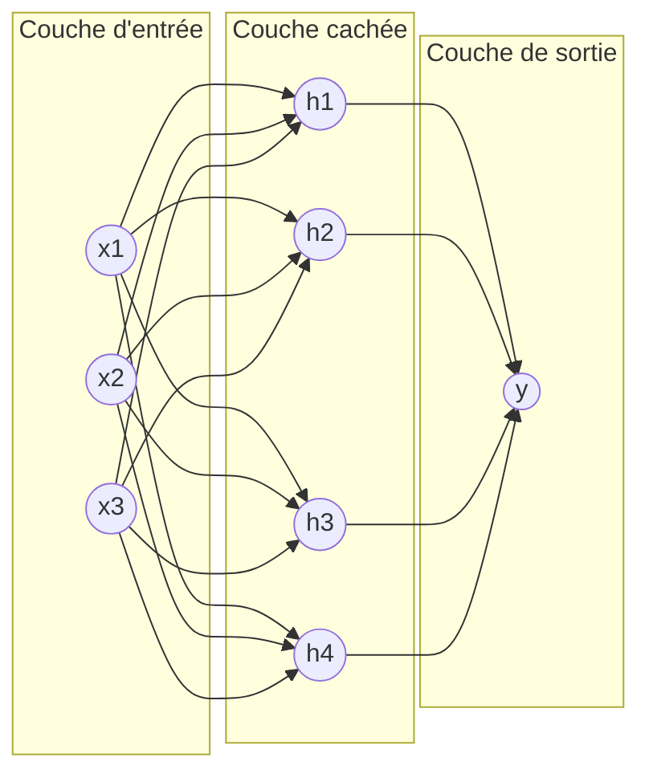
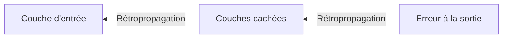

## Introduction

Ce chapitre résout la limite du perceptron isolé identifiée au chapitre précédent — empiler plusieurs couches de perceptrons permet de modéliser des relations bien plus complexes, à condition de disposer d'un algorithme capable d'entraîner efficacement l'ensemble de ces couches simultanément : la rétropropagation.

## L'architecture d'un réseau de neurones à plusieurs couches

<CehCallout>
Un réseau de neurones profond empile plusieurs couches de perceptrons (chapitre 1) : une couche d'entrée qui reçoit les données brutes, une ou plusieurs couches cachées qui transforment progressivement l'information, et une couche de sortie qui produit la prédiction finale.
</CehCallout>

<TipCallout>
C'est précisément cet empilement de couches, chacune apportant sa propre non-linéarité (rappel du chapitre 1), qui permet à un réseau de neurones profond de résoudre des problèmes comme XOR, impossibles pour un perceptron isolé — chaque couche cachée peut être vue comme apprenant une représentation intermédiaire de plus en plus abstraite des données.
</TipCallout>

## La propagation avant (forward pass)

<Steps steps={[
  { title: "Calculer la sortie de la couche d'entrée", description: "Les données brutes traversent directement la première couche." },
  { title: "Propager vers les couches cachées", description: "Chaque neurone de chaque couche cachée calcule sa somme pondérée puis applique sa fonction d'activation (rappel chapitre 1), en utilisant les sorties de la couche précédente comme entrées." },
  { title: "Calculer la sortie finale", description: "La couche de sortie produit la prédiction finale du réseau." },
]} />

## Le problème central — comment ajuster des milliers de poids

<WarningCallout>
Un réseau de neurones profond peut contenir des milliers, voire des millions de poids répartis sur plusieurs couches — la descente de gradient simple du perceptron (chapitre 1) ne suffit pas : il faut un moyen efficace de calculer la contribution de chaque poids, y compris ceux des couches les plus profondes, à l'erreur finale.
</WarningCallout>

## La rétropropagation du gradient

<CehCallout>
La rétropropagation (backpropagation) calcule l'erreur à la couche de sortie, puis la propage en arrière à travers le réseau, couche par couche, en utilisant la règle de dérivation en chaîne (rappel du cours Mathématiques Appliquées) pour déterminer précisément combien chaque poids, à chaque couche, a contribué à l'erreur finale.
</CehCallout>

<Steps steps={[
  { title: "Propagation avant", description: "Calculer la sortie du réseau pour un exemple donné (voir section précédente)." },
  { title: "Calculer l'erreur finale", description: "Comparer la sortie prédite à la sortie attendue." },
  { title: "Propager l'erreur en arrière", description: "Calculer, couche par couche en remontant de la sortie vers l'entrée, la contribution de chaque poids à l'erreur totale, via la règle de dérivation en chaîne." },
  { title: "Ajuster tous les poids", description: "Chaque poids du réseau est mis à jour via la descente de gradient (rappel cours Machine Learning, chapitre 2), proportionnellement à sa contribution calculée à l'erreur." },
]} />

<TipCallout>
La rétropropagation est l'innovation qui a rendu possible l'entraînement pratique de réseaux profonds à de nombreuses couches — sans elle, ajuster individuellement chaque poids d'un grand réseau serait numériquement intraitable.
</TipCallout>

## Lab — Mise en Pratique

**Environnement** : Réflexion guidée (sans terminal)

<Steps steps={[
  { title: "Expliquer le rôle des couches cachées", description: "Pourquoi ajouter une couche cachée à un réseau de neurones lui permet-il de résoudre des problèmes qu'un perceptron isolé ne peut pas résoudre ?" },
  { title: "Résumer la rétropropagation en une phrase", description: "En une phrase, explique ce que fait la rétropropagation et pourquoi elle est nécessaire pour entraîner un réseau à plusieurs couches." },
]} />

## En résumé

- Un réseau de neurones profond empile une couche d'entrée, une ou plusieurs couches cachées, et une couche de sortie.
- La propagation avant calcule la sortie du réseau ; la rétropropagation calcule ensuite, en sens inverse, la contribution de chaque poids à l'erreur finale.
- La rétropropagation, combinée à la descente de gradient, est l'innovation qui rend possible l'entraînement pratique de réseaux à de nombreuses couches.

## Questions de Révision

1. Quelles sont les trois grandes parties de l'architecture d'un réseau de neurones profond ?
2. Que calcule la propagation avant, par opposition à la rétropropagation ?
3. Pourquoi la rétropropagation était-elle nécessaire pour rendre l'entraînement des réseaux profonds pratiquement réalisable ?
