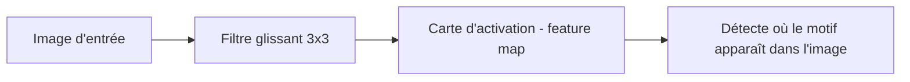

## Introduction

Ce chapitre présente les réseaux de neurones convolutifs (CNN), l'architecture qui a rendu possible les percées majeures en vision par ordinateur — reconnaissance d'objets, détection de visages, mais aussi analyse d'images forensiques ou détection de logos de phishing dans des captures d'écran.

## Pourquoi un réseau dense classique est mal adapté aux images

<WarningCallout>
Une image de taille modeste (par exemple 224x224 pixels en couleur) représente plus de 150 000 valeurs — connecter chaque pixel à chaque neurone d'une couche cachée dense (chapitre 2) produirait un nombre de poids explosif, et surtout ignorerait complètement la structure spatiale de l'image : deux pixels voisins sont bien plus liés que deux pixels éloignés.
</WarningCallout>

<CehCallout>
Les CNN exploitent cette structure spatiale : au lieu de connecter chaque pixel individuellement, ils appliquent de petits filtres qui se déplacent sur l'image, détectant des motifs locaux (contours, textures) indépendamment de leur position exacte dans l'image.
</CehCallout>

## La convolution

<Steps steps={[
  { title: "Définir un petit filtre (noyau)", description: "Une petite matrice de poids, par exemple 3x3, qui détecte un motif particulier (un contour vertical, par exemple)." },
  { title: "Faire glisser le filtre sur l'image", description: "Le filtre se déplace sur toute l'image, calculant à chaque position un produit scalaire entre le filtre et la portion d'image correspondante." },
  { title: "Produire une carte d'activation", description: "Le résultat de ce glissement est une nouvelle grille de valeurs (feature map) indiquant où le motif détecté par le filtre est présent dans l'image." },
]} />

<TipCallout>
Le même filtre est réutilisé sur toute l'image (partage de poids) — un contour vertical est détecté de la même façon qu'il apparaisse en haut à gauche ou en bas à droite de l'image, ce qui réduit drastiquement le nombre de poids par rapport à un réseau dense classique, tout en rendant la détection invariante à la position.
</TipCallout>

## Les couches successives — de motifs simples à motifs complexes

<CehCallout>
Les premières couches convolutives d'un CNN détectent des motifs très simples (contours, coins) ; les couches suivantes combinent ces motifs simples pour détecter des formes plus complexes (yeux, roues), et les couches profondes détectent des concepts encore plus abstraits (visages, véhicules) — une hiérarchie de représentations de plus en plus abstraites, rappel du principe déjà évoqué au chapitre 2 pour les réseaux denses.
</CehCallout>

## Le pooling — réduire la dimension progressivement

<CehCallout>
Une couche de pooling (le plus souvent max-pooling) réduit la taille d'une carte d'activation en ne conservant que la valeur maximale sur de petites régions — cela réduit le volume de calcul des couches suivantes et rend la détection plus robuste à de petites variations de position du motif détecté.
</CehCallout>

<CompareTable
  titleA="Couche"
  titleB="Rôle"
  rows={[
    { a: "Convolution", b: "Détecte des motifs locaux via des filtres glissants" },
    { a: "Pooling (max-pooling)", b: "Réduit la dimension, conserve les activations les plus fortes" },
    { a: "Couche dense finale", b: "Combine les motifs détectés pour produire la classification finale (rappel chapitre 2)" },
]}
/>

<WarningCallout>
Rappel du cours Analyse SOC (chapitre 5, méfiance envers l'automatisation aveugle) : un CNN entraîné pour détecter des logos de phishing dans des captures d'écran reste vulnérable à des variantes visuelles jamais vues à l'entraînement — un modèle de vision n'est jamais infaillible et doit rester un outil d'aide à la décision, pas une autorité absolue.
</WarningCallout>

## Lab — Mise en Pratique

**Environnement** : Python 3 (terminal Nyx Shell ou environnement local avec `numpy` installé — pas besoin de framework deep learning complet pour ces exercices)

<Steps steps={[
  { title: "Implémenter la convolution à la main", description: "Fais glisser un filtre détecteur de contour vertical sur une petite image 5x5 et calcule la carte d'activation, exactement comme décrit dans la section sur la convolution.", code: "import numpy as np\n\n# Petite image 5x5 avec un contour vertical au centre\nimage = np.array([\n    [0, 0, 1, 0, 0],\n    [0, 0, 1, 0, 0],\n    [0, 0, 1, 0, 0],\n    [0, 0, 1, 0, 0],\n    [0, 0, 1, 0, 0],\n])\n\n# Filtre 3x3 detecteur de contour vertical\nkernel = np.array([\n    [1, 0, -1],\n    [1, 0, -1],\n    [1, 0, -1],\n])\n\ndef convolve2d(img, k):\n    kh, kw = k.shape\n    oh, ow = img.shape[0] - kh + 1, img.shape[1] - kw + 1\n    out = np.zeros((oh, ow))\n    for i in range(oh):\n        for j in range(ow):\n            region = img[i:i+kh, j:j+kw]\n            out[i, j] = np.sum(region * k)\n    return out\n\nfeature_map = convolve2d(image, kernel)\nprint('Sortie de la convolution (feature map) :', feature_map)" },
  { title: "Implémenter le max-pooling à la main", description: "Réduis la carte d'activation obtenue en ne conservant que la valeur maximale sur des régions 2x2, comme décrit dans la section sur le pooling.", code: "def max_pool2d(fmap, size=2, stride=2):\n    h, w = fmap.shape\n    oh, ow = (h - size) // stride + 1, (w - size) // stride + 1\n    pooled = np.zeros((oh, ow))\n    for i in range(oh):\n        for j in range(ow):\n            region = fmap[i*stride:i*stride+size, j*stride:j*stride+size]\n            pooled[i, j] = np.max(region)\n    return pooled\n\npooled_map = max_pool2d(feature_map)\nprint('Apres max-pooling :', pooled_map)" },
  { title: "Vérifier la spécificité du filtre", description: "Applique le même filtre à une image uniforme, sans contour, et observe que la réponse est quasi nulle — le filtre ne détecte que le motif pour lequel il a été conçu.", code: "# Meme filtre applique a une image uniforme, sans contour\nimage_no_edge = np.ones((5, 5))\nflat_response = convolve2d(image_no_edge, kernel)\nprint('Reponse du filtre sur une image sans contour :', flat_response)" },
]} />

## En résumé

- Un réseau dense classique est mal adapté aux images car il ignore leur structure spatiale et produit un nombre de poids explosif.
- La convolution applique de petits filtres glissants qui détectent des motifs locaux, avec partage de poids sur toute l'image.
- Les couches successives d'un CNN détectent des motifs de plus en plus abstraits, tandis que le pooling réduit progressivement la dimension.

## Questions de Révision

1. Pourquoi un réseau dense classique est-il mal adapté au traitement direct d'images ?
2. Qu'est-ce qu'une carte d'activation (feature map), et comment est-elle produite ?
3. Quel est le rôle du pooling dans un réseau de neurones convolutif ?
