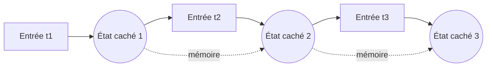

## Introduction

Ce chapitre aborde les architectures conçues pour les données séquentielles — texte, séries temporelles de trafic réseau, séquences de commandes exécutées sur un système — là où les CNN (chapitre 3) excellent sur des données spatiales comme les images.

## Pourquoi les données séquentielles posent un problème particulier

<WarningCallout>
Les architectures vues jusqu'ici (réseaux denses, CNN) traitent chaque entrée indépendamment, sans mémoire des entrées précédentes — inadapté à une séquence de commandes shell, par exemple, où le sens d'une commande dépend souvent des commandes qui l'ont précédée (rappel du cours Analyse SOC, chapitre 4, sur l'analyse de séquences d'événements).
</WarningCallout>

## Le réseau de neurones récurrent (RNN)

<CehCallout>
Un RNN traite une séquence élément par élément, en maintenant un état caché qui résume l'information des éléments précédents — à chaque étape, la sortie dépend à la fois de l'entrée actuelle et de cet état caché, qui joue le rôle d'une mémoire du contexte passé.
</CehCallout>

<TipCallout>
Ce mécanisme d'état caché transmis d'une étape à l'autre permet à un RNN de détecter des motifs qui s'étendent sur plusieurs éléments d'une séquence — par exemple, une séquence de commandes qui, prises isolément, semblent anodines, mais qui ensemble révèlent une tentative d'exfiltration de données.
</TipCallout>

## Le problème du gradient qui s'évanouit

<WarningCallout>
Rappel du chapitre 2 (rétropropagation) : sur une longue séquence, le gradient rétropropagé à travers de nombreuses étapes temporelles tend à devenir extrêmement petit (il "s'évanouit"), rendant les RNN classiques incapables d'apprendre des dépendances entre des éléments très éloignés dans la séquence — un problème pratique majeur pour des séquences longues.
</WarningCallout>

## LSTM — résoudre la mémoire à long terme

<CehCallout>
Les LSTM (Long Short-Term Memory) résolvent ce problème par un mécanisme de portes qui régule explicitement ce qui doit être retenu, oublié ou transmis à chaque étape — au lieu d'une simple mémoire qui s'estompe progressivement, le LSTM peut préserver une information pertinente sur de très nombreuses étapes si les portes apprennent que c'est nécessaire.
</CehCallout>

<Steps steps={[
  { title: "Porte d'oubli", description: "Décide quelle part de la mémoire précédente doit être conservée ou effacée." },
  { title: "Porte d'entrée", description: "Décide quelle nouvelle information de l'étape actuelle doit être ajoutée à la mémoire." },
  { title: "Porte de sortie", description: "Décide quelle part de la mémoire actuelle doit être utilisée pour produire la sortie de cette étape." },
]} />

<CompareTable
  titleA="RNN classique"
  titleB="LSTM"
  rows={[
    { a: "Mémoire simple, s'estompe rapidement sur de longues séquences", b: "Mémoire régulée par des portes, préserve l'information pertinente sur le long terme" },
    { a: "Souffre fortement du gradient qui s'évanouit", b: "Atténue considérablement ce problème grâce au mécanisme de portes" },
    { a: "Plus simple et rapide à entraîner", b: "Plus coûteux en calcul mais bien plus performant sur des séquences longues" },
]}
/>

## Lab — Mise en Pratique

**Environnement** : Python 3 (terminal Nyx Shell ou environnement local avec `numpy` installé — pas besoin de framework deep learning complet pour ces exercices)

<Steps steps={[
  { title: "Implémenter la cellule d'un RNN à la main", description: "Fais dérouler un RNN simplifié sur une petite séquence de 3 valeurs, en maintenant l'état caché d'une étape à l'autre, comme décrit dans la section sur le RNN.", code: "import numpy as np\n\ndef tanh(z):\n    return np.tanh(z)\n\n# Sequence de 3 evenements (par exemple des mesures de trafic reseau)\nsequence = [0.8, -0.5, 0.3]\n\nWx = 0.6\nWh = 0.9\nb = 0.0\n\nh = 0.0\nhidden_states = []\n\nfor x_t in sequence:\n    h = float(tanh(Wx * x_t + Wh * h + b))\n    hidden_states.append(round(h, 4))\n\nprint('Etats caches successifs :', hidden_states)" },
  { title: "Observer le gradient qui s'évanouit", description: "Rétropropage manuellement le gradient à travers les étapes de la séquence et observe comment il rétrécit à chaque étape, comme décrit dans la section sur ce problème.", code: "# A chaque etape retropropagee, le gradient est multiplie par Wh * (1 - h**2)\n# (derivee de tanh) : sur une longue sequence, ce produit repete de facteurs\n# inferieurs a 1 fait tendre le gradient vers zero.\ngradient = 1.0\nfor h in reversed(hidden_states):\n    derivative = 1 - h ** 2\n    gradient *= Wh * derivative\n    print('Gradient retropropage :', gradient)" },
  { title: "Implémenter les trois portes d'un LSTM", description: "Calcule pour une seule étape les portes d'oubli, d'entrée et de sortie ainsi que la mise à jour de la mémoire, en suivant les définitions de la section sur le LSTM.", code: "def sigmoid(z):\n    return 1 / (1 + np.exp(-z))\n\nx_t = 0.5\nh_prev = 0.2\nc_prev = 0.4\n\nWf, Wi, Wo, Wc = 0.5, 0.6, 0.4, 0.3\n\nforget_gate = sigmoid(Wf * (x_t + h_prev))\ninput_gate = sigmoid(Wi * (x_t + h_prev))\noutput_gate = sigmoid(Wo * (x_t + h_prev))\ncandidate = tanh(Wc * (x_t + h_prev))\n\nc_t = forget_gate * c_prev + input_gate * candidate\nh_t = output_gate * tanh(c_t)\n\nprint('Porte oubli  :', round(forget_gate, 3))\nprint('Porte entree :', round(input_gate, 3))\nprint('Porte sortie :', round(output_gate, 3))\nprint('Nouvelle memoire (cell state) :', round(c_t, 3))\nprint('Nouvel etat cache             :', round(h_t, 3))" },
]} />

## En résumé

- Un RNN traite une séquence élément par élément en maintenant un état caché qui résume le contexte des éléments précédents.
- Sur de longues séquences, un RNN classique souffre du problème du gradient qui s'évanouit, limitant sa capacité à apprendre des dépendances lointaines.
- Le LSTM résout ce problème via un mécanisme de portes (oubli, entrée, sortie) qui régule explicitement la mémoire à long terme.

## Questions de Révision

1. Qu'est-ce que l'état caché d'un RNN, et à quoi sert-il ?
2. Qu'est-ce que le problème du gradient qui s'évanouit, et pourquoi affecte-t-il particulièrement les longues séquences ?
3. Quelles sont les trois portes d'un LSTM, et quel est le rôle de chacune ?
