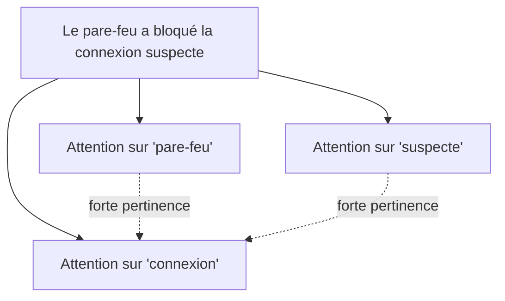

## Introduction

Ce chapitre présente l'architecture Transformer, à l'origine des modèles de langage modernes (dont l'assistant Ask Nyx s'inspire directement) — une avancée qui a largement supplanté les RNN/LSTM (chapitre 4) pour le traitement du texte et de nombreuses autres séquences.

## La limite séquentielle des RNN/LSTM

<WarningCallout>
Rappel du chapitre 4 : un RNN ou un LSTM traite une séquence élément par élément, dans l'ordre — cette contrainte séquentielle empêche toute parallélisation du calcul sur la séquence entière, ce qui ralentit considérablement l'entraînement sur de très grandes quantités de texte.
</WarningCallout>

## Le mécanisme d'attention

<CehCallout>
Le mécanisme d'attention permet à un modèle de pondérer directement l'importance de chaque élément d'une séquence par rapport à tous les autres, sans devoir les traiter séquentiellement un par un — pour chaque mot d'une phrase, l'attention détermine quels autres mots de la phrase sont les plus pertinents pour comprendre son sens dans ce contexte précis.
</CehCallout>

<TipCallout>
Contrairement à l'état caché d'un RNN qui résume progressivement tout le passé de la séquence en une seule représentation compressée, l'attention permet à chaque élément d'accéder directement à n'importe quel autre élément de la séquence, quelle que soit sa distance — ce qui résout élégamment le problème du gradient qui s'évanouit (chapitre 4) sur de longues séquences.
</TipCallout>

## L'architecture Transformer

<Steps steps={[
  { title: "Encoder chaque mot en vecteur", description: "Chaque élément de la séquence (un mot, par exemple) est représenté par un vecteur numérique (rappel du cours Algèbre Linéaire)." },
  { title: "Appliquer l'attention sur toute la séquence", description: "Pour chaque élément, calculer son importance relative par rapport à tous les autres éléments de la séquence, en parallèle plutôt que séquentiellement." },
  { title: "Empiler plusieurs couches d'attention", description: "Comme pour les CNN (chapitre 3), empiler plusieurs couches permet de capturer des relations de plus en plus abstraites entre les éléments de la séquence." },
  { title: "Produire la sortie", description: "Une couche finale transforme les représentations enrichies par l'attention en prédiction (le mot suivant, une classification, etc.)." },
]} />

<CehCallout>
Cette capacité à traiter toute la séquence en parallèle (au lieu d'élément par élément comme un RNN) a permis d'entraîner des modèles sur des quantités de texte considérablement plus grandes, à l'origine des grands modèles de langage (LLM) modernes — le principe même derrière des assistants conversationnels comme celui envisagé pour le futur module Ask Nyx de cette plateforme.
</CehCallout>

## Les Transformers en cybersécurité

<CompareTable
  titleA="Application"
  titleB="Principe"
  rows={[
    { a: "Analyse de logs à grande échelle", b: "Détecter des motifs suspects dans de longues séquences d'événements, sans les limites de mémoire d'un RNN" },
    { a: "Détection de phishing par analyse de texte", b: "Comprendre le contexte complet d'un email pour repérer des tournures suspectes" },
    { a: "Assistants de sécurité conversationnels", b: "Répondre à des questions en s'appuyant sur un contexte de conversation étendu" },
]}
/>

<WarningCallout>
Rappel du cours IA & Agents en Cybersécurité : un modèle basé sur les Transformers, aussi puissant soit-il, reste un outil statistique sans compréhension réelle — il peut produire des réponses plausibles mais incorrectes (hallucinations), une limite à garder en tête pour tout usage en contexte de sécurité où la précision est critique.
</WarningCallout>

## Lab — Mise en Pratique

**Environnement** : Réflexion guidée (sans terminal)

<Steps steps={[
  { title: "Expliquer l'avantage de la parallélisation", description: "Pourquoi la capacité des Transformers à traiter une séquence entière en parallèle accélère-t-elle considérablement l'entraînement par rapport à un RNN ?" },
  { title: "Relier l'attention à un cas concret", description: "Dans la phrase d'exemple de ce chapitre sur le pare-feu, pourquoi les mots 'connexion' et 'suspecte' devraient-ils avoir une forte attention mutuelle ?" },
]} />

## En résumé

- Les RNN/LSTM traitent une séquence élément par élément, ce qui empêche la parallélisation et limite l'entraînement à grande échelle.
- Le mécanisme d'attention permet à chaque élément d'une séquence de pondérer directement sa pertinence par rapport à tous les autres, en parallèle.
- L'architecture Transformer, fondée sur l'attention, est à l'origine des grands modèles de langage modernes, avec des applications directes en analyse de logs et détection de phishing.

## Questions de Révision

1. Quelle limite majeure des RNN/LSTM le mécanisme d'attention permet-il de dépasser ?
2. Que calcule le mécanisme d'attention pour chaque élément d'une séquence ?
3. Pourquoi faut-il rester prudent face aux réponses produites par un modèle basé sur les Transformers, même en contexte de sécurité ?
