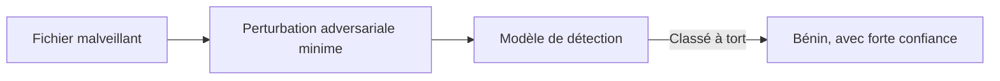

## Introduction

Ce dernier chapitre referme à la fois le cours Deep Learning et l'ensemble du parcours Machine Learning/Deep Learning, en abordant le déploiement pratique d'un modèle et, surtout, ses limites spécifiques en contexte de sécurité — un regard critique indispensable avant d'intégrer un modèle de deep learning dans une chaîne de décision sensible.

## Déployer un modèle de deep learning

<CehCallout>
Rappel du cours Machine Learning (chapitre 7, mise en production) : les mêmes principes s'appliquent au deep learning — sérialiser le modèle entraîné, l'exposer via une interface stable, surveiller sa dérive dans le temps — avec une contrainte supplémentaire propre au deep learning : la taille et le coût de calcul souvent bien plus importants des modèles profonds.
</CehCallout>

<CompareTable
  titleA="Contrainte"
  titleB="Implication pour le déploiement"
  rows={[
    { a: "Taille du modèle (souvent des centaines de Mo à plusieurs Go)", b: "Nécessite parfois une compression ou une simplification du modèle avant déploiement" },
    { a: "Coût de calcul de l'inférence", b: "Peut nécessiter du matériel spécialisé (GPU) même en production, pas seulement à l'entraînement" },
    { a: "Latence", b: "Un modèle profond peut être trop lent pour une décision en temps réel (ex : blocage instantané d'une connexion réseau)" },
]}
/>

## Les attaques adversariales

<WarningCallout>
Une attaque adversariale consiste à modifier légèrement une entrée — de façon souvent imperceptible pour un humain — spécifiquement pour tromper un modèle de deep learning, lui faisant produire une prédiction erronée avec une confiance élevée : une image légèrement perturbée peut ainsi faire classer un malware comme un fichier bénin par un CNN de détection (chapitre 3).
</WarningCallout>

<CehCallout>
Rappel du cours Cybersécurité Offensive : de la même façon qu'un attaquant cherche des angles morts dans une défense périmétrique, une attaque adversariale cherche les angles morts mathématiques d'un modèle — les frontières de décision apprises par le modèle, qui ne coïncident jamais parfaitement avec la véritable frontière entre "malveillant" et "bénin".
</CehCallout>

<TipCallout>
Se défendre contre les attaques adversariales reste un domaine de recherche actif — l'entraînement adversarial (inclure volontairement des exemples perturbés dans l'entraînement) et la détection d'anomalies sur les entrées elles-mêmes (rappel cours Machine Learning, chapitre 5, DBSCAN) sont deux approches complémentaires, aucune n'étant une solution définitive.
</TipCallout>

## Les limites du deep learning en sécurité — synthèse critique

<WarningCallout>
Rappel du cours IA & Agents en Cybersécurité et du cours Analyse SOC : un modèle de deep learning, aussi performant soit-il sur ses données d'évaluation, reste une boîte largement opaque (contrairement à un arbre de décision, cours Machine Learning chapitre 3) — difficile à auditer précisément, vulnérable aux attaques adversariales, et sujet à la dérive de concept face à des menaces en constante évolution.
</WarningCallout>

<Steps steps={[
  { title: "Opacité (manque d'interprétabilité)", description: "Contrairement à un arbre de décision ou une régression, il est difficile d'expliquer précisément pourquoi un réseau profond a pris une décision donnée." },
  { title: "Vulnérabilité aux attaques adversariales", description: "Un modèle peut être délibérément trompé par des entrées conçues spécifiquement pour exploiter ses failles mathématiques." },
  { title: "Dérive de concept", description: "Rappel du cours Machine Learning (chapitre 7) : les techniques d'attaque évoluent, un modèle entraîné sur des données anciennes se dégrade avec le temps." },
  { title: "Dépendance à la qualité et au volume des données", description: "Un modèle de deep learning nécessite généralement bien plus de données étiquetées qu'un modèle de machine learning classique pour atteindre une performance comparable." },
]} />

<CehCallout>
Ces limites ne disqualifient pas le deep learning en cybersécurité — elles imposent simplement de le traiter comme un outil d'aide à la décision parmi d'autres, combiné à une supervision humaine, des règles explicites et une surveillance continue, jamais comme une autorité de décision autonome et infaillible.
</CehCallout>

## Lab — Mise en Pratique

**Environnement** : Python 3 (terminal Nyx Shell ou environnement local avec `numpy` installé — pas besoin de framework deep learning complet pour ces exercices)

<Steps steps={[
  { title: "Construire un classifieur jouet malveillant/bénin", description: "Reprends un perceptron déjà entraîné (chapitre 1) qui classifie un fichier à partir de 2 caractéristiques, et observe sa prédiction initiale.", code: "import numpy as np\n\ndef sigmoid(z):\n    return 1 / (1 + np.exp(-z))\n\n# Modele jouet deja entraine : classifie un fichier (2 caracteristiques) malveillant/benin\nw = np.array([1.2, -0.8])\nb = 0.1\n\ndef predict(x):\n    return sigmoid(np.dot(w, x) + b)\n\nx = np.array([0.9, 0.1])\nprint('Prediction initiale (proba malveillant) :', predict(x))" },
  { title: "Fabriquer une perturbation adversariale minime", description: "Calcule le gradient de la sortie du modèle par rapport à l'entrée et applique une perturbation minuscule dans cette direction, sur le principe d'une attaque adversariale décrit dans ce chapitre.", code: "# Attaque adversariale simplifiee (facon FGSM) :\n# perturber x dans la direction qui reduit le plus vite la sortie du modele\ny_out = predict(x)\ngradient_input = y_out * (1 - y_out) * w\n\nepsilon = 0.05\nx_adv = x - epsilon * np.sign(gradient_input)\n\nprint('Perturbation appliquee :', x_adv - x)\nprint('Nouvelle prediction (proba malveillant) :', predict(x_adv))" },
  { title: "Comparer l'ampleur de la perturbation à celle de la décision", description: "Mesure la différence entre l'entrée d'origine et l'entrée perturbée, et compare-la au changement de prédiction du modèle pour interpréter le résultat.", code: "diff_input = np.linalg.norm(x_adv - x)\ndiff_output = abs(predict(x_adv) - predict(x))\n\nprint('Changement des caracteristiques d entree :', round(diff_input, 4))\nprint('Changement de la prediction du modele    :', round(diff_output, 4))\n# Une perturbation minime en entree peut suffire a faire basculer la decision\n# du modele : exactement le principe d'une attaque adversariale." },
]} />

## En résumé

- Déployer un modèle de deep learning reprend les principes du cours Machine Learning, avec des contraintes supplémentaires de taille, de coût de calcul et de latence.
- Les attaques adversariales exploitent les failles mathématiques d'un modèle par des perturbations souvent imperceptibles pour un humain.
- Opacité, vulnérabilité adversariale, dérive de concept et forte dépendance aux données sont les limites majeures à garder en tête avant d'intégrer le deep learning dans une chaîne de décision sécuritaire.

## Questions de Révision

1. Quelles contraintes supplémentaires, propres au deep learning, compliquent le déploiement d'un modèle par rapport au machine learning classique ?
2. Qu'est-ce qu'une attaque adversariale, et pourquoi peut-elle tromper un modèle avec une confiance élevée ?
3. Pourquoi un modèle de deep learning ne devrait-il jamais constituer une autorité de décision autonome en cybersécurité ?

Félicitations, tu viens de terminer le cours **Deep Learning** — et avec lui, l'ensemble du parcours Machine Learning et Deep Learning de Nyx ! Des perceptrons aux Transformers, en passant par les CNN et les RNN/LSTM, tu disposes désormais d'une compréhension à la fois mathématique et critique de ces technologies, indispensable pour les utiliser judicieusement — et pour en reconnaître les limites — dans un contexte de cybersécurité.
