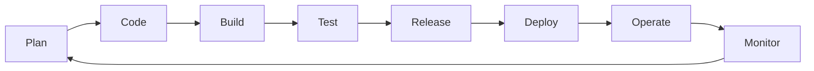

## Introduction

Pendant des décennies, développer un logiciel et le faire tourner en production ont été deux métiers séparés par un mur organisationnel. L'équipe de développement (Dev) livrait du code dont l'objectif était d'ajouter des fonctionnalités le plus vite possible ; l'équipe d'exploitation (Ops) devait garder les systèmes stables, ce qui la poussait naturellement à freiner tout changement. Ce conflit d'intérêts structurel provoquait des mises en production rares, longues, stressantes, et souvent ratées.

Le mouvement DevOps est né au tournant des années 2008-2009 (popularisé notamment par les conférences "devopsdays" initiées par Patrick Debois) comme une réponse directe à ce problème : au lieu d'opposer Dev et Ops, on fusionne leurs responsabilités et leurs outils pour livrer plus vite, plus souvent, et de façon plus fiable. DevOps n'est ni un poste, ni un outil, ni une équipe qu'on ajoute à l'organigramme — c'est une culture et un ensemble de pratiques.

Ce premier chapitre pose les fondations théoriques du cours : l'origine du mouvement, le framework CALMS qui structure une transformation DevOps, la boucle infinie qui représente le cycle de vie d'un logiciel, et les métriques DORA qui permettent de mesurer objectivement la performance d'une équipe. Nous verrons aussi, sans nous y attarder, pourquoi la sécurité ne peut pas rester une case cochée en fin de parcours dans cette nouvelle culture — ce sera le cœur du cours "DevSecOps Avancé" qui prolonge celui-ci.

## L'origine du mouvement : sortir des silos

Dans un modèle traditionnel en silos, chaque équipe optimise localement son propre objectif : le Dev est jugé sur la vitesse de livraison de fonctionnalités, l'Ops est jugé sur le nombre d'incidents évités. Ces deux objectifs entrent naturellement en tension, et chaque transfert de responsabilité (le fameux "ça marche sur ma machine") devient un point de friction et de blâme.

```text
Modèle en silos (avant DevOps)
Dev  --------> [mur] --------> Ops
"Livrer vite"              "Ne rien casser"
   → conflits, lenteur, mises en production rares et risquées
```

DevOps propose de remplacer ce mur par une responsabilité partagée de bout en bout : l'équipe qui développe une fonctionnalité est aussi responsable de son bon fonctionnement en production. Cela ne signifie pas que les rôles disparaissent, mais que la frontière organisationnelle et le manque de communication qui ralentissaient les livraisons s'effacent au profit d'objectifs communs et d'outils partagés (automatisation, observabilité, déploiement continu).

<TipCallout>
Retiens cette définition simple : DevOps est un ensemble de pratiques culturelles et techniques qui rapprochent développement et exploitation pour livrer du logiciel plus rapidement, plus souvent et plus fiablement — sans sacrifier la stabilité.
</TipCallout>

## Le framework CALMS

CALMS est l'acronyme le plus utilisé pour structurer une transformation DevOps. Chaque lettre représente une dimension à travailler, et une transformation DevOps réussie doit progresser sur les cinq à la fois — se concentrer uniquement sur l'outillage sans changer la culture est l'échec le plus courant observé dans les entreprises.

<CompareTable
  titleA="Dimension"
  titleB="Ce qu'elle signifie concrètement"
  rows={[
    { a: "Culture", b: "Confiance mutuelle entre Dev et Ops, responsabilité partagée des incidents, droit à l'erreur (blameless postmortem) plutôt que recherche de coupable" },
    { a: "Automation", b: "Automatiser tout ce qui est répétitif et sujet à l'erreur humaine : intégration, tests, provisioning d'infrastructure, déploiement" },
    { a: "Lean", b: "Éliminer le gaspillage (temps d'attente, tâches manuelles inutiles), livrer par petits incréments visibles plutôt que par gros lots risqués" },
    { a: "Measurement", b: "Mesurer objectivement la performance (métriques DORA, taux d'erreur, temps de cycle) plutôt que se fier à des impressions" },
    { a: "Sharing", b: "Partager les connaissances, les outils et les responsabilités entre équipes — casser les silos d'information autant que les silos organisationnels" },
  ]}
/>

<CehCallout>
CALMS n'est pas une checklist à cocher une fois : c'est une grille de lecture permanente. Face à un problème d'organisation, demande-toi systématiquement sur laquelle des cinq dimensions il agit avant de proposer un outil.
</CehCallout>

## La boucle infinie DevOps

Le cycle de vie DevOps est traditionnellement représenté par un symbole infini (∞) plutôt que par une ligne droite, pour souligner qu'il n'y a pas de fin : chaque déploiement génère des données de monitoring qui nourrissent immédiatement la planification suivante.



Chaque étape correspond à une phase concrète et souvent à un outil :

```text
Plan     : définir le besoin, planifier le travail (backlog, tickets)
Code     : écrire et versionner le code (Git)
Build    : compiler, packager, construire une image (CI)
Test     : exécuter les tests automatisés (unitaires, intégration)
Release  : préparer et valider une version prête pour la production
Deploy   : déployer la version en production (CD)
Operate  : faire fonctionner le système en conditions réelles
Monitor  : observer les métriques et logs pour détecter anomalies et besoins
   → retour vers Plan
```

La moitié gauche de la boucle (Plan à Release) correspond traditionnellement au monde du Dev, la moitié droite (Deploy à Monitor) au monde de l'Ops. La boucle DevOps visualise justement la fusion de ces deux moitiés en un flux continu et sans rupture — c'est le cœur des chapitres suivants de ce cours, qui détailleront CI/CD, conteneurisation et infrastructure as code.

<WarningCallout>
Une boucle DevOps qui tourne vite sans intégrer de vérifications de sécurité à chaque étape ne fait qu'accélérer la mise en production de vulnérabilités. Nous ne développons pas ce point ici — il fait l'objet complet du cours "DevSecOps Avancé" — mais retiens dès maintenant que la sécurité doit être pensée comme une dimension transversale de la culture CALMS, pas comme une étape ajoutée après coup.
</WarningCallout>

## Mesurer la performance : les quatre métriques DORA

Le DORA (DevOps Research and Assessment), équipe de recherche à l'origine du rapport annuel *State of DevOps*, a identifié quatre métriques qui corrèlent fortement avec la performance organisationnelle globale d'une équipe logicielle. Elles permettent de sortir du débat subjectif ("on livre vite" / "on est stables") pour s'appuyer sur des données mesurables.

<CompareTable
  titleA="Métrique"
  titleB="Définition"
  rows={[
    { a: "Deployment Frequency", b: "À quelle fréquence l'équipe déploie-t-elle en production (plusieurs fois par jour, par semaine, par mois...) " },
    { a: "Lead Time for Changes", b: "Temps écoulé entre le commit d'un changement de code et sa mise en production effective" },
    { a: "MTTR (Mean Time To Recovery)", b: "Temps moyen nécessaire pour restaurer le service après un incident en production" },
    { a: "Change Failure Rate", b: "Pourcentage des déploiements en production qui provoquent une dégradation du service ou nécessitent un correctif immédiat" },
  ]}
/>

Le rapport *State of DevOps* classe chaque année les organisations en quatre catégories de performance (élite, haute, moyenne, faible) selon ces quatre métriques combinées. Les écarts entre catégories sont spectaculaires :

<CompareTable
  titleA="Équipe Elite"
  titleB="Équipe Low Performer"
  rows={[
    { a: "Déploiements à la demande, plusieurs fois par jour", b: "Déploiements une fois par mois, voire moins" },
    { a: "Lead time inférieur à une heure", b: "Lead time de plusieurs mois" },
    { a: "MTTR inférieur à une heure", b: "MTTR de plusieurs jours à une semaine" },
    { a: "Taux d'échec de changement entre 0 et 15%", b: "Taux d'échec de changement entre 46 et 60%" },
  ]}
/>

<TipCallout>
Le résultat le plus contre-intuitif — et le plus constant d'année en année — du rapport DORA : déployer plus souvent ne rend pas moins stable, bien au contraire. Les équipes qui déploient le plus fréquemment ont aussi le taux d'échec le plus bas, car chaque changement est plus petit, donc plus facile à tester, à revoir et à corriger rapidement s'il échoue.
</TipCallout>

<AuditCallout>
Pour un auditeur ou un responsable de conformité, les métriques DORA sont aussi un signal de maturité de gouvernance : un MTTR élevé associé à un taux d'échec de changement élevé indique souvent une absence de procédure de rollback fiable et un déficit de tests automatisés — deux points qui apparaissent régulièrement dans les référentiels ISO 27001 et SOC 2 relatifs à la gestion du changement.
</AuditCallout>

## Lab — Mise en Pratique

**Environnement** : aucun terminal requis pour ce premier chapitre — exercice d'analyse organisationnelle sur poste personnel (papier, éditeur de texte ou tableur).

<Steps steps={[
  { title: "Cartographier une boucle DevOps existante", description: "Choisis un projet logiciel que tu connais (professionnel, personnel, ou un projet open-source public) et identifie, pour chacune des huit étapes de la boucle infinie, l'outil ou le processus utilisé aujourd'hui (ex: Plan → Trello, Build → GitHub Actions)." },
  { title: "Évaluer les cinq dimensions CALMS", description: "Pour ce même projet, note sur 5 chaque dimension CALMS (Culture, Automation, Lean, Measurement, Sharing) et identifie la dimension la plus faible." },
  { title: "Estimer tes métriques DORA", description: "Estime, même approximativement, la fréquence de déploiement, le lead time, le MTTR et le taux d'échec de changement de ce projet — et classe-le parmi les quatre catégories de performance du rapport State of DevOps." },
  { title: "Identifier un point d'amélioration", description: "À partir de la dimension CALMS la plus faible identifiée à l'étape 2, propose une action concrète et réaliste qui améliorerait au moins une des quatre métriques DORA." },
]} />

## En résumé

- DevOps est né pour supprimer le mur organisationnel entre développement (Dev) et exploitation (Ops), qui provoquait des mises en production rares et risquées.
- Le framework CALMS structure une transformation DevOps autour de cinq dimensions à travailler simultanément : Culture, Automation, Lean, Measurement, Sharing.
- La boucle infinie DevOps (plan → code → build → test → release → deploy → operate → monitor → plan) représente un cycle de vie logiciel continu, sans étape finale.
- Les quatre métriques DORA (deployment frequency, lead time for changes, MTTR, change failure rate) permettent de mesurer objectivement la performance d'une équipe et de la situer parmi les catégories elite, haute, moyenne ou faible.
- Une équipe elite déploie plus fréquemment et échoue pourtant moins souvent qu'une équipe low performer — la vitesse et la stabilité ne s'opposent pas quand les changements sont petits et automatisés.
- La sécurité doit s'intégrer dès la culture CALMS plutôt qu'être ajoutée après coup ; ce sujet sera développé en profondeur dans le cours DevSecOps Avancé.
- Les sept chapitres suivants de ce cours couvriront successivement le versioning avec Git, l'intégration et le déploiement continus (CI/CD), la conteneurisation avec Docker, l'orchestration avec Kubernetes, l'infrastructure as code, le monitoring et l'observabilité, avant une synthèse sur les limites et pièges courants d'une transformation DevOps.

## Questions de Révision

1. Pourquoi le modèle en silos traditionnel Dev/Ops provoquait-il des mises en production rares et risquées ?
2. Cite les cinq dimensions du framework CALMS et donne un exemple concret pour chacune.
3. Pourquoi la boucle DevOps est-elle représentée comme un symbole infini plutôt que comme une ligne droite avec un début et une fin ?
4. Quelles sont les quatre métriques DORA, et laquelle mesure spécifiquement la capacité à se relever d'un incident ?
5. Pourquoi le rapport State of DevOps observe-t-il qu'une fréquence de déploiement élevée est associée à un taux d'échec de changement plus bas, et non l'inverse ?
6. Selon ce chapitre, à quel moment la sécurité doit-elle être intégrée dans une culture DevOps, et pourquoi ce sujet n'est-il pas développé ici ?
