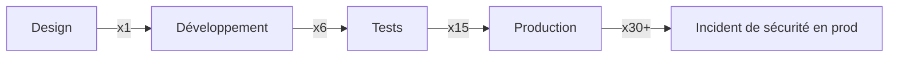

## Introduction

Le mot « DevSecOps » est aujourd'hui affiché sur toutes les offres d'emploi et toutes les conférences, souvent réduit au slogan « everyone is responsible for security ». Cette phrase n'est pas fausse, mais elle ne dit rien de concret : qui configure les scanners, qui répond à une alerte critique un vendredi soir, qui possède le registry d'images, qui a le droit de modifier un pipeline de production ? Sans réponses précises, le slogan devient un alibi qui dilue la responsabilité au lieu de la partager.

Ce premier chapitre pose les fondations conceptuelles du cours en trois temps. D'abord, une définition opérationnelle du DevSecOps qui va au-delà du mantra pour parler de responsabilités, d'automatisation et de gouvernance. Ensuite, le principe du shift-left, avec un chiffre concret sur le coût exponentiel d'une vulnérabilité selon le moment où elle est découverte. Enfin, un exercice de threat modeling appliqué non pas à l'application (déjà traité dans un autre cours de la plateforme), mais au pipeline CI/CD lui-même — ses runners, ses secrets, son registry — en utilisant le framework STRIDE.

Ce chapitre se termine en positionnant explicitement ce cours dans l'écosystème Nyx : ce que tu dois déjà savoir avant de continuer, et ce que ce cours couvre que les autres ne couvrent pas.

## Le DevSecOps au-delà du slogan

<CehCallout>
DevSecOps n'est pas un outil, ni une équipe, ni un poste : c'est un modèle opérationnel qui intègre des contrôles de sécurité automatisés à chaque étape du cycle de livraison logicielle, avec une responsabilité explicitement répartie entre développeurs, équipe plateforme/infra et équipe sécurité — plutôt qu'un contrôle final unique confié à une équipe sécurité isolée.
</CehCallout>

Concrètement, « la sécurité est l'affaire de tous » ne veut rien dire tant que trois questions n'ont pas de réponse écrite quelque part (idéalement dans un document de gouvernance ou un `CODEOWNERS`) :

```text
1. Qui possède la définition du pipeline (le fichier .yml de CI/CD) ?
2. Qui peut approuver un changement sur les runners ou les secrets ?
3. Qui est responsable de trier et corriger une alerte de sécurité automatisée ?
```

Sans ces réponses, un scanner qui remonte 200 vulnérabilités devient du bruit que personne ne traite. Le DevSecOps mature ne se mesure donc pas au nombre d'outils de scan installés, mais à la clarté de la chaîne de responsabilité et à la vitesse de remédiation (souvent mesurée en MTTR — Mean Time To Remediate).

<CompareTable
  titleA="DevSecOps du slogan"
  titleB="DevSecOps opérationnel"
  rows={[
    { a: "\"La sécurité est l'affaire de tous\" affiché sans détail", b: "Responsabilités écrites : qui possède quelle étape du pipeline, qui approuve quoi" },
    { a: "Scanner installé, alertes ignorées", b: "Seuils de sévérité définis, SLA de remédiation suivi (MTTR)" },
    { a: "Équipe sécurité seule en fin de projet", b: "Contrôles automatisés répartis à chaque étape, propriété partagée" },
  ]}
/>

## Le shift-left : coût exponentiel d'une vulnérabilité

Le principe du shift-left consiste à déplacer les contrôles de sécurité le plus tôt possible dans le cycle de vie du logiciel — vers la « gauche » d'une frise chronologique qui va du commit à la production. L'argument central n'est pas seulement technique, il est économique.

```text
Coût moyen de correction d'un défaut selon la phase de découverte (ordre de grandeur, IBM Systems Sciences Institute) :

Conception / design  →  1x
Développement         →  ~6x
Tests / recette       →  ~15x
Production            →  ~30x (voire >100x en cas d'incident de sécurité avec impact client)
```



<WarningCallout>
Le facteur x30 en production n'inclut pas les coûts indirects d'un incident de sécurité réel : notification réglementaire, perte de confiance client, astreinte d'urgence, potentiel arrêt de service. Le chiffre affiché dans les études est presque toujours une borne basse.
</WarningCallout>

Le shift-left ne dit pas « fais tout à la main plus tôt » — il dit « automatise les contrôles pour qu'ils s'exécutent au commit et à la pull request plutôt qu'à l'audit annuel ». C'est précisément l'objet des chapitres suivants de ce cours : durcissement des runners, scan d'images de conteneurs avant push, politiques Kubernetes appliquées avant déploiement, SBOM généré à la construction plutôt que reconstitué après coup.

<TipCallout>
Un contrôle shift-left qui bloque systématiquement les développeurs sans leur donner de moyen de comprendre ou corriger rapidement finit par être contourné (`--force`, exceptions manuelles). Le shift-left efficace inclut toujours un retour rapide et actionnable, pas seulement un gate bloquant.
</TipCallout>

## Threat modeling du pipeline lui-même

C'est ici que ce cours prend une direction différente des cours applicatifs de la plateforme : au lieu de modéliser les menaces qui pèsent sur une application (son code, ses API, ses données), on modélise les menaces qui pèsent sur la **machinerie qui construit et déploie cette application**. Le pipeline CI/CD est lui-même une cible à haute valeur : un attaquant qui compromet un runner ou un secret CI n'a pas besoin de trouver une faille applicative — il obtient un accès direct à la production.

Trois éléments composent la surface d'attaque d'un pipeline et doivent chacun avoir un propriétaire clairement identifié :

```text
1. Les runners CI/CD  → qui peut y exécuter du code, sur quelle infrastructure, avec quels privilèges réseau ?
2. Les secrets         → qui peut les lire, les faire tourner (rotation), les injecter dans un job ?
3. Le registry d'images → qui peut publier, qui peut promouvoir une image de staging vers production ?
```

Le framework STRIDE, habituellement appliqué à une application, s'applique tout aussi bien au pipeline en tant que système :

<AttackDefenseTable rows={[
  { phase: "Spoofing (usurpation)", attack: "Un job malveillant se fait passer pour un runner ou un service légitime pour intercepter des identifiants", defense: "Authentification mutuelle entre runners et orchestrateur, tokens de job à durée de vie courte" },
  { phase: "Tampering (altération)", attack: "Modification non détectée du fichier de définition du pipeline (.gitlab-ci.yml, workflow GitHub Actions) pour y insérer une étape malveillante", defense: "Protection de branche sur les fichiers de pipeline, revue obligatoire par CODEOWNERS, signature des commits" },
  { phase: "Repudiation (répudiation)", attack: "Un déploiement en production sans trace de qui l'a déclenché ni pourquoi", defense: "Logs d'audit immuables et centralisés pour chaque exécution de pipeline, horodatés et non modifiables" },
  { phase: "Information disclosure (divulgation)", attack: "Un secret CI (clé cloud, token registry) exposé dans les logs de build ou une variable d'environnement mal masquée", defense: "Masquage systématique des secrets dans les logs, coffre-fort de secrets (vault) plutôt que variables en clair" },
  { phase: "Denial of Service", attack: "Épuisement des runners partagés par des jobs malveillants ou mal configurés (cryptomining, boucles infinies)", defense: "Quotas de ressources et de durée par job, isolation des runners par niveau de confiance" },
  { phase: "Elevation of privilege", attack: "Un job de build obtient plus de droits que nécessaire (accès complet au cluster Kubernetes de production)", defense: "Principe du moindre privilège par job/étape, comptes de service dédiés et scellés par environnement" },
]} />

<CehCallout>
Applique STRIDE à un système, pas seulement à du code : un runner CI, un registry d'images ou un secret store sont chacun des actifs qui méritent leur propre analyse de menaces, exactement comme une application — c'est le changement de focale central de ce cours.
</CehCallout>

## Où se situe ce cours

<AuditCallout>
Positionnement du cours DevSecOps Avancé dans le parcours Nyx : le cours **DevOps Fondamentaux** (prérequis) t'a donné les bases Git/CI/Docker/Kubernetes/IaC. Le cours **Sécurité des Applications et des API** couvre la sécurité de la couche applicative (SSDLC, OWASP API Top 10, OAuth/JWT, GraphQL, microservices, chaîne d'approvisionnement logicielle, SAST/DAST/SCA). Ce cours, **DevSecOps Avancé**, descend d'un niveau : il couvre la sécurité de l'**infrastructure et de la machinerie du pipeline elle-même** — durcissement des runners, sécurité des images de conteneurs, sécurité Kubernetes, SBOM et signature d'artefacts, policy-as-code et conformité automatisée.
</AuditCallout>

Concrètement, si tu veux savoir comment détecter une injection dans une API ou où placer un scan SCA dans un pipeline, le cours Sécurité des Applications et des API répond à cette question. Si tu veux savoir qui doit avoir accès à un runner, comment signer une image de conteneur, ou comment un pipeline lui-même peut être compromis, tu es au bon endroit : c'est l'objet des six chapitres suivants de ce cours.

## Lab — Mise en Pratique

**Environnement** : Terminal Nyx Shell — pas de conteneur cible pour ce premier chapitre, exercice de modélisation sur documents

<Steps steps={[
  { title: "Cartographier ton pipeline", description: "Choisis un pipeline CI/CD réel ou fictif (par exemple celui d'un des labs DevOps Fondamentaux) et liste ses composants : runners, secrets utilisés, registry cible.", code: "# Exemple de structure à documenter\n# runners: [self-hosted-linux, github-actions-cloud]\n# secrets: [DOCKER_REGISTRY_TOKEN, KUBE_CONFIG, CLOUD_API_KEY]\n# registry: [ghcr.io/monorg/monapp]" },
  { title: "Appliquer STRIDE à chaque composant", description: "Pour chaque composant listé, identifie au moins une menace par catégorie STRIDE pertinente et son propriétaire actuel (ou l'absence de propriétaire, à noter comme risque).", code: "" },
  { title: "Identifier le point le plus critique", description: "Détermine quel composant (runner, secret ou registry) représenterait le pire scénario s'il était compromis, et pourquoi.", code: "" },
  { title: "Rédiger une matrice de responsabilité", description: "Écris une matrice simple (qui possède quoi) pour au moins trois étapes du pipeline, en t'inspirant du format CODEOWNERS.", code: "# CODEOWNERS (extrait)\n.github/workflows/  @equipe-plateforme\ninfra/secrets/       @equipe-securite\nk8s/production/      @equipe-plateforme @equipe-securite" },
]} />

## En résumé

- Le DevSecOps n'est pas un slogan mais un modèle opérationnel : responsabilités écrites, contrôles automatisés à chaque étape, MTTR suivi comme indicateur de maturité.
- Le shift-left déplace les contrôles de sécurité vers l'amont du cycle de vie ; le coût de correction d'une vulnérabilité croît de façon exponentielle entre la conception (x1) et la production (x30 et plus, hors coûts indirects d'incident).
- Un shift-left efficace donne un retour rapide et actionnable aux développeurs, sinon les contrôles finissent contournés.
- Le pipeline CI/CD est lui-même une cible : runners, secrets et registry d'images doivent chacun avoir un propriétaire identifié et une analyse de menaces, via le framework STRIDE appliqué au système plutôt qu'à l'application.
- Ce cours (DevSecOps Avancé) suppose acquis DevOps Fondamentaux et se distingue de Sécurité des Applications et des API en couvrant l'infrastructure et la machinerie du pipeline, pas la couche applicative.

## Questions de Révision

1. Pourquoi la phrase « la sécurité est l'affaire de tous », affichée seule, ne suffit-elle pas à définir une pratique DevSecOps mature ?
2. Que signifie concrètement le coût « exponentiel » d'une vulnérabilité découverte en production plutôt qu'en conception ?
3. Pourquoi un contrôle shift-left purement bloquant, sans retour actionnable, risque-t-il d'être contourné par les équipes de développement ?
4. Cite les trois éléments principaux de la surface d'attaque d'un pipeline CI/CD abordés dans ce chapitre.
5. Donne un exemple de menace STRIDE de catégorie « Elevation of privilege » appliquée à un pipeline, différent de celui du chapitre.
6. En quoi ce cours se distingue-t-il du cours Sécurité des Applications et des API, et quel cours est son prérequis ?
