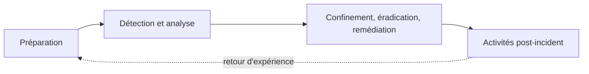

## Introduction

Le DFIR (Digital Forensics and Incident Response) réunit deux disciplines complémentaires : la réponse à incident (agir vite pour contenir une menace active) et la forensique numérique (comprendre en détail ce qui s'est passé, avec un niveau de rigueur permettant une utilisation juridique). Ce cours part du principe posé au chapitre 5 du cours Droit et Réglementation : une investigation techniquement brillante mais mal menée sur le plan de la preuve n'a aucune valeur.

## Réponse à incident vs forensique — deux temporalités différentes

<CompareTable
  titleA="Réponse à incident (Incident Response)"
  titleB="Forensique numérique (Digital Forensics)"
  rows={[
    { a: "Objectif : contenir et éradiquer rapidement", b: "Objectif : comprendre précisément ce qui s'est passé" },
    { a: "Timescale : minutes à heures", b: "Timescale : heures à semaines" },
    { a: "Peut accepter des compromis pour restaurer le service", b: "Exige la préservation stricte de l'intégrité des preuves" },
    { a: "Piloté par le SOC (cours Analyse SOC)", b: "Piloté par des analystes DFIR spécialisés" },
]}
/>

<TipCallout>
Ces deux activités entrent parfois en tension : redémarrer un serveur compromis répond vite à l'urgence opérationnelle, mais détruit potentiellement la mémoire vive contenant des preuves critiques — la décision de "contenir vs préserver" doit être prise consciemment, jamais par défaut.
</TipCallout>

## Le modèle du NIST pour la réponse à incident

<CehCallout>
Ce modèle, popularisé par le NIST (SP 800-61), recoupe directement les temporalités vues au chapitre 4 du cours Rédaction de Rapports (confinement, éradication, remédiation) — c'est le même cadre conceptuel, ici appliqué du point de vue technique de l'investigation plutôt que de la rédaction du rapport final.
</CehCallout>

## Les principes fondamentaux de l'investigation forensique

<Steps steps={[
  { title: "Ne jamais travailler sur l'original", description: "Toute analyse se fait sur une copie forensique, jamais sur le système compromis lui-même (approfondi au chapitre 2)." },
  { title: "Documenter chaque action en temps réel", description: "Un carnet d'investigation daté et détaillé, pas une reconstitution de mémoire après coup." },
  { title: "Ordre de volatilité", description: "Collecter d'abord les preuves les plus volatiles (mémoire vive) avant les moins volatiles (disque), car elles disparaissent les premières." },
  { title: "Corroborer, ne jamais présumer", description: "Une hypothèse d'investigation doit être confirmée par plusieurs sources de preuve indépendantes avant d'être présentée comme un fait." },
]} />

<WarningCallout>
Un analyste qui formule une conclusion ("c'est forcément un ransomware") avant d'avoir croisé plusieurs sources de preuve risque de biaiser toute la suite de son investigation — chaque piste technique doit rester une hypothèse jusqu'à corroboration explicite.
</WarningCallout>

## Lab — Mise en Pratique

**Environnement** : Réflexion guidée (sans terminal)

<Steps steps={[
  { title: "Arbitrer contenir vs préserver", description: "Un serveur de production semble compromis par un ransomware en cours de chiffrement. L'équipe IT veut le redémarrer immédiatement pour limiter les dégâts. Quel est le risque pour l'investigation, et quelle décision proposerais-tu ?" },
  { title: "Appliquer l'ordre de volatilité", description: "Classe ces sources de preuve par ordre de collecte prioritaire (de la plus volatile à la moins volatile) : disque dur, mémoire vive (RAM), logs archivés sur bande, cache réseau." },
]} />

## En résumé

- La réponse à incident (rapide, orientée confinement) et la forensique numérique (rigoureuse, orientée preuve) sont complémentaires mais répondent à des logiques différentes.
- Le modèle NIST (préparation, détection/analyse, confinement/éradication/remédiation, post-incident) structure la réponse à incident.
- L'ordre de volatilité impose de collecter d'abord les preuves les plus fragiles (mémoire vive) avant qu'elles ne disparaissent.

## Questions de Révision

1. Pourquoi redémarrer précipitamment un serveur compromis peut-il nuire gravement à une investigation forensique ?
2. Quelles sont les quatre phases du modèle NIST de réponse à incident ?
3. Pourquoi la mémoire vive doit-elle être collectée avant le disque dur lors d'une investigation ?
