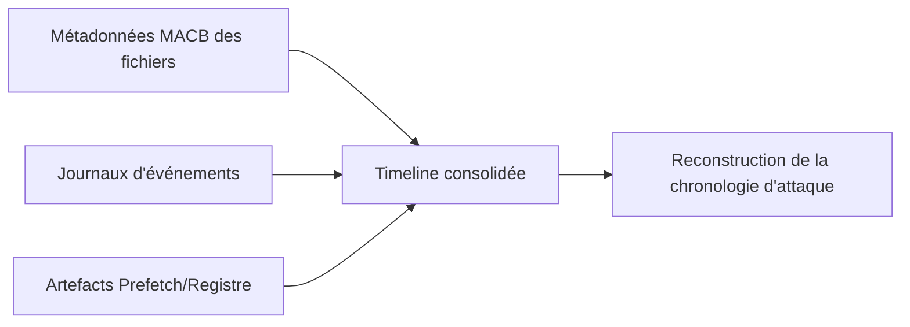

## Introduction

Malgré la montée en importance de l'analyse mémoire (chapitre 3), le disque reste une mine d'artefacts persistants — programmes exécutés, périphériques USB connectés, fichiers récemment ouverts — souvent bien après que la mémoire vive originale ait disparu au redémarrage.

## Les artefacts Windows incontournables

<CompareTable
  titleA="Artefact"
  titleB="Ce qu'il révèle"
  rows={[
    { a: "Prefetch", b: "Historique des programmes exécutés, avec horodatage et nombre d'exécutions" },
    { a: "Registre — clé Run/RunOnce", b: "Programmes configurés pour démarrer automatiquement — vecteur de persistance classique" },
    { a: "Registre — USB history (SYSTEM hive)", b: "Historique des périphériques USB connectés à la machine" },
    { a: "Journaux d'événements Windows (EVTX)", b: "Connexions, exécutions de processus, création de tâches planifiées" },
    { a: "$MFT (Master File Table)", b: "Métadonnées de tous les fichiers du volume NTFS, y compris certains fichiers supprimés récemment" },
]}
/>

<CehCallout>
Le fichier Prefetch d'un programme reste présent même après la suppression du programme lui-même — un attaquant qui supprime son outil après usage laisse fréquemment une trace Prefetch révélant qu'il a bien été exécuté, avec un horodatage précis.
</CehCallout>

## Retrouver des fichiers supprimés

<Steps steps={[
  { title: "Comprendre la suppression NTFS", description: "Supprimer un fichier marque son espace comme libre dans la MFT, mais son contenu reste physiquement présent jusqu'à écrasement par de nouvelles données." },
  { title: "Utiliser le carving de fichiers (file carving)", description: "Rechercher des signatures de fichiers connues (en-têtes/pieds de page) directement dans l'espace non alloué, indépendamment du système de fichiers." },
  { title: "Examiner la corbeille et ses métadonnées", description: "Le dossier $Recycle.Bin sur Windows conserve des métadonnées (nom original, date de suppression) même après vidage apparent." },
]} />

<TipCallout>
Le file carving fonctionne même sur un système de fichiers corrompu ou reformaté, car il ne dépend pas des métadonnées du système de fichiers mais reconnaît directement les signatures binaires des formats de fichiers (ex: en-tête PDF, JPEG) dans les données brutes.
</TipCallout>

## Construire une timeline à partir des métadonnées

<WarningCallout>
Les métadonnées de fichiers (MACB — Modified, Accessed, Created, entry Modified) peuvent être manipulées volontairement par un attaquant expérimenté (timestomping) pour masquer la date réelle de dépôt d'un outil malveillant — une timeline construite uniquement sur ces métadonnées doit toujours être corroborée par d'autres sources (logs, Prefetch, registre).
</WarningCallout>

<CehCallout>
Croiser plusieurs sources indépendantes (métadonnées de fichiers, journaux d'événements, Prefetch) plutôt que se fier à une seule est le principe de corroboration vu au chapitre 1 — un attaquant peut manipuler un timestamp de fichier, beaucoup plus difficilement l'ensemble des sources simultanément sans incohérence détectable.
</CehCallout>

## Lab — Mise en Pratique

**Environnement** : Réflexion guidée (sans terminal)

<Steps steps={[
  { title: "Interpréter un artefact Prefetch", description: "Un fichier Prefetch pour 'mimikatz.exe' existe sur un poste, alors que le fichier exécutable lui-même a été supprimé. Que cela révèle-t-il malgré la suppression du fichier original ?" },
  { title: "Identifier un timestomping", description: "Un fichier malveillant présente une date de création antérieure à l'installation du système d'exploitation lui-même. Que suggère cette incohérence, et quelles autres sources faudrait-il croiser pour la confirmer ?" },
]} />

## En résumé

- Prefetch, registre (Run/RunOnce, USB history) et journaux d'événements comptent parmi les artefacts Windows les plus révélateurs d'une investigation disque.
- Le file carving permet de récupérer des fichiers même sur un système de fichiers corrompu, en reconnaissant directement les signatures binaires.
- Une timeline construite à partir des métadonnées seules reste vulnérable au timestomping — la corroboration multi-source est indispensable.

## Questions de Révision

1. Pourquoi un fichier Prefetch peut-il révéler l'exécution d'un outil même après sa suppression ?
2. En quoi le file carving diffère-t-il d'une récupération de fichier classique basée sur les métadonnées du système de fichiers ?
3. Pourquoi une timeline basée uniquement sur les métadonnées de fichiers (MACB) peut-elle induire en erreur un analyste DFIR ?
