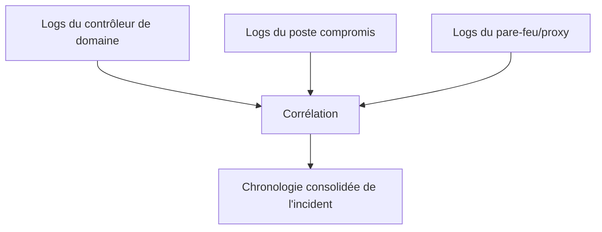

## Introduction

Ce chapitre approfondit la construction de timeline amorcée au chapitre 4, en se concentrant spécifiquement sur les journaux d'événements — la source de preuve la plus riche en détails temporels, mais aussi la plus volumineuse et la plus facile à mal interpréter sans méthode.

## Les journaux d'événements Windows essentiels

<CompareTable
  titleA="Journal / ID d'événement"
  titleB="Ce qu'il révèle"
  rows={[
    { a: "Security — Event ID 4624/4625", b: "Connexions réussies (4624) et échouées (4625), avec le type de connexion (locale, réseau, RDP)" },
    { a: "Security — Event ID 4688", b: "Création de processus, avec la ligne de commande complète si l'audit avancé est activé" },
    { a: "System — Event ID 7045", b: "Installation d'un nouveau service — vecteur de persistance classique" },
    { a: "PowerShell — Event ID 4104", b: "Contenu des scripts PowerShell exécutés, y compris ceux obfusqués" },
]}
/>

<CehCallout>
L'Event ID 4624 avec un type de connexion "3" (réseau) suivi d'un 4688 (création de processus) sur la même machine, dans un intervalle de quelques secondes, correspond souvent à un mouvement latéral réussi (chapitre 4 du cours Active Directory) — corréler ces deux événements révèle bien plus qu'un seul examiné isolément.
</CehCallout>

## Corréler des logs multi-sources

<Steps steps={[
  { title: "Synchroniser les fuseaux horaires", description: "Vérifier que toutes les sources de logs utilisent le même référentiel temporel (UTC recommandé) avant toute corrélation — sans cela, la chronologie reconstruite sera fausse." },
  { title: "Identifier un point d'ancrage", description: "Un événement certain (ex: l'alerte initiale du SIEM) sert de point de repère pour situer les autres événements avant/après." },
  { title: "Élargir progressivement la fenêtre temporelle", description: "Commencer par une fenêtre étroite autour du point d'ancrage, puis l'élargir si la chronologie reste incomplète." },
]} />

<WarningCallout>
Une erreur fréquente et coûteuse : corréler des logs provenant de systèmes configurés sur des fuseaux horaires différents sans les convertir au préalable vers un référentiel commun — cela peut faire apparaître un événement comme s'étant produit AVANT sa cause réelle, biaisant complètement l'analyse.
</WarningCallout>

## Pièges classiques d'interprétation

<Steps steps={[
  { title: "Confondre corrélation et causalité", description: "Deux événements proches dans le temps ne sont pas automatiquement liés — une hypothèse de lien doit être corroborée par d'autres preuves (chapitre 1)." },
  { title: "Ignorer les logs manquants", description: "L'absence de logs pour une période donnée n'est pas neutre — elle peut résulter d'une purge volontaire par l'attaquant, elle-même un indicateur de compromission." },
  { title: "Se fier à un volume de logs écrasant sans filtrage méthodique", description: "Sans hypothèse de travail claire, l'analyste se noie dans des millions d'événements sans jamais identifier le signal pertinent." },
]} />

<TipCallout>
Un journal d'événements Security anormalement plus petit que d'habitude, ou dont les entrées s'arrêtent brutalement à une heure précise, est en lui-même un indicateur de compromission — un attaquant qui efface ses traces génère un événement 1102 ("le journal d'audit a été effacé") qu'il oublie parfois de supprimer également.
</TipCallout>

## Lab — Mise en Pratique

**Environnement** : Réflexion guidée (sans terminal)

<Steps steps={[
  { title: "Corréler deux événements", description: "Un Event ID 4624 (connexion réseau réussie) apparaît sur SRV-02 à 14:32:10, suivi d'un Event ID 4688 (création de processus PowerShell) à 14:32:14. Que suggère cette séquence, et quelle hypothèse formulerais-tu ?" },
  { title: "Interpréter une absence de logs", description: "Le journal Security d'un serveur compromis présente un vide inexpliqué de 45 minutes juste avant la détection de l'incident. Que pourrait signifier cette absence, et quel événement spécifique chercherais-tu pour la confirmer ?" },
]} />

## En résumé

- Les Event ID 4624/4625, 4688, 7045 et 4104 comptent parmi les journaux Windows les plus riches pour une investigation.
- La corrélation multi-source exige une synchronisation stricte des fuseaux horaires et un point d'ancrage clair.
- Confondre corrélation et causalité, ou ignorer des logs manquants comme s'ils étaient neutres, sont deux pièges classiques d'interprétation.

## Questions de Révision

1. Pourquoi la synchronisation des fuseaux horaires est-elle une étape indispensable avant toute corrélation de logs multi-sources ?
2. Que peut signifier un vide inexpliqué dans un journal d'événements Security, et quel événement spécifique confirmerait cette hypothèse ?
3. Pourquoi deux événements proches dans le temps ne constituent-ils pas, à eux seuls, une preuve de lien causal ?
