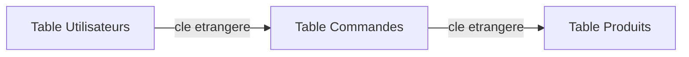

## Introduction

Ce chapitre pose les fondations du modèle relationnel, indispensables pour comprendre en profondeur l'injection SQL déjà étudiée au cours Sécurité Web (chapitre 3) — comprendre comment une base de données fonctionne normalement rend beaucoup plus clair pourquoi et comment elle peut être détournée.

## Le modèle relationnel — tables et relations



<CehCallout>
Une base de données relationnelle organise les données en tables reliées entre elles par des clés — une clé primaire identifie de façon unique chaque ligne d'une table, une clé étrangère référence la clé primaire d'une autre table, créant ainsi des relations entre des données autrement séparées.
</CehCallout>

<CompareTable
  titleA="Concept"
  titleB="Définition"
  rows={[
    { a: "Clé primaire", b: "Identifiant unique d'une ligne dans une table (ex : id_utilisateur)" },
    { a: "Clé étrangère", b: "Référence vers la clé primaire d'une autre table, créant une relation entre les deux" },
    { a: "Normalisation", b: "Organiser les données pour éviter la duplication et les incohérences" },
]}
/>

## Écrire des requêtes SQL de base

```sql
-- Sélectionner des données
SELECT nom, email FROM utilisateurs WHERE actif = 1;

-- Joindre deux tables via leur relation
SELECT u.nom, c.montant
FROM utilisateurs u
JOIN commandes c ON u.id = c.id_utilisateur;

-- Insérer, modifier, supprimer des données
INSERT INTO utilisateurs (nom, email) VALUES ('Alice', 'alice@example.com');
UPDATE utilisateurs SET actif = 0 WHERE id = 42;
DELETE FROM commandes WHERE id = 17;
```

<TipCallout>
Ces quatre opérations (SELECT, INSERT, UPDATE, DELETE) forment l'essentiel du langage SQL manipulé au quotidien — comprendre leur syntaxe exacte est précisément ce qui permet de comprendre comment une injection SQL parvient à modifier la requête prévue par l'application.
</TipCallout>

## Pourquoi ce socle éclaire l'injection SQL

<WarningCallout>
Rappel du cours Sécurité Web (chapitre 3) : une injection SQL fonctionne en insérant du code SQL supplémentaire dans une requête via une entrée utilisateur non validée — comprendre la syntaxe SQL normale (JOIN, WHERE, UNION) rend immédiatement plus clair pourquoi une entrée comme `' OR '1'='1` modifie la logique de la clause WHERE d'une requête d'authentification.
</WarningCallout>

```sql
-- Requête prévue par l'application (simplifiée)
SELECT * FROM utilisateurs WHERE nom = 'saisie_utilisateur' AND mot_de_passe = 'saisie_mdp';

-- Si saisie_utilisateur = admin' --
SELECT * FROM utilisateurs WHERE nom = 'admin' -- ' AND mot_de_passe = '...';
-- Le -- commente la suite de la requête, contournant la vérification du mot de passe
```

## Lab — Mise en Pratique

**Environnement** : Kali Linux (terminal Nyx Shell)

<Steps steps={[
  { title: "Écrire une jointure SQL", description: "Pour une table 'employes' (id, nom, id_service) et une table 'services' (id, nom_service), écris une requête SQL affichant le nom de chaque employé avec le nom de son service." },
  { title: "Expliquer une injection classique", description: "En te basant sur la syntaxe SQL de ce chapitre, explique précisément pourquoi l'entrée `' OR '1'='1` contourne une vérification de mot de passe mal protégée." },
]} />

## En résumé

- Le modèle relationnel organise les données en tables reliées par des clés primaires et étrangères.
- SELECT, INSERT, UPDATE et DELETE forment l'essentiel des opérations SQL manipulées au quotidien.
- Comprendre la syntaxe SQL normale rend beaucoup plus clair le mécanisme précis d'une injection SQL déjà étudiée au cours Sécurité Web.

## Questions de Révision

1. Quelle est la différence entre une clé primaire et une clé étrangère ?
2. Écris une requête SQL simple sélectionnant les utilisateurs actifs d'une table "utilisateurs".
3. Pourquoi comprendre la syntaxe SQL normale aide-t-il à comprendre le mécanisme d'une injection SQL ?
