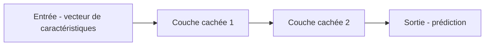

## Introduction

Ce cours prolonge le machine learning classique vu aux cours Data Science Complète et Python pour la Data Science vers des approches plus récentes — réseaux de neurones profonds et grands modèles de langage — avant d'aborder leur usage concret en défense (agents SOC) et les risques qu'ils introduisent côté offensif.

## Du modèle classique au réseau de neurones

<CehCallout>
Un réseau de neurones peut être vu comme un empilement de transformations linéaires (rappel du cours Algèbre Linéaire — chaque couche applique une multiplication matricielle) suivies de fonctions non linéaires, permettant d'apprendre des motifs bien plus complexes qu'un modèle classique comme un arbre de décision ou un k-NN.
</CehCallout>

<CompareTable
  titleA="Machine learning classique (cours Data Science Complète)"
  titleB="Deep learning (réseaux de neurones profonds)"
  rows={[
    { a: "Nécessite souvent une extraction manuelle de caractéristiques", b: "Peut apprendre directement des caractéristiques pertinentes à partir de données brutes" },
    { a: "Fonctionne bien avec des jeux de données de taille modeste", b: "Nécessite généralement de très grands volumes de données pour être performant" },
    { a: "Modèles souvent plus interprétables (arbre de décision)", b: "Modèles souvent peu interprétables ('boîte noire')" },
]}
/>

## Les grands modèles de langage (LLM)

<CehCallout>
Un LLM (Large Language Model) est un réseau de neurones entraîné sur d'immenses volumes de texte pour prédire la suite probable d'une séquence de mots — cette capacité de prédiction, à grande échelle, produit des comportements qui semblent relever de la compréhension et du raisonnement, sans que le modèle "comprenne" au sens humain du terme.
</CehCallout>

<Steps steps={[
  { title: "Pré-entraînement", description: "Le modèle apprend des motifs linguistiques généraux sur d'immenses corpus de texte, sans tâche spécifique en tête." },
  { title: "Alignement (fine-tuning)", description: "Le modèle est ensuite ajusté pour suivre des instructions et adopter un comportement utile et sûr." },
  { title: "Utilisation via prompt", description: "L'utilisateur interagit avec le modèle en langage naturel, sans avoir besoin de connaître son fonctionnement interne." },
]} />

## Pourquoi l'IA générative change le paysage de la cybersécurité

<CompareTable
  titleA="Usage défensif"
  titleB="Usage offensif ou risque"
  rows={[
    { a: "Résumer automatiquement des alertes SOC (chapitre 5)", b: "Générer des emails de phishing très convaincants et personnalisés à grande échelle" },
    { a: "Assister la rédaction de rapports (cours Rédaction de Rapports)", b: "Générer du code malveillant ou des variantes de malware" },
    { a: "Détecter des anomalies dans des logs textuels (chapitre 3)", b: "Automatiser la reconnaissance et l'exploitation de vulnérabilités" },
]}
/>

<WarningCallout>
La même capacité générative qui permet à un analyste de gagner un temps précieux en résumant des centaines d'alertes permet à un attaquant de générer, à un coût dérisoire, des milliers de variantes de messages de phishing convaincants — cette dualité fondamentale (dual-use) traverse l'ensemble de ce cours.
</WarningCallout>

## Lab — Mise en Pratique

**Environnement** : Python 3 (terminal Nyx Shell ou environnement local avec `pandas`/`scikit-learn` installés)

<Steps steps={[
  { title: "Créer un jeu de données minuscule", description: "Construis un petit tableau de connexions réseau (durée, octets envoyés) étiquetées normal/suspect, comme au cours Data Science Complète.", code: 'import pandas as pd\n\ndata = pd.DataFrame({\n    "duree_s": [2, 300, 1, 250, 3, 280, 2, 310, 1, 4],\n    "octets_envoyes": [500, 50000, 400, 48000, 600, 52000, 550, 51000, 300, 700],\n    "label": ["normal", "suspect", "normal", "suspect", "normal", "suspect", "normal", "suspect", "normal", "normal"]\n})\nprint(data)' },
  { title: "Entraîner un modèle classique (k-NN)", description: "Entraîne un k-NN sur ce jeu de seulement 10 exemples et mesure sa précision.", code: 'from sklearn.model_selection import train_test_split\nfrom sklearn.neighbors import KNeighborsClassifier\n\nX = data[["duree_s", "octets_envoyes"]]\ny = data["label"]\nX_train, X_test, y_train, y_test = train_test_split(X, y, test_size=0.3, random_state=42)\n\nknn = KNeighborsClassifier(n_neighbors=3)\nknn.fit(X_train, y_train)\nprint("Precision k-NN (ML classique):", knn.score(X_test, y_test))' },
  { title: "Entraîner un réseau de neurones (MLP) sur les mêmes données", description: "Entraîne un MLPClassifier sur le même jeu minuscule et compare sa précision à celle du k-NN.", code: 'from sklearn.neural_network import MLPClassifier\n\nmlp = MLPClassifier(hidden_layer_sizes=(16, 16), max_iter=2000, random_state=42)\nmlp.fit(X_train, y_train)\nprint("Precision MLP (reseau de neurones):", mlp.score(X_test, y_test))\n# Avec seulement 10 exemples, le MLP ne peut pas exploiter son avantage:\n# il lui faudrait des milliers d\'observations pour depasser le k-NN.' },
]} />

## En résumé

- Un réseau de neurones empile des transformations linéaires et non linéaires pour apprendre des motifs complexes, au prix d'une interprétabilité souvent réduite.
- Un LLM prédit la suite probable d'un texte à partir d'un immense volume d'entraînement, produisant des comportements qui semblent relever du raisonnement.
- L'IA générative est fondamentalement à double usage (dual-use) : les mêmes capacités servent aussi bien la défense que l'attaque.

## Questions de Révision

1. Quelle est la principale différence entre le machine learning classique et le deep learning en termes de volume de données nécessaire ?
2. Que signifie le "pré-entraînement" d'un LLM ?
3. Donne un exemple concret de capacité d'IA générative à double usage (défensif et offensif).
