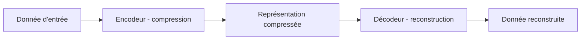

## Introduction

Ce chapitre approfondit la détection d'anomalies non supervisée déjà vue au cours Data Science Complète (chapitre 6), avec une architecture de réseau de neurones spécifiquement conçue pour cet usage : l'autoencodeur.

## Le principe d'un autoencodeur

<CehCallout>
Un autoencodeur est entraîné à reproduire sa propre entrée en sortie, après être passé par une représentation intermédiaire fortement compressée (moins de dimensions que l'entrée originale) — un principe qui rejoint directement la réduction de dimension par PCA vue au cours Algèbre Linéaire (chapitre 5), mais réalisée ici par un réseau de neurones plutôt que par une décomposition linéaire.
</CehCallout>

## Pourquoi l'erreur de reconstruction révèle une anomalie

<Steps steps={[
  { title: "Entraîner uniquement sur du trafic normal", description: "L'autoencodeur apprend à compresser et reconstruire fidèlement les motifs typiques du trafic habituel." },
  { title: "Mesurer l'erreur de reconstruction sur de nouvelles données", description: "Comparer la donnée d'entrée à sa version reconstruite par le modèle." },
  { title: "Signaler une anomalie si l'erreur dépasse un seuil", description: "Une donnée très différente du trafic normal appris sera mal reconstruite — une erreur de reconstruction élevée révèle un écart au motif habituel." },
]} />

<TipCallout>
Ce principe est particulièrement adapté à la détection d'attaques inédites : l'autoencodeur n'a jamais besoin d'exemples étiquetés d'attaques pour fonctionner — il suffit qu'un comportement s'écarte suffisamment de ce qui a été appris comme "normal", un lien direct avec la détection d'anomalies non supervisée du cours Data Science Complète.
</TipCallout>

## Comparaison avec le clustering classique

<CompareTable
  titleA="Clustering (k-means, cours Data Science Complète)"
  titleB="Autoencodeur"
  rows={[
    { a: "Fonctionne bien sur des données à faible dimension", b: "Gère efficacement des données à très haute dimension (images, séquences longues)" },
    { a: "Suppose des groupes de forme relativement simple", b: "Peut apprendre des structures normales bien plus complexes et non linéaires" },
    { a: "Plus rapide à entraîner, plus interprétable", b: "Nécessite plus de données et de puissance de calcul, moins interprétable" },
]}
/>

<WarningCallout>
Un autoencodeur entraîné sur un trafic "normal" non représentatif (par exemple, capturé uniquement pendant une période calme) produira de nombreux faux positifs une fois déployé sur un trafic réel plus varié — rappel du principe vu au cours Data Science Complète (chapitre 2) : la qualité et la représentativité des données d'entraînement conditionnent directement la fiabilité du modèle.
</WarningCallout>

## Choisir le bon seuil de détection

<CehCallout>
Le choix du seuil d'erreur de reconstruction au-delà duquel une observation est signalée comme anomalie reproduit exactement le compromis précision/rappel vu au cours Data Science Complète (chapitre 7) : un seuil trop bas génère de nombreux faux positifs, un seuil trop élevé laisse passer des attaques réelles.
</CehCallout>

## Lab — Mise en Pratique

**Environnement** : Réflexion guidée (sans terminal)

<Steps steps={[
  { title: "Expliquer le principe de détection", description: "Pourquoi une connexion réseau très différente du trafic habituel produit-elle une erreur de reconstruction élevée dans un autoencodeur entraîné uniquement sur du trafic normal ?" },
  { title: "Choisir entre clustering et autoencodeur", description: "Pour détecter des anomalies dans des images de captures d'écran (haute dimension), clustering classique ou autoencodeur serait-il plus adapté ? Justifie." },
]} />

## En résumé

- Un autoencodeur apprend à compresser puis reconstruire fidèlement des données normales, sans jamais avoir besoin d'exemples étiquetés d'attaques.
- Une erreur de reconstruction élevée sur une nouvelle donnée révèle un écart par rapport aux motifs normaux appris, signalant une anomalie potentielle.
- Le choix du seuil de détection reproduit le même compromis précision/rappel que pour tout modèle de détection classique.

## Questions de Révision

1. Que signifie l'"erreur de reconstruction" d'un autoencodeur, et comment révèle-t-elle une anomalie ?
2. Pourquoi un autoencodeur entraîné sur des données non représentatives produira-t-il de nombreux faux positifs ?
3. Dans quel cas un autoencodeur est-il préférable à un clustering classique pour la détection d'anomalies ?
