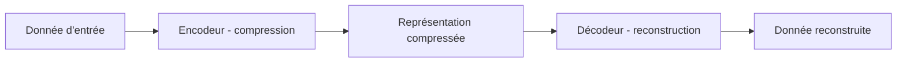

## Introduction

Ce chapitre approfondit la détection d'anomalies non supervisée déjà vue au cours Data Science Complète (chapitre 6), avec une architecture de réseau de neurones spécifiquement conçue pour cet usage : l'autoencodeur.

## Le principe d'un autoencodeur

<CehCallout>
Un autoencodeur est entraîné à reproduire sa propre entrée en sortie, après être passé par une représentation intermédiaire fortement compressée (moins de dimensions que l'entrée originale) — un principe qui rejoint directement la réduction de dimension par PCA vue au cours Algèbre Linéaire (chapitre 5), mais réalisée ici par un réseau de neurones plutôt que par une décomposition linéaire.
</CehCallout>

## Pourquoi l'erreur de reconstruction révèle une anomalie

<Steps steps={[
  { title: "Entraîner uniquement sur du trafic normal", description: "L'autoencodeur apprend à compresser et reconstruire fidèlement les motifs typiques du trafic habituel." },
  { title: "Mesurer l'erreur de reconstruction sur de nouvelles données", description: "Comparer la donnée d'entrée à sa version reconstruite par le modèle." },
  { title: "Signaler une anomalie si l'erreur dépasse un seuil", description: "Une donnée très différente du trafic normal appris sera mal reconstruite — une erreur de reconstruction élevée révèle un écart au motif habituel." },
]} />

<TipCallout>
Ce principe est particulièrement adapté à la détection d'attaques inédites : l'autoencodeur n'a jamais besoin d'exemples étiquetés d'attaques pour fonctionner — il suffit qu'un comportement s'écarte suffisamment de ce qui a été appris comme "normal", un lien direct avec la détection d'anomalies non supervisée du cours Data Science Complète.
</TipCallout>

## Comparaison avec le clustering classique

<CompareTable
  titleA="Clustering (k-means, cours Data Science Complète)"
  titleB="Autoencodeur"
  rows={[
    { a: "Fonctionne bien sur des données à faible dimension", b: "Gère efficacement des données à très haute dimension (images, séquences longues)" },
    { a: "Suppose des groupes de forme relativement simple", b: "Peut apprendre des structures normales bien plus complexes et non linéaires" },
    { a: "Plus rapide à entraîner, plus interprétable", b: "Nécessite plus de données et de puissance de calcul, moins interprétable" },
]}
/>

<WarningCallout>
Un autoencodeur entraîné sur un trafic "normal" non représentatif (par exemple, capturé uniquement pendant une période calme) produira de nombreux faux positifs une fois déployé sur un trafic réel plus varié — rappel du principe vu au cours Data Science Complète (chapitre 2) : la qualité et la représentativité des données d'entraînement conditionnent directement la fiabilité du modèle.
</WarningCallout>

## Choisir le bon seuil de détection

<CehCallout>
Le choix du seuil d'erreur de reconstruction au-delà duquel une observation est signalée comme anomalie reproduit exactement le compromis précision/rappel vu au cours Data Science Complète (chapitre 7) : un seuil trop bas génère de nombreux faux positifs, un seuil trop élevé laisse passer des attaques réelles.
</CehCallout>

## Lab — Mise en Pratique

**Environnement** : Python 3 (terminal Nyx Shell ou environnement local avec `pandas`/`scikit-learn` installés)

<Steps steps={[
  { title: "Générer un trafic majoritairement normal", description: "Construis un petit jeu de connexions réseau, essentiellement normales, avec quelques anomalies injectées.", code: 'import numpy as np\nimport pandas as pd\n\nnp.random.seed(42)\nnormal = pd.DataFrame({\n    "duree_s": np.random.normal(5, 1, 20),\n    "octets": np.random.normal(600, 100, 20)\n})\nanomalies = pd.DataFrame({\n    "duree_s": [400, 350, 420],\n    "octets": [90000, 85000, 95000]\n})\ntrafic = pd.concat([normal, anomalies], ignore_index=True)\nprint(trafic.tail(6))' },
  { title: "Entraîner une Isolation Forest sur ce trafic", description: "Utilise IsolationForest comme substitut pratique à l'autoencodeur pour détecter les connexions qui s'écartent du comportement normal.", code: 'from sklearn.ensemble import IsolationForest\n\nmodele = IsolationForest(contamination=0.15, random_state=42)\nmodele.fit(trafic)\ntrafic["anomalie"] = modele.predict(trafic)  # -1 = anomalie, 1 = normal\nprint(trafic["anomalie"].value_counts())' },
  { title: "Examiner les connexions signalées", description: "Trie les connexions par score de décision : un score très bas joue ici le même rôle qu'une erreur de reconstruction élevée dans un autoencodeur.", code: 'trafic["score"] = modele.score_samples(trafic[["duree_s", "octets"]])\nsuspectes = trafic[trafic["anomalie"] == -1].sort_values("score")\nprint(suspectes)\n# Un score tres bas ~ une erreur de reconstruction elevee dans un autoencodeur:\n# plus la connexion s\'ecarte du trafic normal appris, plus elle est signalee.' },
  { title: "Ajuster le seuil et observer le compromis", description: "Fais varier le taux de contamination (équivalent du seuil de reconstruction) et observe l'effet sur le nombre d'alertes.", code: 'for c in [0.05, 0.15, 0.30]:\n    m = IsolationForest(contamination=c, random_state=42).fit(trafic[["duree_s", "octets"]])\n    n_anomalies = (m.predict(trafic[["duree_s", "octets"]]) == -1).sum()\n    print(f"contamination={c} -> {n_anomalies} connexions signalees")' },
]} />

Pour aller plus loin sur un vrai jeu de données, essaie le lab **ds-001 — Le Trafic Suspect** (détection d'anomalies réseau par IsolationForest).

## En résumé

- Un autoencodeur apprend à compresser puis reconstruire fidèlement des données normales, sans jamais avoir besoin d'exemples étiquetés d'attaques.
- Une erreur de reconstruction élevée sur une nouvelle donnée révèle un écart par rapport aux motifs normaux appris, signalant une anomalie potentielle.
- Le choix du seuil de détection reproduit le même compromis précision/rappel que pour tout modèle de détection classique.

## Questions de Révision

1. Que signifie l'"erreur de reconstruction" d'un autoencodeur, et comment révèle-t-elle une anomalie ?
2. Pourquoi un autoencodeur entraîné sur des données non représentatives produira-t-il de nombreux faux positifs ?
3. Dans quel cas un autoencodeur est-il préférable à un clustering classique pour la détection d'anomalies ?
