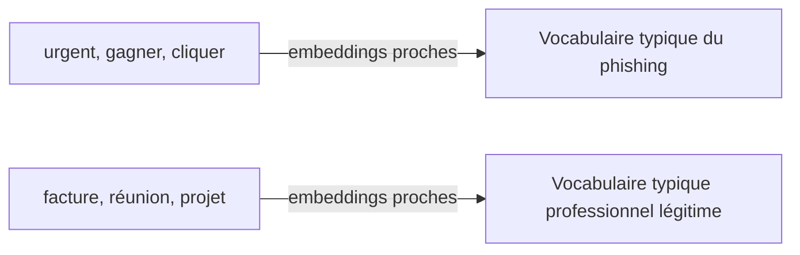

## Introduction

Une grande partie des données de sécurité est textuelle — emails, logs, tickets, rapports d'incident. Ce chapitre couvre le traitement automatique du langage (NLP), qui transforme ce texte brut en données numériques exploitables par les modèles vus précédemment.

## Transformer du texte en vecteurs

<CehCallout>
Rappel du cours Algèbre Linéaire (chapitre 1) : tout modèle de machine learning a besoin de vecteurs numériques en entrée — le NLP répond précisément à la question "comment transformer une phrase en vecteur ?".
</CehCallout>

<CompareTable
  titleA="Technique"
  titleB="Principe"
  rows={[
    { a: "Sac de mots (bag of words)", b: "Compte simplement la fréquence de chaque mot, sans tenir compte de l'ordre ni du sens" },
    { a: "TF-IDF", b: "Pondère chaque mot selon sa fréquence dans le document ET sa rareté dans l'ensemble des documents" },
    { a: "Embeddings de mots", b: "Représente chaque mot comme un vecteur dense capturant des relations de sens (des mots similaires ont des vecteurs proches)" },
]}
/>

## Le principe des embeddings

<TipCallout>
Les embeddings de mots ont une propriété remarquable : les opérations vectorielles (rappel du cours Algèbre Linéaire, chapitre 1) sur ces représentations capturent parfois des relations sémantiques — l'exemple classique "roi - homme + femme ≈ reine" illustre que la distance et la direction entre vecteurs de mots peuvent refléter des relations de sens.
</TipCallout>

<CehCallout>
La similarité cosinus (rappel du cours Algèbre Linéaire, chapitre 6) est l'outil standard pour mesurer à quel point deux textes (ou deux mots) sont proches sémantiquement une fois transformés en vecteurs — un email de phishing partage souvent un vocabulaire dont les embeddings sont proches de ceux d'autres emails de phishing déjà connus.
</CehCallout>

## Application 1 — détection de phishing par le contenu

<Steps steps={[
  { title: "Vectoriser le corps de l'email", description: "Transformer le texte en vecteur via TF-IDF ou embeddings." },
  { title: "Combiner avec des caractéristiques structurelles", description: "Nombre de liens, présence de pièces jointes, domaine de l'expéditeur (rappel du chapitre 8 du cours Data Science Complète)." },
  { title: "Classifier avec un modèle supervisé", description: "Réutiliser les techniques du cours Data Science Complète (chapitre 5) sur ce vecteur combiné texte + structure." },
]} />

## Application 2 — analyse de logs textuels non structurés

<WarningCallout>
De nombreux logs applicatifs sont des messages texte libres plutôt que des champs structurés — un message d'erreur peut varier légèrement à chaque occurrence (identifiants différents, timestamps inclus dans le texte) rendant un simple comptage exact inefficace pour regrouper des événements similaires.
</WarningCallout>

<CehCallout>
Le "log parsing" ou "log clustering" utilise des techniques NLP pour regrouper automatiquement des messages de logs qui partagent la même structure sous-jacente malgré des variations de détail (identifiants, valeurs numériques) — une étape préalable indispensable avant toute analyse à grande échelle de logs applicatifs.
</CehCallout>

## Lab — Mise en Pratique

**Environnement** : Python 3 (terminal Nyx Shell ou environnement local avec `pandas`/`scikit-learn` installés)

<Steps steps={[
  { title: "Constituer un petit corpus d'emails", description: "Rassemble quelques emails de phishing et quelques emails légitimes étiquetés, comme base d'entraînement.", code: 'emails = [\n    "Urgent, votre compte a ete bloque, cliquez ici pour le reactiver immediatement",\n    "Felicitations vous avez gagne un prix, cliquez vite pour reclamer votre cadeau",\n    "Bonjour, voici le compte-rendu de la reunion de projet de ce matin",\n    "Merci de trouver ci-joint la facture du mois pour le service consulting",\n    "Action requise: verifiez vos identifiants de connexion sous 24h sinon suspension",\n    "Rappel: la reunion d\'equipe est deplacee a 15h en salle B"\n]\nlabels = ["phishing", "phishing", "legitime", "legitime", "phishing", "legitime"]' },
  { title: "Vectoriser le corps des emails avec TF-IDF", description: "Transforme le texte brut en vecteurs numériques exploitables par un modèle.", code: 'from sklearn.feature_extraction.text import TfidfVectorizer\n\nvectoriseur = TfidfVectorizer()\nX = vectoriseur.fit_transform(emails)\nprint("Vocabulaire:", len(vectoriseur.vocabulary_), "mots")\nprint("Forme de la matrice TF-IDF:", X.shape)' },
  { title: "Classifier avec un modèle supervisé (Naive Bayes)", description: "Réutilise une technique de classification supervisée sur ce vecteur texte, comme au cours Data Science Complète.", code: 'from sklearn.naive_bayes import MultinomialNB\n\nclassifieur = MultinomialNB()\nclassifieur.fit(X, labels)\nprint("Precision sur le corpus d\'entrainement:", classifieur.score(X, labels))' },
  { title: "Tester sur un nouvel email", description: "Vérifie que le classifieur généralise à un email jamais vu lors de l'entraînement.", code: 'nouvel_email = ["Alerte de securite: cliquez ici en urgence pour eviter la fermeture de votre compte"]\nX_nouveau = vectoriseur.transform(nouvel_email)\nprediction = classifieur.predict(X_nouveau)\nprint("Classification:", prediction[0])' },
]} />

Pour aller plus loin sur un vrai jeu de données, essaie le lab **ds-002 — Le Filtre à Phishing** (classification d'emails par Naive Bayes).

## En résumé

- Le NLP transforme du texte en vecteurs numériques exploitables par les modèles de machine learning, via sac de mots, TF-IDF ou embeddings.
- Les embeddings de mots capturent des relations sémantiques, permettant de mesurer la similarité de sens via la similarité cosinus.
- Le NLP s'applique concrètement à la détection de phishing par le contenu et au regroupement automatique de logs textuels non structurés.

## Questions de Révision

1. Quelle est la différence entre le sac de mots et les embeddings de mots ?
2. Pourquoi la similarité cosinus est-elle l'outil standard pour comparer deux textes vectorisés ?
3. Pourquoi le "log parsing" est-il nécessaire avant d'analyser à grande échelle des logs applicatifs en texte libre ?
