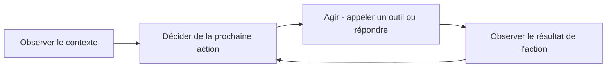

## Introduction

Ce chapitre pose les bases conceptuelles nécessaires avant d'aborder, au chapitre suivant, l'usage concret des agents IA pour l'automatisation SOC. Un agent n'est pas qu'un modèle qui répond à une question — c'est un système qui perçoit, décide et agit de façon autonome, potentiellement sur plusieurs étapes.

## Qu'est-ce qui distingue un agent d'un simple modèle

<CompareTable
  titleA="Modèle simple (ex : classificateur de phishing)"
  titleB="Agent IA autonome"
  rows={[
    { a: "Reçoit une entrée, produit une sortie unique", b: "Peut effectuer plusieurs actions successives pour atteindre un objectif" },
    { a: "N'interagit pas avec des systèmes externes", b: "Peut appeler des outils externes (bases de données, API, terminal)" },
    { a: "Aucune mémoire entre deux appels", b: "Peut maintenir un contexte et un état sur plusieurs étapes" },
]}
/>

<CehCallout>
Un agent IA de triage d'alertes SOC ne se contente pas de classer une alerte "suspecte" ou "normale" — il peut, de façon autonome, interroger une base de renseignement sur la menace (threat intelligence), consulter l'historique de l'utilisateur concerné, puis rédiger une recommandation, enchaînant plusieurs actions pour une seule alerte.
</CehCallout>

## Le cycle observation-décision-action

<Steps steps={[
  { title: "Observer", description: "L'agent reçoit un objectif et un contexte initial (ex : une alerte SIEM à trier)." },
  { title: "Décider", description: "L'agent détermine la prochaine action la plus utile pour progresser vers l'objectif." },
  { title: "Agir", description: "L'agent exécute cette action — souvent en appelant un outil externe." },
  { title: "Boucler", description: "Le résultat de l'action devient une nouvelle observation, et le cycle recommence jusqu'à ce que l'objectif soit atteint." },
]} />

## Le rôle central des outils (tools)

<CehCallout>
Un agent seul, sans accès à des outils externes, ne peut que raisonner sur ce qu'il connaît déjà — donner à un agent l'accès à des outils (interroger une base de données, exécuter une recherche, appeler une API de threat intelligence) est ce qui transforme un simple générateur de texte en système réellement capable d'agir sur le monde réel.
</CehCallout>

<CompareTable
  titleA="Outil"
  titleB="Usage en sécurité"
  rows={[
    { a: "Requête vers une base de vulnérabilités (CVE)", b: "Vérifier si un logiciel mentionné dans une alerte est concerné par une vulnérabilité connue" },
    { a: "Requête vers un SIEM", b: "Rechercher des événements corrélés à une alerte donnée" },
    { a: "Exécution de commandes (terminal)", b: "Automatiser une investigation ou une action de confinement, sous supervision" },
]}
/>

<WarningCallout>
Donner à un agent IA un accès direct à des outils capables d'agir sur des systèmes réels (exécuter des commandes, modifier des configurations) sans supervision humaine ni garde-fou introduit un risque opérationnel réel — un agent qui interprète mal une instruction ou est manipulé (chapitre 6) peut causer des dommages bien au-delà d'une simple réponse textuelle erronée.
</WarningCallout>

## Lab — Mise en Pratique

**Environnement** : Python 3 (terminal Nyx Shell ou environnement local avec `pandas`/`scikit-learn` installés)

<Steps steps={[
  { title: "Définir les outils disponibles pour l'agent", description: "Implémente deux outils simples qu'un agent pourrait appeler : consultation de threat intelligence et d'historique utilisateur.", code: 'def consulter_threat_intel(ip):\n    base = {"41.207.12.3": "connue malveillante", "192.168.1.10": "inconnue"}\n    return base.get(ip, "inconnue")\n\ndef consulter_historique(utilisateur):\n    base = {"jdupont": "connexions habituelles depuis la France"}\n    return base.get(utilisateur, "aucun historique")' },
  { title: "Implémenter le cycle observation-décision-action", description: "Écris une fonction qui observe une alerte, appelle les outils disponibles, puis décide d'escalader ou de clôturer.", code: 'def trier_alerte(alerte):\n    trace = []\n    trace.append(("observer", alerte))\n\n    reputation = consulter_threat_intel(alerte["ip"])\n    trace.append(("agir: consulter_threat_intel", reputation))\n\n    historique = consulter_historique(alerte["utilisateur"])\n    trace.append(("agir: consulter_historique", historique))\n\n    if reputation == "connue malveillante":\n        decision = "escalade: IP malveillante connue"\n    elif "habituelles" not in historique:\n        decision = "escalade: comportement inhabituel"\n    else:\n        decision = "cloture automatique: contexte normal"\n\n    trace.append(("decider", decision))\n    return trace' },
  { title: "Exécuter l'agent sur une alerte simulée", description: "Fais tourner le cycle complet sur une alerte de test et observe la trace de chaque étape.", code: 'alerte = {"ip": "41.207.12.3", "utilisateur": "jdupont"}\nfor etape, detail in trier_alerte(alerte):\n    print(f"{etape}: {detail}")' },
]} />

## En résumé

- Un agent IA se distingue d'un simple modèle par sa capacité à enchaîner plusieurs actions autonomes vers un objectif, en s'appuyant sur un contexte maintenu.
- Le cycle observation-décision-action-boucle structure le fonctionnement d'un agent jusqu'à l'atteinte de son objectif.
- L'accès à des outils externes transforme un agent en système capable d'agir réellement, avec les risques opérationnels que cela implique sans supervision adéquate.

## Questions de Révision

1. Qu'est-ce qui distingue fondamentalement un agent IA d'un simple modèle de classification ?
2. Décris les quatre étapes du cycle observation-décision-action.
3. Pourquoi l'accès à des outils capables d'agir sur des systèmes réels introduit-il un risque opérationnel spécifique pour un agent IA ?
