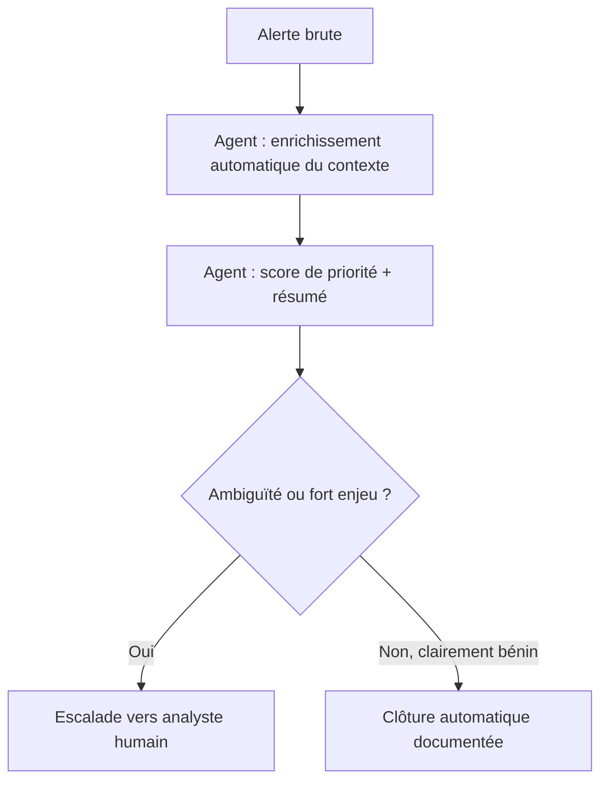

## Introduction

Ce chapitre applique les principes d'agents du chapitre précédent au contexte concret d'un SOC (Security Operations Center), en lien direct avec le cours Analyse SOC — le triage manuel d'alertes reste l'une des tâches les plus chronophages et répétitives d'un analyste, un candidat naturel à l'assistance par IA.

## Où les agents IA apportent le plus de valeur en SOC

<CompareTable
  titleA="Tâche SOC"
  titleB="Apport de l'agent IA"
  rows={[
    { a: "Triage initial d'alertes", b: "Résumer et prioriser automatiquement un grand volume d'alertes selon leur contexte" },
    { a: "Enrichissement de contexte", b: "Interroger automatiquement plusieurs sources (threat intel, historique utilisateur) sans action manuelle répétée" },
    { a: "Rédaction de rapports d'incident", b: "Générer un premier brouillon structuré à partir des logs et actions entreprises (lien avec le cours Rédaction de Rapports)" },
    { a: "Réponse à incident automatisée", b: "Exécuter des actions de confinement de premier niveau selon des règles strictes et validées" },
]}
/>

<CehCallout>
La priorisation automatique d'alertes par un agent IA ne remplace pas le jugement de l'analyste — elle réduit le temps passé à trier manuellement des centaines d'alertes à faible valeur, pour concentrer l'attention humaine sur les cas ambigus ou à fort enjeu, un principe similaire à l'automatisation des scripts vus au cours Linux pour la Cybersécurité.
</CehCallout>

## Le principe du triage assisté

<Steps steps={[
  { title: "Collecte automatique de contexte", description: "L'agent rassemble automatiquement les informations pertinentes (historique, géolocalisation, réputation IP) associées à l'alerte." },
  { title: "Résumé et score de priorité", description: "L'agent produit un résumé lisible et un score estimant l'urgence, à partir du contexte collecté." },
  { title: "Décision d'escalade", description: "Les cas clairement bénins peuvent être clôturés automatiquement (avec traçabilité) ; les cas ambigus sont transmis à un analyste humain avec le contexte déjà préparé." },
]} />

## Les garde-fous indispensables

<WarningCallout>
Un agent IA qui clôture automatiquement des alertes sans traçabilité claire ni possibilité d'audit a posteriori introduit un risque de sécurité en soi : une attaque réelle mal classée et clôturée silencieusement par l'agent peut passer complètement inaperçue, sans qu'aucun humain n'ait eu l'occasion de la repérer.
</WarningCallout>

<Steps steps={[
  { title: "Traçabilité complète", description: "Chaque décision de l'agent (clôture, escalade, action) doit être journalisée avec son raisonnement, consultable a posteriori." },
  { title: "Seuils de confiance conservateurs", description: "En cas de doute, l'agent doit systématiquement escalader vers un humain plutôt que de clôturer par excès de confiance." },
  { title: "Revue périodique des décisions automatisées", description: "Un échantillon des clôtures automatiques doit être régulièrement audité par un analyste pour détecter une dérive du comportement de l'agent." },
]} />

<CehCallout>
Ce principe de garde-fous rejoint directement le RGPD (cours Droit et Réglementation, chapitre 2) : une décision automatisée ayant un impact significatif (comme la clôture d'une alerte de sécurité potentiellement critique) doit rester encadrée, documentée et susceptible de révision humaine.
</CehCallout>

## Lab — Mise en Pratique

**Environnement** : Réflexion guidée (sans terminal)

<Steps steps={[
  { title: "Concevoir un critère d'escalade", description: "Propose un critère concret permettant à un agent de décider qu'une alerte de connexion doit être escaladée à un humain plutôt que clôturée automatiquement." },
  { title: "Identifier un risque de garde-fou manquant", description: "Un agent IA clôture automatiquement 95% des alertes sans qu'aucun humain ne consulte jamais un échantillon de ces clôtures. Quel risque concret cela fait-il courir ?" },
]} />

## En résumé

- Les agents IA apportent le plus de valeur au SOC sur le triage initial, l'enrichissement de contexte et la rédaction de premiers brouillons de rapport.
- Un cycle de triage assisté combine collecte de contexte, résumé/score de priorité, et escalade sélective vers un analyste humain.
- Traçabilité complète, seuils de confiance conservateurs et audit périodique sont des garde-fous indispensables face à un agent capable de clôturer des alertes de façon autonome.

## Questions de Révision

1. Sur quelles tâches SOC concrètes un agent IA apporte-t-il le plus de valeur ?
2. Pourquoi la traçabilité complète des décisions d'un agent est-elle indispensable, pas seulement souhaitable ?
3. En quoi le principe de garde-fous d'un agent SOC rejoint-il une exigence du RGPD vue au cours Droit et Réglementation ?
