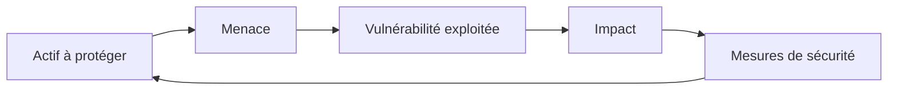

## Introduction

Avant de manipuler le moindre outil de pentest, il faut comprendre le problème que la cybersécurité cherche à résoudre. Ce chapitre pose les bases conceptuelles sur lesquelles s'appuient tous les cours suivants de Nyx : la triade CIA, les types de menaces, et le vocabulaire de base que tu retrouveras partout — y compris dans les certifications CEH et Security+.

## Qu'est-ce que la cybersécurité ?

La cybersécurité regroupe l'ensemble des pratiques, technologies et processus visant à protéger les systèmes, réseaux et données contre les accès non autorisés, les altérations et les interruptions de service. Ce n'est pas un état figé mais un processus continu : une organisation n'est jamais "sécurisée" une fois pour toutes, elle gère un risque en permanence.

## La triade CIA

Trois propriétés fondamentales structurent toute analyse de sécurité :

<CompareTable
  titleA="Propriété"
  titleB="Ce qu'elle garantit"
  rows={[
    { a: "Confidentialité (Confidentiality)", b: "Seules les personnes autorisées peuvent accéder à l'information" },
    { a: "Intégrité (Integrity)", b: "L'information n'est pas altérée de façon non autorisée" },
    { a: "Disponibilité (Availability)", b: "L'information et les services restent accessibles quand nécessaire" },
  ]}
/>

<TipCallout>
Retiens l'acronyme CIA (Confidentiality, Integrity, Availability) — c'est l'un des concepts les plus testés dans toutes les certifications d'entrée en cybersécurité, CEH et Security+ en tête.
</TipCallout>

Un exemple concret : une attaque par déni de service (DDoS) ne vole aucune donnée et n'en altère aucune — elle vise uniquement la **disponibilité**. À l'inverse, une fuite de base de données clients touche la **confidentialité** sans nécessairement affecter la disponibilité du service.

## Les grandes familles de menaces

<AttackDefenseTable rows={[
  { phase: "Malware", attack: "Virus, ransomware, spyware infectant un système", defense: "Antivirus/EDR, sauvegardes hors-ligne, sensibilisation utilisateurs" },
  { phase: "Ingénierie sociale", attack: "Phishing, prétexting, manipulation psychologique", defense: "Formation continue, simulations de phishing, MFA" },
  { phase: "Attaque réseau", attack: "Man-in-the-middle, sniffing, DDoS", defense: "Chiffrement (TLS), segmentation réseau, anti-DDoS" },
  { phase: "Exploitation applicative", attack: "Injection SQL, XSS, désérialisation", defense: "Validation des entrées, revues de code, WAF" },
]} />

<CehCallout>
Le CEH structure officiellement son référentiel autour de 5 phases d'attaque : Reconnaissance, Scanning, Gaining Access, Maintaining Access, Covering Tracks. Tu les retrouveras en détail dans le cours Cybersécurité Offensive.
</CehCallout>

## Les acteurs de la menace

Tous les attaquants n'ont pas les mêmes motivations ni les mêmes moyens :

- **Script kiddies** : peu de compétences techniques, utilisent des outils tout faits
- **Hacktivistes** : motivation idéologique ou politique
- **Cybercriminels organisés** : motivation financière, souvent très structurés (ransomware-as-a-service)
- **APT (Advanced Persistent Threat)** : groupes sophistiqués, souvent étatiques, campagnes longues et discrètes
- **Insiders** : employés ou prestataires malveillants ou négligents, menace souvent sous-estimée

<WarningCallout>
Les statistiques du secteur montrent régulièrement que la menace interne (insider threat), qu'elle soit malveillante ou simplement due à la négligence, représente une part très significative des incidents de sécurité — bien plus que les attaques APT médiatisées.
</WarningCallout>

## Lab — Mise en Pratique

**Environnement** : Réflexion guidée (pas de terminal requis pour ce chapitre)

<Steps steps={[
  { title: "Analyser un scénario", description: "Un site e-commerce subit une attaque DDoS de 3 heures pendant laquelle aucune commande client n'a pu être passée, mais aucune donnée n'a été volée. Quelle propriété de la triade CIA est touchée ?" },
  { title: "Classifier un incident", description: "Un employé mécontent copie la base clients avant son départ. À quelle famille de menace appartient cet incident ?" },
  { title: "Proposer une mesure", description: "Pour chaque famille de menace vue dans ce chapitre, note une mesure de protection déjà en place chez toi ou ton entourage professionnel." },
]} />

## Pour aller plus loin

### Au-delà de CIA : les propriétés étendues (Parkerian Hexad)

La triade CIA reste la référence, mais certains experts (notamment Donn Parker) proposent un modèle étendu à six propriétés, plus fin pour analyser certains incidents :

<CompareTable
  titleA="Propriété additionnelle"
  titleB="Ce qu'elle capture"
  rows={[
    { a: "Possession / Contrôle", b: "Perdre le contrôle d'une donnée sans forcément la rendre publique (ex: ransomware qui chiffre sans exfiltrer)" },
    { a: "Authenticité", b: "Garantir que l'origine d'une information est bien celle annoncée (ex: contrer l'usurpation d'identité)" },
    { a: "Utilité", b: "L'information reste exploitable, pas seulement accessible (ex: des données présentes mais corrompues/illisibles)" },
  ]}
/>

<TipCallout>
Un ransomware illustre bien la limite de la triade CIA seule : les données restent confidentielles (personne d'autre ne les voit) et parfois même intactes (intégrité préservée), mais leur disponibilité ET leur possession sont perdues — le Parkerian Hexad capture cette nuance plus précisément.
</TipCallout>

### Chiffres clés pour ancrer la compréhension du risque

Quelques ordres de grandeur, issus des rapports annuels du secteur (IBM Cost of a Data Breach, Verizon DBIR), aident à comprendre pourquoi la cybersécurité est devenue une priorité stratégique plutôt qu'un sujet purement technique :

- Le coût moyen d'une violation de données se compte en millions de dollars pour une grande entreprise, avec un délai moyen de détection souvent supérieur à 200 jours.
- Le phishing et le vol d'identifiants restent, année après année, le vecteur d'accès initial le plus fréquent — bien avant l'exploitation de vulnérabilités zero-day.
- La majorité des incidents impliquent une composante humaine (erreur, négligence ou manipulation), pas uniquement une faille technique.

<CehCallout>
Ces statistiques justifient pourquoi le CEH accorde une place importante à l'ingénierie sociale (Module 09) — techniquement, une porte blindée ne sert à rien si quelqu'un en donne la clé.
</CehCallout>

### Le triangle sécurité / fonctionnalité / facilité d'utilisation

Un principe informel mais très cité en sécurité : on ne peut maximiser simultanément la sécurité, la fonctionnalité et la facilité d'utilisation d'un système — chaque décision de sécurité implique un compromis sur les deux autres axes. Un mot de passe de 32 caractères aléatoires est très sécurisé, mais personne ne s'en souviendra sans gestionnaire de mots de passe : la facilité d'utilisation en pâtit, ce qui pousse parfois les utilisateurs à contourner la mesure (post-it, réutilisation du même mot de passe).

<AuditCallout>
Un bon RSSI (Responsable de la Sécurité des Systèmes d'Information) ne cherche pas la sécurité maximale absolue, mais le meilleur compromis acceptable pour l'organisation — une mesure de sécurité que personne ne respecte parce qu'elle est trop contraignante n'apporte aucune protection réelle.
</AuditCallout>

## En résumé

- La cybersécurité est un processus continu de gestion du risque, pas un état final.
- La triade CIA (Confidentialité, Intégrité, Disponibilité) structure toute analyse de sécurité.
- Les menaces se répartissent en grandes familles : malware, ingénierie sociale, attaques réseau, exploitation applicative.
- Les acteurs de la menace ont des motivations très différentes, de l'amateur à l'APT étatique — l'insider reste une menace fréquemment sous-estimée.

## Questions de Révision

1. Que signifie l'acronyme CIA en cybersécurité ?
2. Une attaque DDoS touche principalement quelle propriété de la triade CIA ?
3. Quelle est la différence entre un hacktiviste et un APT ?
