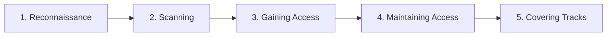

## Introduction

Un pentest réussi n'est pas une succession désordonnée de commandes : c'est une méthodologie structurée, reproductible, et documentée à chaque étape. Ce chapitre présente les deux cadres de référence les plus utilisés dans l'industrie — les 5 phases du CEH et la Cyber Kill Chain — qui te serviront de fil rouge pour tous les cours offensifs de Nyx.

## Les 5 phases du CEH



<CompareTable
  titleA="Phase"
  titleB="Objectif"
  rows={[
    { a: "1. Reconnaissance", b: "Collecter un maximum d'informations passives et actives sur la cible" },
    { a: "2. Scanning", b: "Identifier les ports ouverts, services et versions exposés" },
    { a: "3. Gaining Access", b: "Exploiter une vulnérabilité pour obtenir un accès initial" },
    { a: "4. Maintaining Access", b: "Établir une persistance (backdoor, compte, tâche planifiée)" },
    { a: "5. Covering Tracks", b: "Effacer les traces de l'intrusion (logs, artefacts)" },
  ]}
/>

<CehCallout>
Ces 5 phases structurent l'intégralité de l'examen CEH. Chaque outil que tu croiseras dans Nyx (Nmap, Metasploit, Mimikatz...) se rattache à l'une de ces phases — c'est le fil conducteur à garder en tête.
</CehCallout>

## Reconnaissance passive vs active

La reconnaissance se divise en deux approches complémentaires :

- **Passive** : collecte d'informations sans interaction directe avec la cible (OSINT, recherches DNS publiques, réseaux sociaux, Shodan, Google dorking). Indétectable par la cible.
- **Active** : interaction directe avec la cible (ping, scan de ports, requêtes DNS directes). Peut être détectée par un IDS/IPS.

```bash
# Reconnaissance passive : recherche DNS publique
whois example.com
dig example.com ANY

# Reconnaissance active : test de disponibilité direct
ping -c 4 example.com
```

<TipCallout>
En situation réelle, toujours privilégier la reconnaissance passive le plus longtemps possible avant de basculer vers l'actif — cela réduit le risque de détection précoce et donne un maximum de contexte avant d'interagir directement avec la cible.
</TipCallout>

## La Cyber Kill Chain (Lockheed Martin)

Un second modèle, plus orienté défense, est largement utilisé par les équipes SOC et Blue Team :

<AttackDefenseTable rows={[
  { phase: "1. Reconnaissance", attack: "Collecte d'informations sur la cible", defense: "Surveillance de l'exposition publique (OSINT défensif)" },
  { phase: "2. Weaponization", attack: "Préparation d'un payload malveillant", defense: "Threat intelligence, signatures antivirus à jour" },
  { phase: "3. Delivery", attack: "Envoi du payload (email, USB, lien)", defense: "Filtrage email, sensibilisation phishing" },
  { phase: "4. Exploitation", attack: "Exécution du code malveillant", defense: "EDR, sandboxing, durcissement système" },
  { phase: "5. Installation", attack: "Installation d'une backdoor persistante", defense: "Détection d'anomalies, intégrité des fichiers" },
  { phase: "6. Command & Control", attack: "Communication avec un serveur C2", defense: "Surveillance réseau, détection de trafic anormal" },
  { phase: "7. Actions on Objectives", attack: "Exfiltration de données, sabotage", defense: "DLP (Data Loss Prevention), segmentation réseau" },
]} />

<AuditCallout>
La Cyber Kill Chain est un des modèles de référence utilisés par les analystes SOC pour cartographier un incident — tu la retrouveras en détail dans le cours Analyse SOC de Nyx.
</AuditCallout>

## Documenter chaque étape

<WarningCallout>
Un test d'intrusion sans documentation n'a aucune valeur pour le client, quel que soit le nombre de vulnérabilités trouvées. Chaque commande, chaque preuve (capture d'écran, sortie d'outil) doit être horodatée et conservée en vue du rapport final.
</WarningCallout>

## Lab — Mise en Pratique

**Environnement** : Réflexion guidée (pas de terminal requis pour ce chapitre)

<Steps steps={[
  { title: "Classer des actions par phase", description: "Pour chacune des actions suivantes, indique la phase CEH correspondante : (a) scanner les ports avec Nmap, (b) rechercher les employés d'une entreprise sur LinkedIn, (c) créer une tâche planifiée après un accès obtenu, (d) supprimer les logs d'authentification." },
  { title: "Relier Kill Chain et défense", description: "Pour la phase 'Delivery' de la Kill Chain, propose deux mesures défensives concrètes autres que celles déjà citées." },
]} />

## Pour aller plus loin

### MITRE ATT&CK : la matrice qui a remplacé la Kill Chain dans le quotidien SOC

Si la Cyber Kill Chain reste pédagogiquement utile, la plupart des équipes SOC modernes travaillent avec la matrice **MITRE ATT&CK** — un référentiel bien plus granulaire, structuré en tactiques (les "pourquoi", ex: Persistence, Privilege Escalation) et techniques (les "comment", ex: T1053 Scheduled Task).

<CompareTable
  titleA="Cyber Kill Chain"
  titleB="MITRE ATT&CK"
  rows={[
    { a: "7 étapes linéaires et séquentielles", b: "14 tactiques, non nécessairement séquentielles, avec des centaines de techniques documentées" },
    { a: "Modèle conceptuel, peu d'exemples concrets", b: "Chaque technique référence des cas réels observés (groupes APT, malwares)" },
    { a: "Bon pour expliquer/former", b: "Bon pour cartographier un incident réel et outiller la détection (règles SIEM)" },
]}
/>

<CehCallout>
Tu retrouveras ATT&CK en détail dans le cours Analyse SOC — de nombreux SIEM (Splunk, Elastic, Microsoft Sentinel) mappent directement leurs alertes sur des identifiants de techniques ATT&CK (ex: T1110 pour le bruteforce), ce qui en fait un langage commun entre Red Team et Blue Team.
</CehCallout>

### PTES : un standard de méthodologie de bout en bout

Le **Penetration Testing Execution Standard (PTES)** détaille 7 phases qui englobent et dépassent les 5 phases du CEH, en ajoutant explicitement ce qui se passe avant et après la technique pure :

<Steps steps={[
  { title: "Pre-engagement", description: "Négociation du scope, signature des Rules of Engagement — avant toute technique." },
  { title: "Intelligence Gathering", description: "Équivalent de la reconnaissance CEH, en plus structuré (OSINT, empreinte technique, humaine, physique)." },
  { title: "Threat Modeling", description: "Croiser les actifs identifiés avec les menaces les plus pertinentes pour prioriser l'effort de test." },
  { title: "Vulnerability Analysis", description: "Identifier les failles sans forcément les exploiter (scan, revue de configuration)." },
  { title: "Exploitation", description: "Exploiter les vulnérabilités confirmées pour obtenir un accès." },
  { title: "Post Exploitation", description: "Évaluer l'impact réel : quelles données, quels systèmes seraient accessibles depuis ce point d'entrée." },
  { title: "Reporting", description: "Livrable final : synthèse exécutive, détails techniques, recommandations priorisées." },
]} />

<TipCallout>
Le PTES rappelle une réalité souvent sous-estimée par les débutants : le "Reporting" est une phase à part entière, pas une formalité de fin — un client paie autant pour la qualité du rapport et des recommandations que pour les vulnérabilités trouvées.
</TipCallout>

### Purple Team : quand Red et Blue collaborent en direct

Une évolution récente de la pratique consiste à faire travailler Red Team (attaque) et Blue Team (défense) en temps réel plutôt qu'en silos successifs : l'attaquant exécute une technique, le défenseur vérifie immédiatement si son SIEM/EDR la détecte, et ajuste ses règles sur-le-champ. Cette approche, dite **Purple Team**, raccourcit considérablement la boucle d'amélioration par rapport à un pentest classique suivi d'un rapport lu des semaines plus tard.

## En résumé

- Le CEH structure le pentest en 5 phases : Reconnaissance, Scanning, Gaining Access, Maintaining Access, Covering Tracks.
- La reconnaissance passive précède toujours la reconnaissance active pour limiter le risque de détection.
- La Cyber Kill Chain de Lockheed Martin, en 7 étapes, est le modèle de référence côté défense (SOC, Blue Team).
- Une documentation rigoureuse à chaque étape est indispensable, indépendamment des résultats obtenus.

## Questions de Révision

1. Quelles sont les 5 phases du CEH, dans l'ordre ?
2. Quelle est la différence entre reconnaissance passive et active ?
3. Nomme trois des sept étapes de la Cyber Kill Chain.
