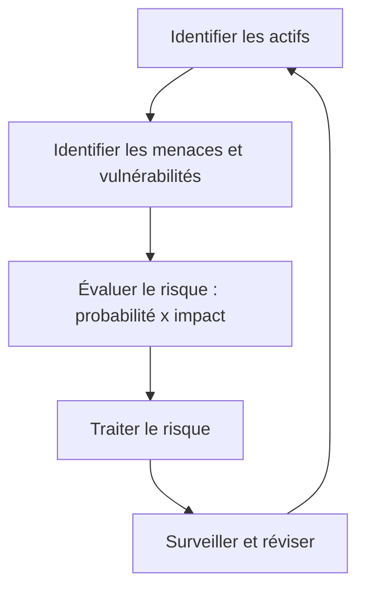

## Introduction

La sécurité parfaite n'existe pas : chaque organisation doit arbitrer entre le coût des mesures de protection et le niveau de risque qu'elle est prête à accepter. Ce chapitre introduit le vocabulaire et les référentiels qui structurent cette approche — indispensables pour comprendre le "pourquoi" derrière les recommandations techniques des chapitres précédents.

## Vulnérabilité, menace et risque : ne pas confondre

Ces trois termes sont souvent utilisés de façon interchangeable à tort, alors qu'ils désignent des concepts distincts :

<CompareTable
  titleA="Terme"
  titleB="Définition"
  rows={[
    { a: "Vulnérabilité", b: "Une faiblesse dans un système (bug logiciel, mauvaise configuration, absence de patch)" },
    { a: "Menace", b: "Un acteur ou événement susceptible d'exploiter une vulnérabilité (attaquant, incendie, erreur humaine)" },
    { a: "Risque", b: "La probabilité qu'une menace exploite une vulnérabilité, pondérée par l'impact potentiel" },
  ]}
/>

<TipCallout>
Formule simplifiée à retenir : **Risque = Menace × Vulnérabilité × Impact**. Sans vulnérabilité, une menace ne peut rien faire ; sans menace active, une vulnérabilité reste théorique.
</TipCallout>

## Le cycle de gestion du risque



Face à un risque identifié, quatre stratégies de traitement sont possibles :

- **Éviter** : supprimer l'activité à l'origine du risque
- **Réduire** (mitiger) : appliquer des mesures de sécurité pour diminuer probabilité ou impact
- **Transférer** : souscrire une cyber-assurance, externaliser à un prestataire
- **Accepter** : décider consciemment de vivre avec le risque, si son coût de traitement dépasse son impact potentiel

<CehCallout>
Le CEH attend une bonne maîtrise de ce vocabulaire de gestion du risque — plusieurs questions de l'examen portent directement sur la distinction entre ces quatre stratégies de traitement.
</CehCallout>

## Les grands référentiels normatifs

<CompareTable
  titleA="Référentiel"
  titleB="Ce qu'il couvre"
  rows={[
    { a: "ISO/IEC 27001", b: "Système de management de la sécurité de l'information (SMSI), certifiable" },
    { a: "NIST Cybersecurity Framework", b: "Cadre volontaire américain structuré en 5 fonctions : Identify, Protect, Detect, Respond, Recover" },
    { a: "CIS Controls", b: "Liste priorisée de mesures techniques concrètes (18 contrôles)" },
    { a: "RGPD", b: "Réglementation européenne sur la protection des données personnelles" },
  ]}
/>

<AuditCallout>
La norme ISO 27001 impose une analyse de risque documentée et régulièrement mise à jour (généralement annuelle) comme pierre angulaire du SMSI. C'est souvent le premier document demandé lors d'un audit de certification.
</AuditCallout>

## Les 5 fonctions du NIST Cybersecurity Framework

<AttackDefenseTable rows={[
  { phase: "Identify", attack: "—", defense: "Cartographier les actifs, données et risques de l'organisation" },
  { phase: "Protect", attack: "—", defense: "Mettre en œuvre les mesures de protection (contrôle d'accès, formation, durcissement)" },
  { phase: "Detect", attack: "—", defense: "Mettre en place les capacités de détection d'incident (SOC, SIEM)" },
  { phase: "Respond", attack: "—", defense: "Plan de réponse à incident et de communication de crise" },
  { phase: "Recover", attack: "—", defense: "Plan de continuité et de reprise d'activité (PCA/PRA)" },
]} />

## Lab — Mise en Pratique

**Environnement** : Réflexion guidée (pas de terminal requis pour ce chapitre)

<Steps steps={[
  { title: "Distinguer les concepts", description: "Un serveur web tourne avec une version de PHP obsolète connue pour une faille RCE, mais le serveur n'est accessible que sur un réseau interne isolé sans accès Internet. La vulnérabilité existe-t-elle ? Le risque est-il élevé ? Justifie." },
  { title: "Choisir une stratégie de traitement", description: "Une PME utilise un vieux logiciel métier non maintenu, critique pour son activité, et le migrer coûterait plus cher que l'incident potentiel le plus probable. Quelle stratégie de traitement du risque est la plus réaliste ?" },
]} />

## Pour aller plus loin

### Quantifier le risque : approche qualitative vs quantitative

En pratique, deux approches coexistent pour évaluer un risque :

<CompareTable
  titleA="Approche qualitative"
  titleB="Approche quantitative"
  rows={[
    { a: "Échelle simple (faible/moyen/élevé/critique)", b: "Valeur monétaire estimée (ex: perte annuelle attendue en €)" },
    { a: "Rapide à mettre en place, facile à communiquer", b: "Plus précis mais nécessite des données fiables (coût d'un incident, fréquence)" },
    { a: "Risque de subjectivité entre évaluateurs", b: "Permet de justifier un budget sécurité auprès de la direction" },
]}
/>

```text
Exemple de calcul quantitatif simplifié (méthode ALE) :
SLE (Single Loss Expectancy) = valeur de l'actif × facteur d'exposition
ALE (Annual Loss Expectancy) = SLE × ARO (fréquence annuelle estimée)

Un serveur à 50 000 €, exposition de 40% en cas d'incident, 1 incident tous les 5 ans (ARO = 0.2) :
SLE = 50 000 × 0.4 = 20 000 €
ALE = 20 000 × 0.2 = 4 000 € / an
```

<TipCallout>
Ce calcul d'ALE (Annual Loss Expectancy) permet une comparaison directe et parlante pour la direction : "investir 3 000 €/an dans une mesure de protection contre un risque évalué à 4 000 €/an" est un argument bien plus convaincant qu'une échelle qualitative seule.
</TipCallout>

### Autres référentiels à connaître

Au-delà d'ISO 27001 et du NIST CSF déjà vus, quelques référentiels complémentaires reviennent fréquemment selon le secteur :

<CompareTable
  titleA="Référentiel"
  titleB="Contexte d'usage"
  rows={[
    { a: "PCI-DSS", b: "Obligatoire pour toute organisation traitant des paiements par carte bancaire" },
    { a: "HDS / HIPAA", b: "Hébergement de données de santé (France / États-Unis respectivement)" },
    { a: "EBIOS Risk Manager", b: "Méthode d'analyse de risque française, portée par l'ANSSI" },
    { a: "SOC 2", b: "Référentiel américain très demandé par les clients de solutions SaaS B2B" },
]}
/>

<AuditCallout>
En pratique, une organisation combine souvent plusieurs référentiels : ISO 27001 comme cadre de gouvernance général, complété par PCI-DSS si elle traite des paiements, et EBIOS RM ou une méthode équivalente pour l'analyse de risque détaillée exigée par ISO 27001.
</AuditCallout>

### Le concept de risque résiduel

Aucune mesure de sécurité ne ramène jamais un risque à zéro : après traitement, il subsiste toujours un **risque résiduel**, que la direction doit accepter formellement (souvent via signature d'un responsable désigné). C'est un concept clé en gouvernance : la décision d'accepter un risque résiduel doit être documentée et assumée à un niveau hiérarchique approprié, jamais laissée implicite.

## En résumé

- Vulnérabilité, menace et risque sont trois concepts distincts : le risque combine probabilité d'exploitation et impact.
- Quatre stratégies existent face à un risque : éviter, réduire, transférer, accepter.
- ISO 27001 encadre un système de management de la sécurité certifiable ; le NIST CSF structure l'approche en 5 fonctions (Identify, Protect, Detect, Respond, Recover).
- La gestion du risque est un cycle continu, pas une action ponctuelle.

## Questions de Révision

1. Quelle est la différence entre une vulnérabilité et un risque ?
2. Cite les quatre stratégies de traitement d'un risque.
3. Quelles sont les 5 fonctions du NIST Cybersecurity Framework ?
